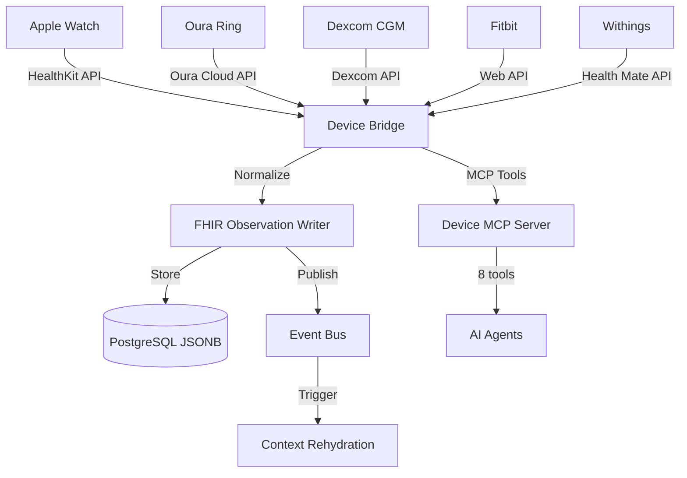

# EPIC-012: Wearable & IoT Device Integration

> **Timeline:** Sprint 2.5 (Week 7)
> **Phase:** 1 - Foundation
> **Dependencies:** [[EPIC-007-mcp-sdk-refactoring]], [[EPIC-003-fhir-data-layer]]
> **Blocks:** [[EPIC-006-pilot-readiness]]
> **ADR:** [[ADR-007-wearable-iot-integration]]

## Objective

Build the Device Bridge integration layer enabling MedOS to ingest, normalize, store, and analyze health data from consumer wearable devices (Oura Ring, Apple Watch, Dexcom CGM, Fitbit, Withings). Every device reading is stored as a FHIR R4 Observation with LOINC coding, published to the event bus for context rehydration, and available to AI agents via MCP tools.

This enables Remote Patient Monitoring (RPM) — a $100-150/patient/month revenue stream via CPT 99453-99458.

---

## Architecture



## Supported Devices & Metrics

| Device | Metrics | LOINC Codes |
|--------|---------|-------------|
| Apple Watch | HR, HRV, SpO2, ECG, steps, activity, fall detection | 8867-4, 80404-7, 2708-6 |
| Oura Ring | HR, HRV, sleep stages, temperature, readiness | 8867-4, 80404-7, 8310-5 |
| Dexcom G8 | Continuous glucose, trend arrows | 2345-7 |
| Fitbit | HR, steps, sleep, activity | 8867-4 |
| Withings | Blood pressure, weight, sleep | 8480-6, 29463-7 |

---

## Tasks

### T1: Device MCP Server (8 tools)
- **File:** `src/medos/mcp/servers/device_server.py`
- **Status:** in-progress
- **Acceptance:**
  - [ ] 8 tools: register, list, ingest_reading, batch_ingest, get_readings, get_summary, check_alerts, deregister
  - [ ] `@hipaa_tool` decorators with PHI levels
  - [ ] Mock data for 3 device types (Oura Ring, Apple Watch, Dexcom)
  - [ ] Realistic health readings with LOINC codes
  - [ ] Configurable alert thresholds (HR >120/<45, SpO2 <92, glucose >180/<70)

### T2: Schema & Gateway Updates
- **Files:** `schemas/agent.py`, `gateway.py`, `agent_cards.py`
- **Status:** in-progress
- **Acceptance:**
  - [ ] `AgentType.DEVICE_BRIDGE` added to enum
  - [ ] PHI policy for DEVICE_BRIDGE in gateway
  - [ ] Device skills in A2A agent card

### T3: Device Server Tests
- **File:** `tests/test_device_server.py`
- **Status:** in-progress
- **Acceptance:**
  - [ ] 12+ tests covering all 8 tools
  - [ ] Edge cases: duplicate registration, empty readings, threshold breaches
  - [ ] All existing tests still pass

### T4: Frontend Device Management (future)
- **Status:** planned
- **Acceptance:**
  - [ ] Device list on patient detail page
  - [ ] Vitals chart with device readings over time
  - [ ] Alert badge on patient card for threshold breaches
  - [ ] Device registration flow

### T5: Real Device API Adapters (future)
- **Status:** planned
- **Acceptance:**
  - [ ] Apple HealthKit adapter (via mobile app sync)
  - [ ] Oura Cloud API webhook receiver
  - [ ] Dexcom API adapter with OAuth2
  - [ ] FHIR Observation mapping with proper LOINC coding

---

## Verification

```bash
# Run device server tests
cd backend && venv/Scripts/python.exe -m pytest tests/test_device_server.py -v

# Verify lint
cd backend && venv/Scripts/ruff.exe check src/medos/mcp/servers/device_server.py

# Verify all tests still pass
cd backend && venv/Scripts/python.exe -m pytest tests/ -v

# Check MCP tool count (should include 8 device tools)
curl https://medos-platform.vercel.app/mcp/tools | python -m json.tool | grep device
```

---

## Revenue Impact

Remote Patient Monitoring (RPM) billing codes:
- **CPT 99453**: Initial setup and patient education ($19-21)
- **CPT 99454**: Device supply and daily recordings ($55-63/month)
- **CPT 99457**: First 20 min clinical staff review ($48-52/month)
- **CPT 99458**: Each additional 20 min ($38-42/month)

**Per-patient revenue:** $100-150/month for active RPM patients
**At 1,000 RPM patients:** $1.2-1.8M/year additional revenue for the practice
