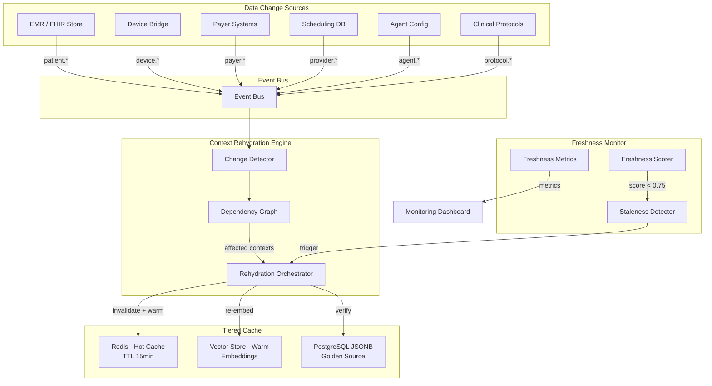

# EPIC-013: System-Wide Context Rehydration & Freshness Monitoring

> **Timeline:** Sprint 2.5 (Week 7)
> **Phase:** 1 - Foundation
> **Dependencies:** [[EPIC-007-mcp-sdk-refactoring]], [[EPIC-012-device-integration]]
> **Blocks:** [[EPIC-006-pilot-readiness]]
> **ADR:** [[ADR-006-patient-context-rehydration]]

## Objective

Build a system-wide context rehydration engine and freshness monitor that ensures ALL cached data in MedOS stays fresh. When ANY data changes — patient records, payer rules, provider schedules, agent configs, clinical protocols, or compliance policies — the system detects the change, identifies all affected contexts, and triggers selective refresh based on urgency.

This prevents "context rotting" where AI agents operate on stale data, which in healthcare can mean wrong treatment recommendations, incorrect billing, or missed alerts.

### Key Insight (from pre-interview research)

> "Context rotting is inevitable in long-running agent conversations. Control it with tiered memory, drift detection, and pruning. If cosine similarity drops below 0.75, trigger a refresh from the golden source (EMR)."

---

## Architecture



---

## Data Change Events (System-Wide)

| Event | Source | Description |
|-------|--------|-------------|
| `patient.demographic.updated` | EMR | Patient name, DOB, address changed |
| `patient.lab.received` | EMR/Lab | New lab result |
| `patient.vitals.recorded` | EMR/Device | New vital signs |
| `patient.device.reading` | Device Bridge | Wearable reading ingested |
| `patient.medication.changed` | EMR | Medication started/stopped/modified |
| `patient.encounter.created` | EMR | New visit/encounter |
| `patient.claim.status_changed` | Payer | Claim approved/denied/pending |
| `patient.appointment.changed` | Scheduler | Appointment booked/cancelled |
| `patient.allergy.updated` | EMR | Allergy list changed |
| `patient.insurance.updated` | Payer | Insurance coverage changed |
| `payer.rules_updated` | Payer Portal | Payer billing rules changed |
| `provider.schedule_changed` | Scheduler | Provider availability changed |
| `agent.config_updated` | Admin | Agent thresholds/policies changed |
| `protocol.clinical_updated` | Clinical | Clinical guidelines updated |
| `formulary.updated` | Pharmacy | Drug formulary changed |
| `compliance.policy_changed` | Compliance | HIPAA/regulatory policy changed |
| `system.mcp_tools_changed` | System | MCP tool registry updated |

## Context Types (System-Wide)

| Context | Description | Refresh Urgency |
|---------|-------------|-----------------|
| `encounter` | Active encounter data | Immediate |
| `clinical_summary` | Patient clinical overview | Soon (1 min) |
| `billing` | Insurance + claims context | Soon |
| `medication` | Active medications + interactions | Immediate |
| `analytics` | Population health metrics | Batch (15 min) |
| `care_plan` | Treatment plan context | Soon |
| `device_vitals` | Wearable/IoT readings summary | Soon |
| `scheduling` | Provider schedules, availability | Soon |
| `payer_rules` | Payer billing rules, contracted rates | Batch |
| `agent_config` | Agent policies, thresholds | Immediate |
| `clinical_protocols` | Clinical guidelines, order sets | Batch |
| `formulary` | Drug formulary, preferences | Batch |
| `compliance` | Regulatory state, audit requirements | Immediate |

---

## Tasks

### T1: Context Rehydration Engine
- **File:** `src/medos/core/context_rehydration.py`
- **Status:** in-progress
- **Acceptance:**
  - [ ] `ChangeType` enum with all 17 event types
  - [ ] `ContextType` enum with all 13 context types
  - [ ] `ContextDependencyGraph` with full mapping
  - [ ] `RefreshPolicy` with urgency levels (immediate, soon, batch, lazy)
  - [ ] `ContextCache` with tiered storage (hot/warm/cold mocks)
  - [ ] `RehydrationOrchestrator` with on_data_change, force_refresh, staleness_report

### T2: Context Freshness Monitor
- **File:** `src/medos/core/context_freshness.py`
- **Status:** in-progress
- **Acceptance:**
  - [ ] `FreshnessScorer` with multi-signal scoring (time decay, source recency, change incorporation)
  - [ ] Threshold: freshness < 0.75 = stale
  - [ ] `StalenessDetector` with check_patient and check_all_active
  - [ ] `FreshnessMetrics` with p50/p95/p99 latency, stale count, average freshness
  - [ ] Exponential time decay: fresh at 0 min, 0.5 at 30 min, ~0 at 2 hours

### T3: Context MCP Server (4 tools)
- **File:** `src/medos/mcp/servers/context_server.py`
- **Status:** pending
- **Acceptance:**
  - [ ] `context_get_freshness` - Get freshness scores for a patient's contexts
  - [ ] `context_force_refresh` - Force rehydration of specific context
  - [ ] `context_get_dependency_graph` - Show data→context dependencies
  - [ ] `context_get_staleness_report` - System-wide staleness report

### T4: Tests
- **Files:** `tests/test_context_rehydration.py`, `tests/test_context_freshness.py`
- **Status:** pending
- **Acceptance:**
  - [ ] 15+ rehydration tests (event handling, dependency graph, cache, orchestration)
  - [ ] 12+ freshness tests (scoring, decay, detection, metrics)
  - [ ] All existing tests still pass

### T5: Frontend Freshness Dashboard (future)
- **Status:** planned
- **Acceptance:**
  - [ ] Context freshness indicators on patient cards
  - [ ] System-wide freshness dashboard in analytics
  - [ ] Stale context alerts in notification center
  - [ ] Manual "refresh context" button per patient

---

## Tiered Cache Architecture

```
┌─────────────────────────────────────────────────────┐
│                   AI Agent Request                    │
│                                                       │
│  1. Check HOT cache (Redis, TTL 15min)               │
│     ├─ HIT + fresh (score ≥ 0.75) → Return           │
│     └─ MISS or STALE                                  │
│                                                       │
│  2. Check WARM cache (Vector store, embeddings)       │
│     ├─ HIT + cosine ≥ 0.75 → Return + warm HOT       │
│     └─ MISS or cosine < 0.75                          │
│                                                       │
│  3. Query COLD store (PostgreSQL JSONB, golden source) │
│     ├─ Fetch fresh data from EMR/source               │
│     ├─ Re-embed for WARM cache                        │
│     ├─ Populate HOT cache                             │
│     └─ Return fresh context                           │
└─────────────────────────────────────────────────────┘
```

---

## Verification

```bash
# Run context rehydration tests
cd backend && venv/Scripts/python.exe -m pytest tests/test_context_rehydration.py -v

# Run context freshness tests
cd backend && venv/Scripts/python.exe -m pytest tests/test_context_freshness.py -v

# Verify lint
cd backend && venv/Scripts/ruff.exe check src/medos/core/context_rehydration.py src/medos/core/context_freshness.py

# Verify all tests still pass
cd backend && venv/Scripts/python.exe -m pytest tests/ -v
```

---

## References

- [[ADR-006-patient-context-rehydration]] — Architectural decision for context rehydration
- [[ADR-001-fhir-native-data-model]] — FHIR-native JSONB storage (golden source)
- [[ADR-003-ai-agent-framework]] — LangGraph agent framework (context consumers)
- [[agent-architecture]] — Bounded autonomy framework
- [[System-Architecture-Overview]] — Event bus routing, data sync strategy
- Pre-interview research: Tiered memory, cosine similarity thresholds, context rotting detection
