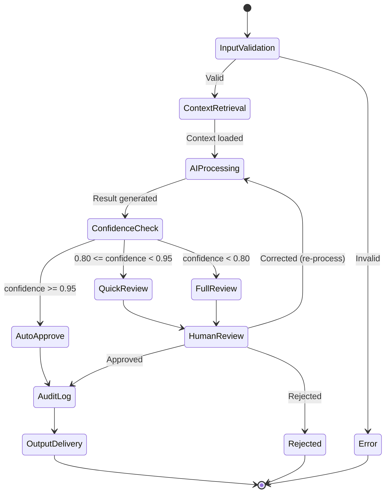

# ADR-003: LangGraph for AI Agent Orchestration with Claude as Primary LLM

## Status

**Accepted** -- 2026-02-27

## Context

MedOS integrates AI deeply into clinical workflows: automated medical coding (ICD-10/CPT), clinical documentation assistance, prior authorization generation, denial appeal drafting, and patient communication. These are not simple prompt-in/response-out interactions. They require **stateful, multi-step reasoning** with **bounded autonomy** -- the AI must be capable but must never act beyond its confidence threshold without human review.

See [[HEALTHCARE_OS_MASTERPLAN]] for the full vision of AI-assisted healthcare operations.

Our AI requirements are:

1. **Stateful workflows** -- A coding agent must retrieve the encounter, extract diagnoses, map to ICD-10 codes, validate against payer rules, and present results. This is a multi-step graph, not a single LLM call.
2. **Bounded autonomy** -- AI agents must operate within defined confidence thresholds. Above 95% confidence, auto-approve. Between 80-95%, flag for quick review. Below 80%, require full human review. These thresholds must be configurable per tenant and per task type.
3. **Human-in-the-loop** -- Clinicians must be able to interrupt, correct, and override AI decisions at any point. The system must learn from corrections.
4. **Audit trail** -- Every AI decision must be logged with the reasoning chain, confidence score, model version, and prompt used. Required by [[HIPAA-Deep-Dive]] and payer audit requirements.
5. **HIPAA compliance** -- LLM API calls must be covered by a Business Associate Agreement (BAA). PHI must be handled according to minimum necessary principle.
6. **Multi-model capability** -- While Claude is the primary LLM, we must be able to route specific tasks to specialized models (e.g., a fine-tuned coding model) without rewriting the orchestration layer.

## Decision

**We will use LangGraph as the AI agent orchestration framework, with Anthropic Claude (via HIPAA BAA) as the primary LLM, implementing a state machine pattern with configurable confidence thresholds and mandatory human-in-the-loop checkpoints.**

### Agent Architecture Pattern



### LangGraph Implementation Pattern

```python
from langgraph.graph import StateGraph, END
from langgraph.checkpoint.postgres import PostgresSaver
from pydantic import BaseModel, Field
from typing import Literal
import anthropic

# Agent state definition
class CodingAgentState(BaseModel):
    """State for the medical coding agent."""
    # Input
    encounter_id: str
    tenant_id: str

    # Context (populated during retrieval)
    encounter_fhir: dict | None = None
    patient_fhir: dict | None = None
    clinical_notes: list[str] = Field(default_factory=list)

    # AI processing
    suggested_codes: list[dict] = Field(default_factory=list)  # {code, system, display, confidence}
    reasoning_chain: list[str] = Field(default_factory=list)
    confidence_score: float = 0.0
    model_version: str = ""
    prompt_hash: str = ""

    # Human review
    review_status: Literal["pending", "approved", "corrected", "rejected"] = "pending"
    reviewer_id: str | None = None
    corrections: list[dict] = Field(default_factory=list)

    # Output
    final_codes: list[dict] = Field(default_factory=list)
    audit_record_id: str | None = None
    error: str | None = None


def build_coding_agent() -> StateGraph:
    """Build the medical coding agent graph."""
    graph = StateGraph(CodingAgentState)

    # Define nodes
    graph.add_node("validate_input", validate_input)
    graph.add_node("retrieve_context", retrieve_clinical_context)
    graph.add_node("generate_codes", generate_codes_with_claude)
    graph.add_node("check_confidence", check_confidence_threshold)
    graph.add_node("auto_approve", auto_approve_codes)
    graph.add_node("request_review", request_human_review)
    graph.add_node("log_audit", log_audit_trail)
    graph.add_node("deliver_output", deliver_results)

    # Define edges
    graph.set_entry_point("validate_input")
    graph.add_edge("validate_input", "retrieve_context")
    graph.add_edge("retrieve_context", "generate_codes")
    graph.add_edge("generate_codes", "check_confidence")

    # Conditional routing based on confidence
    graph.add_conditional_edges(
        "check_confidence",
        route_by_confidence,
        {
            "auto_approve": "auto_approve",
            "review_needed": "request_review",
        }
    )

    graph.add_edge("auto_approve", "log_audit")
    graph.add_edge("request_review", "log_audit")  # After human completes review
    graph.add_edge("log_audit", "deliver_output")
    graph.add_edge("deliver_output", END)

    return graph.compile(
        checkpointer=PostgresSaver.from_conn_string(DATABASE_URL),
        interrupt_before=["request_review"],  # Pause for human input
    )


async def generate_codes_with_claude(state: CodingAgentState) -> dict:
    """Use Claude to generate medical codes from clinical context."""
    client = anthropic.AsyncAnthropic()

    prompt = build_coding_prompt(
        encounter=state.encounter_fhir,
        notes=state.clinical_notes,
        patient=state.patient_fhir,
    )

    response = await client.messages.create(
        model="claude-sonnet-4-20250514",
        max_tokens=4096,
        system=MEDICAL_CODING_SYSTEM_PROMPT,
        messages=[{"role": "user", "content": prompt}],
        metadata={"user_id": f"tenant:{state.tenant_id}"},  # HIPAA: no PHI in metadata
    )

    parsed = parse_coding_response(response.content[0].text)

    return {
        "suggested_codes": parsed.codes,
        "reasoning_chain": parsed.reasoning,
        "confidence_score": parsed.overall_confidence,
        "model_version": response.model,
        "prompt_hash": hash_prompt(prompt),
    }


def route_by_confidence(state: CodingAgentState) -> str:
    """Route based on configurable confidence thresholds."""
    # Thresholds are configurable per tenant (loaded from tenant settings)
    auto_threshold = 0.95   # Default; overridden by tenant config
    review_threshold = 0.80  # Below this = full review required

    if state.confidence_score >= auto_threshold:
        return "auto_approve"
    else:
        return "review_needed"
```

### Agent Types

The platform defines several agent types, all following the same state machine pattern:

| Agent | Module | Function | Confidence Default |
|-------|--------|----------|-------------------|
| **CodingAgent** | Module A/B | ICD-10/CPT code suggestion | auto: 95%, review: 80% |
| **DocumentationAgent** | Module B | Clinical note generation | auto: 90%, review: 75% |
| **PriorAuthAgent** | Module C | Prior auth form generation | auto: 0% (always review) |
| **DenialAppealAgent** | Module C | Appeal letter drafting | auto: 0% (always review) |
| **EligibilityAgent** | Module C | Insurance verification | auto: 98%, review: 90% |
| **PatientCommsAgent** | Module E | Patient message drafting | auto: 85%, review: 70% |

### HIPAA Compliance Controls

```python
class HIPAAComplianceLayer:
    """Wraps all LLM calls with HIPAA-required controls."""

    async def call_llm(self, prompt: str, state: AgentState) -> str:
        # 1. Minimum necessary: strip PHI not needed for the task
        sanitized_prompt = self.apply_minimum_necessary(prompt, state.task_type)

        # 2. Log the call (without PHI in the log)
        await self.log_ai_interaction(
            tenant_id=state.tenant_id,
            task_type=state.task_type,
            prompt_hash=hash_prompt(sanitized_prompt),
            model="claude-sonnet-4-20250514",
        )

        # 3. Make the call via BAA-covered endpoint
        response = await self.client.messages.create(...)

        # 4. Log the response metadata (not content)
        await self.log_ai_response(
            tokens_used=response.usage.output_tokens,
            confidence=self.extract_confidence(response),
        )

        return response.content[0].text
```

## Consequences

### Positive

- **Explicit state machines** -- Every AI workflow is a visible, auditable graph. No hidden prompt chains or opaque agent loops. Regulators and clinicians can understand exactly what the AI does at each step.
- **Guaranteed human checkpoints** -- LangGraph's `interrupt_before` mechanism ensures the agent physically cannot proceed past review points without human input. This is enforced at the framework level, not the application level.
- **Persistent state** -- LangGraph's PostgreSQL checkpointer means agent state survives process restarts. A coding review started at 5pm can be completed the next morning without data loss.
- **Multi-model routing** -- The node-based architecture allows swapping LLMs per node. The coding node could use a specialized model while the documentation node uses Claude.
- **Replay and debugging** -- Every state transition is checkpointed. We can replay any agent run to understand its behavior, which is invaluable for debugging and compliance.

### Negative

- **LangGraph learning curve** -- The team must learn LangGraph's graph construction and state management patterns. Mitigation: we will build a base agent class that encapsulates common patterns, reducing per-agent boilerplate.
- **Anthropic dependency** -- Claude as primary LLM creates vendor dependency. Mitigation: the LangGraph node architecture isolates LLM calls to specific nodes. Swapping to a different provider requires changing only the LLM call node, not the orchestration logic.
- **Latency** -- Multi-step agent graphs add latency compared to single LLM calls. A coding agent might make 2-3 LLM calls. Mitigation: parallel node execution where dependencies allow; streaming responses for user-facing interactions; acceptable for async workflows like coding review.

## Alternatives Considered

### 1. Raw Claude API with Custom State Management

Direct Anthropic API calls with hand-built state tracking.

- **Rejected because**: We would end up building a worse version of LangGraph. State persistence, checkpointing, human-in-the-loop interrupts, and graph visualization are hard problems that LangGraph has already solved.

### 2. CrewAI

Multi-agent framework focused on role-based agent collaboration.

- **Rejected because**: CrewAI is designed for autonomous agent swarms, which is the opposite of what healthcare needs. We need tightly bounded, auditable workflows with mandatory human checkpoints, not agents deciding on their own when to collaborate.

### 3. AutoGen (Microsoft)

Multi-agent conversation framework.

- **Rejected because**: AutoGen's conversation-based paradigm does not map well to structured healthcare workflows. Medical coding is not a conversation between agents -- it is a deterministic pipeline with AI-powered steps. AutoGen also lacks the state persistence and checkpointing we require.

### 4. Custom State Machine (No Framework)

Build our own state machine library tailored to healthcare.

- **Rejected because**: Significant engineering investment with no community support. LangGraph provides the foundation; we customize the healthcare-specific layers on top.

## References

- [[HEALTHCARE_OS_MASTERPLAN]] -- AI integration vision and module definitions
- [[ADR-001-fhir-native-data-model]] -- FHIR data consumed by AI agents
- [[ADR-004-fastapi-backend-architecture]] -- Backend serving agent endpoints
- [[ADR-005-mcp-sdk-integration]] -- HIPAAFastMCP security pipeline for agent tool calls
- [[Revenue-Cycle-Deep-Dive]] -- Medical coding and billing workflows that agents automate
- [[agent-architecture]] -- Full agent specification (5 agents, bounded autonomy)
- [[mcp-integration-plan]] -- MCP tool catalog consumed by agents
- [[context-rotting-and-agent-memory]] -- Agent memory architecture and context rot detection
- [[EPIC-004-ai-clinical-documentation]] -- Clinical Scribe agent implementation
- [[EPIC-007-mcp-sdk-refactoring]] -- Prior Auth + Denial Management agent implementation
- [[EPIC-008-demo-polish]] -- Agent Runner API and patient intake workflow
- [LangGraph Documentation](https://langchain-ai.github.io/langgraph/)
- [Anthropic Claude API](https://docs.anthropic.com/en/docs)
- [Anthropic HIPAA BAA](https://www.anthropic.com/trust)
