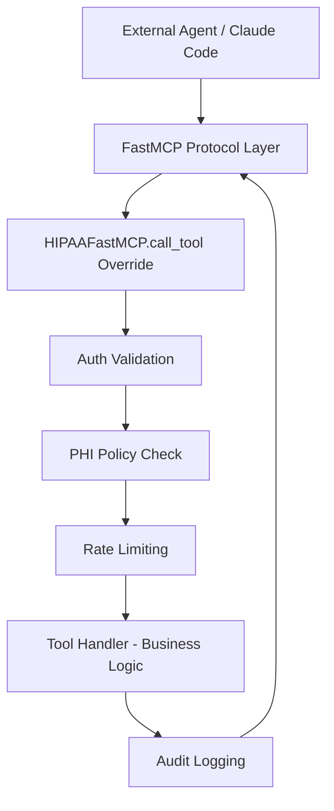

# ADR-005: MCP SDK Integration - Hybrid HIPAAFastMCP Approach

## Status

**Accepted** -- 2026-02-28

## Context

Sprint 1 of MedOS implemented a custom MCP transport layer, tool registry, and JSON-RPC handling to connect AI agents with healthcare tools. While functional, the implementation duplicates significant work already handled by the official MCP Python SDK (`FastMCP`).

The official MCP Python SDK (FastMCP) provides:
- JSON-RPC 2.0 protocol handling
- SSE and Streamable HTTP transport
- Automatic input schema generation from type hints
- Tool registration via decorators
- Built-in error handling and validation

Our custom implementation (`transport.py`, `registry.py`) handles the same protocol concerns but also includes our HIPAA security pipeline: agent authentication, PHI access policies, rate limiting, and audit logging. Having two parallel implementations creates maintenance burden and increases the surface area for bugs.

The question: How do we adopt the SDK without losing our security pipeline?

See [[mcp-integration-plan]] for the broader MCP strategy and [[agent-architecture]] for how agents consume MCP tools.

## Decision

**We will create `HIPAAFastMCP`, a subclass of `FastMCP` that overrides `call_tool()` to inject our HIPAA security pipeline. Tool registration will use a `@hipaa_tool` decorator that wraps FastMCP's `@mcp.tool()` with healthcare metadata.**

### Architecture Flow



### Key Design Decisions

1. **Subclass, not wrap**: `HIPAAFastMCP(FastMCP)` inherits all SDK behavior and overrides only `call_tool()`. This preserves the SDK's protocol handling, transport, and schema generation.

2. **`@hipaa_tool` decorator**: Replaces tuple-based tool registration with a decorator that:
   - Registers the tool with FastMCP's internal registry
   - Attaches HIPAA metadata (PHI access level, required scopes, audit category)
   - Generates input schemas from Python type hints

3. **Delete custom transport**: The `transport.py` module (~176 lines of custom JSON-RPC handling) is replaced by FastMCP's built-in SSE/Streamable HTTP transport.

4. **Gateway simplification**: The MCP Gateway (`gateway.py`) delegates protocol handling to FastMCP and focuses solely on routing and cross-server concerns.

### Implementation Pattern

```python
from mcp.server.fastmcp import FastMCP

class HIPAAFastMCP(FastMCP):
    """FastMCP subclass with HIPAA security pipeline."""

    async def call_tool(self, name: str, arguments: dict) -> Any:
        # 1. Auth validation (agent identity, scopes)
        await self._validate_auth(name, arguments)
        # 2. PHI policy check (does this agent have PHI access?)
        await self._check_phi_policy(name, arguments)
        # 3. Rate limiting (per-agent, per-tool)
        await self._check_rate_limit(name)
        # 4. Execute tool handler via SDK
        result = await super().call_tool(name, arguments)
        # 5. Audit logging (FHIR AuditEvent)
        await self._log_audit(name, arguments, result)
        return result
```

## Consequences

### Positive

- **SDK protocol compliance**: FastMCP handles JSON-RPC 2.0, SSE transport, and Streamable HTTP. We no longer maintain custom protocol code.
- **Code reduction**: Delete `transport.py` (~176 lines), simplify `registry.py`, reduce `gateway.py` complexity.
- **Tool registration simplified**: Decorators replace tuple-based registration, reducing boilerplate and improving readability.
- **Input schema generation**: FastMCP auto-generates JSON Schema from Python type hints, eliminating manual schema definitions.
- **Future-proof**: SDK updates (new transports, protocol features) are inherited automatically.
- **Community alignment**: Using the official SDK means better documentation, community support, and compatibility with MCP ecosystem tools.

### Negative

- **Coupled to FastMCP API surface**: If FastMCP changes `call_tool()` signature or internal method names, our subclass must adapt. Mitigation: pin SDK version, test on upgrades.
- **Subclassing complexity**: Developers must understand both FastMCP internals and our override layer. Mitigation: document the override pattern clearly, keep the override thin.
- **SDK versioning**: FastMCP is still evolving. Breaking changes may require migration effort. Mitigation: use version pinning and test before upgrading.

## Alternatives Considered

### 1. Full SDK Adoption (Drop Security Pipeline)

Use FastMCP as-is with middleware for security.

- **Rejected because**: FastMCP's middleware model does not provide the fine-grained control we need for per-tool PHI policies, agent-scoped rate limiting, and FHIR AuditEvent generation. We would lose the security pipeline that is fundamental to HIPAA compliance.

### 2. Keep Custom Implementation (No SDK)

Continue maintaining our own transport, registry, and protocol handling.

- **Rejected because**: Maintaining two parallel MCP implementations (SDK evolving upstream, ours frozen) creates technical debt. The SDK handles edge cases in JSON-RPC and SSE that we would need to discover and fix independently.

### 3. Middleware Approach (FastMCP -> Middleware -> Handler)

Use FastMCP with a middleware layer that intercepts all tool calls.

- **Rejected because**: FastMCP's middleware hooks are less flexible than subclassing. The middleware approach provides less control over the execution flow and makes it harder to inject context (tenant_id, agent identity) into the security pipeline. Subclassing gives us direct access to the full call context.

## References

- [[mcp-integration-plan]] -- MCP integration strategy and server roadmap
- [[agent-architecture]] -- Agent framework that consumes MCP tools
- [[ADR-003-ai-agent-framework]] -- LangGraph + Claude decision
- [[ADR-004-fastapi-backend-architecture]] -- Backend framework
- [[HIPAA-Deep-Dive]] -- HIPAA compliance requirements for security pipeline
- [[claude-for-healthcare-hipaa]] -- Claude via Bedrock with BAA
- [[EPIC-007-mcp-sdk-refactoring]] -- Sprint 2 implementation of HIPAAFastMCP
- [[EPIC-008-demo-polish]] -- Sprint 3 agent runner using MCP tools
- [MCP Python SDK (FastMCP)](https://github.com/modelcontextprotocol/python-sdk)
- [MCP Specification](https://modelcontextprotocol.io/)
