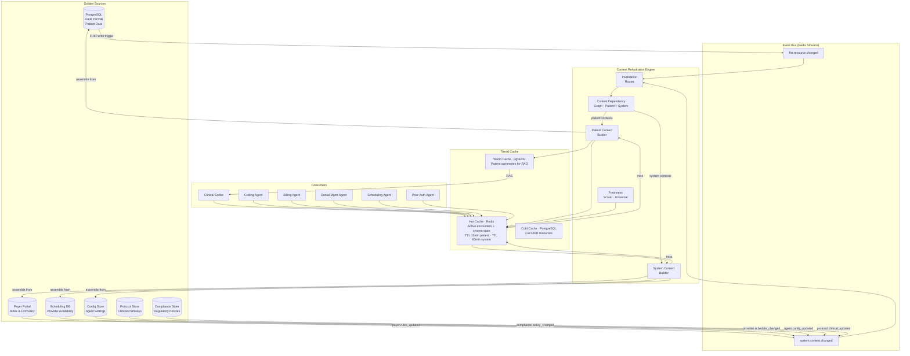
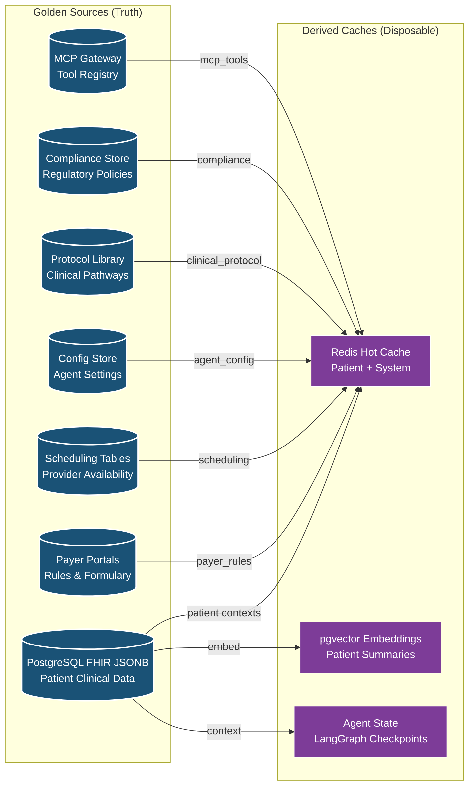
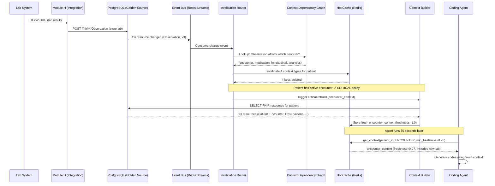
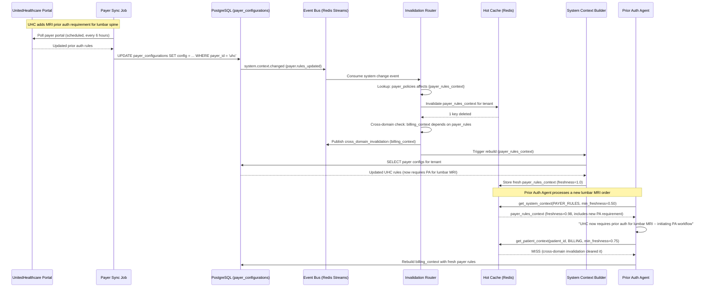
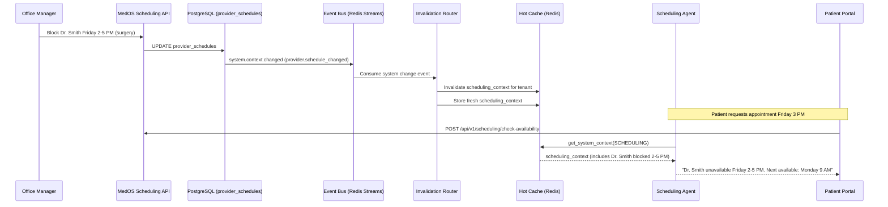

# ADR-006: System-Wide Context Rehydration Architecture

## Status

**Accepted** -- 2026-02-28

## Context

MedOS is not just a clinical record system -- it is an AI-native healthcare operating system where agents make decisions across clinical, billing, scheduling, compliance, and operational domains. Every agent decision depends on **context**: assembled snapshots of the relevant system state. These contexts span two fundamental categories:

### Patient-Level Contexts

AI agents (see [[ADR-003-ai-agent-framework]]) operate on patient context -- assembled snapshots of a patient's clinical, billing, and administrative state. Coding agents need diagnoses + procedures + medications, documentation agents need encounter history + vitals + allergies, billing agents need coverage + eligibility + claim history. The underlying data lives as FHIR R4 JSONB resources in PostgreSQL (see [[ADR-001-fhir-native-data-model]]). Assembling a patient context from scratch on every agent invocation is expensive -- a typical encounter context requires reading 15-30 FHIR resources across 6-8 resource types. At 50 concurrent encounters, this creates unsustainable database pressure.

### System-Level Contexts

Beyond patient data, agents depend on **system-wide operational state** that changes independently of patient interactions:

- **Payer rules**: Insurance companies update coverage policies, pre-authorization requirements, and fee schedules. A billing agent using stale payer rules will generate claims that get denied.
- **Provider schedules**: When a provider blocks time off, cancels a clinic day, or changes availability, the scheduling agent must know immediately -- not at the next cache refresh.
- **Agent configurations**: Confidence thresholds, prompt templates, model versions, and feature flags change as the system evolves. An agent using an outdated prompt template may produce lower-quality output.
- **Clinical protocols**: Practice-specific clinical pathways, order sets, and treatment algorithms are updated as evidence changes. Documentation agents must reference current protocols.
- **Drug formulary**: Insurance formularies change quarterly. A medication agent recommending a drug removed from formulary causes prior auth denials and patient frustration.
- **Compliance and regulatory state**: HIPAA policies, state regulations, and payer audit requirements evolve. Agents must operate under current compliance rules.
- **MCP tool registry**: When MCP tools are added, updated, or deprecated, agents must discover and use the current tool set.

### The Context Rotting Problem

Cached data in any of these domains introduces **context rotting**. When a nurse records new vitals, a payer updates their rules, or a provider changes their schedule, any cached context that includes those data points becomes stale. An AI agent making decisions on stale context can:

- Suggest codes based on outdated diagnoses
- Miss drug interactions from newly prescribed medications
- Generate documentation that contradicts the latest lab results
- Calculate billing based on expired insurance coverage
- Submit prior authorizations using deprecated payer requirements
- Schedule patients into slots that no longer exist
- Apply clinical protocols that have been superseded

Context rot in healthcare is not a performance problem -- it is a **patient safety and revenue problem**.

Our requirements are:

1. **Event-driven refresh** -- Context must update when underlying data changes, not on arbitrary TTLs. This applies to ALL data domains, not just FHIR resources.
2. **Selective invalidation** -- A new lab result should refresh encounter context but not scheduling context. A payer rule change should refresh billing context but not medication context.
3. **Freshness scoring** -- Agents must know how fresh their context is and adjust behavior accordingly. Every context in the system gets a freshness score.
4. **Performance** -- Context assembly must be sub-200ms for active encounters, sub-500ms for system contexts.
5. **Multiple golden sources** -- Each data domain has its own source of truth: EMR for patient data, payer portals for billing rules, scheduling DB for availability, config store for agent settings.
6. **Multi-tenant isolation** -- Context caching must respect tenant boundaries (see [[ADR-002-multi-tenancy-schema-per-tenant]]).

Research from our team's analysis of production agent systems (see [[context-rotting-and-agent-memory]]) identified cosine similarity degradation as a leading indicator of context rot, with a threshold of < 0.75 triggering mandatory refresh from the golden source.

## Decision

**We will implement a system-wide event-driven context rehydration architecture with a tiered cache, context dependency graphs (patient-level and system-level), universal freshness scoring, and configurable auto-refresh policies. Each data domain has its own golden source -- the rehydration engine treats ALL cached data uniformly regardless of origin.**

### Architecture Overview



### Context Taxonomy

The rehydration system manages two categories of context. Patient-level contexts are scoped to a specific patient and tenant. System-level contexts are scoped to a tenant (or globally) and shared across all agents operating within that tenant.

```python
from dataclasses import dataclass, field
from enum import Enum


class ContextCategory(str, Enum):
    """Top-level context classification."""
    PATIENT = "patient"    # Scoped to a specific patient + tenant
    SYSTEM = "system"      # Scoped to a tenant (or global)


class ContextType(str, Enum):
    """All context types in the system -- patient and system level."""
    # --- Patient-Level Contexts ---
    ENCOUNTER = "encounter_context"           # Active clinical encounter
    BILLING = "billing_context"               # Insurance, claims, eligibility
    MEDICATION = "medication_context"         # Current meds, interactions, allergies
    LONGITUDINAL = "longitudinal_context"     # Full patient timeline
    ANALYTICS = "analytics_context"           # Population health metrics

    # --- System-Level Contexts ---
    PAYER_RULES = "payer_rules_context"       # Payer coverage policies, fee schedules, PA requirements
    SCHEDULING = "scheduling_context"         # Provider availability, slot templates, location hours
    AGENT_CONFIG = "agent_config_context"     # Confidence thresholds, prompt templates, model versions
    CLINICAL_PROTOCOL = "clinical_protocol_context"  # Practice-specific pathways, order sets
    FORMULARY = "formulary_context"           # Drug formulary per payer/plan
    COMPLIANCE = "compliance_context"         # HIPAA policies, state regs, audit requirements
    MCP_TOOLS = "mcp_tools_context"           # Available MCP tools, schemas, deprecation status


# Classification: which contexts are patient-scoped vs system-scoped
CONTEXT_CATEGORIES: dict[ContextType, ContextCategory] = {
    # Patient-level
    ContextType.ENCOUNTER: ContextCategory.PATIENT,
    ContextType.BILLING: ContextCategory.PATIENT,
    ContextType.MEDICATION: ContextCategory.PATIENT,
    ContextType.LONGITUDINAL: ContextCategory.PATIENT,
    ContextType.ANALYTICS: ContextCategory.PATIENT,
    # System-level
    ContextType.PAYER_RULES: ContextCategory.SYSTEM,
    ContextType.SCHEDULING: ContextCategory.SYSTEM,
    ContextType.AGENT_CONFIG: ContextCategory.SYSTEM,
    ContextType.CLINICAL_PROTOCOL: ContextCategory.SYSTEM,
    ContextType.FORMULARY: ContextCategory.SYSTEM,
    ContextType.COMPLIANCE: ContextCategory.SYSTEM,
    ContextType.MCP_TOOLS: ContextCategory.SYSTEM,
}
```

### Context Dependency Graph -- Patient Level

The core innovation is a **directed dependency graph** that maps which context types depend on which data sources. When data changes, the graph identifies exactly which contexts are affected. The patient-level graph maps contexts to FHIR resource types:

```python
class FHIRResourceType(str, Enum):
    """FHIR R4 resource types that feed into patient contexts."""
    PATIENT = "Patient"
    ENCOUNTER = "Encounter"
    OBSERVATION = "Observation"
    CONDITION = "Condition"
    PROCEDURE = "Procedure"
    MEDICATION_REQUEST = "MedicationRequest"
    ALLERGY_INTOLERANCE = "AllergyIntolerance"
    DIAGNOSTIC_REPORT = "DiagnosticReport"
    COVERAGE = "Coverage"
    CLAIM = "Claim"
    CLAIM_RESPONSE = "ClaimResponse"
    DEVICE = "Device"
    IMMUNIZATION = "Immunization"


# Patient-level dependency graph: which contexts depend on which FHIR resource types
PATIENT_DEPENDENCY_GRAPH: dict[ContextType, set[FHIRResourceType]] = {
    ContextType.ENCOUNTER: {
        FHIRResourceType.PATIENT,
        FHIRResourceType.ENCOUNTER,
        FHIRResourceType.OBSERVATION,          # Vitals, lab results
        FHIRResourceType.CONDITION,             # Active diagnoses
        FHIRResourceType.PROCEDURE,             # Procedures performed
        FHIRResourceType.MEDICATION_REQUEST,    # Current medications
        FHIRResourceType.ALLERGY_INTOLERANCE,   # Allergies
        FHIRResourceType.DIAGNOSTIC_REPORT,     # Imaging, pathology
        FHIRResourceType.DEVICE,                # Wearable readings
    },
    ContextType.BILLING: {
        FHIRResourceType.PATIENT,               # Demographics for claims
        FHIRResourceType.COVERAGE,              # Insurance info
        FHIRResourceType.CLAIM,                 # Existing claims
        FHIRResourceType.CLAIM_RESPONSE,        # Payer responses
        FHIRResourceType.ENCOUNTER,             # Service dates
        FHIRResourceType.PROCEDURE,             # Billable procedures
        FHIRResourceType.CONDITION,             # Diagnosis codes for claims
    },
    ContextType.MEDICATION: {
        FHIRResourceType.MEDICATION_REQUEST,    # Active prescriptions
        FHIRResourceType.ALLERGY_INTOLERANCE,   # Drug allergies
        FHIRResourceType.CONDITION,             # Contraindications
        FHIRResourceType.OBSERVATION,           # Lab values (renal function, etc.)
    },
    ContextType.LONGITUDINAL: {
        # Depends on everything -- full patient timeline
        FHIRResourceType.PATIENT,
        FHIRResourceType.ENCOUNTER,
        FHIRResourceType.OBSERVATION,
        FHIRResourceType.CONDITION,
        FHIRResourceType.PROCEDURE,
        FHIRResourceType.MEDICATION_REQUEST,
        FHIRResourceType.ALLERGY_INTOLERANCE,
        FHIRResourceType.DIAGNOSTIC_REPORT,
        FHIRResourceType.COVERAGE,
        FHIRResourceType.IMMUNIZATION,
        FHIRResourceType.DEVICE,
    },
    ContextType.ANALYTICS: {
        FHIRResourceType.ENCOUNTER,
        FHIRResourceType.CONDITION,
        FHIRResourceType.PROCEDURE,
        FHIRResourceType.CLAIM,
        FHIRResourceType.CLAIM_RESPONSE,
        FHIRResourceType.OBSERVATION,
    },
}


# Reverse index: given a FHIR resource type, which patient contexts are affected?
def build_patient_reverse_index() -> dict[FHIRResourceType, set[ContextType]]:
    """Build reverse lookup: resource_type -> affected patient context types."""
    reverse: dict[FHIRResourceType, set[ContextType]] = {}
    for context_type, resource_types in PATIENT_DEPENDENCY_GRAPH.items():
        for rt in resource_types:
            reverse.setdefault(rt, set()).add(context_type)
    return reverse


RESOURCE_TO_PATIENT_CONTEXTS = build_patient_reverse_index()
# Example: RESOURCE_TO_PATIENT_CONTEXTS[FHIRResourceType.OBSERVATION] =
#   {ContextType.ENCOUNTER, ContextType.MEDICATION, ContextType.LONGITUDINAL, ContextType.ANALYTICS}
```

### Context Dependency Graph -- System Level

System-level contexts depend on system data sources rather than FHIR resources. Each system data source has its own golden source and change event.

```python
class SystemDataSource(str, Enum):
    """System-level data sources that feed into system contexts."""
    PAYER_POLICIES = "payer_policies"            # Coverage rules, PA requirements, fee schedules
    PAYER_FEE_SCHEDULES = "payer_fee_schedules"  # Contracted rates per CPT
    PROVIDER_SCHEDULES = "provider_schedules"    # Availability, time blocks, locations
    LOCATION_HOURS = "location_hours"            # Facility operating hours
    AGENT_THRESHOLDS = "agent_thresholds"        # Confidence thresholds per agent type
    AGENT_PROMPTS = "agent_prompts"              # System prompts, prompt templates
    AGENT_MODELS = "agent_models"                # Model versions, routing rules
    CLINICAL_PATHWAYS = "clinical_pathways"      # Evidence-based treatment protocols
    ORDER_SETS = "order_sets"                    # Standard order sets per condition
    DRUG_FORMULARY = "drug_formulary"            # Per-payer formulary tiers
    DRUG_INTERACTIONS = "drug_interactions"      # Interaction databases
    HIPAA_POLICIES = "hipaa_policies"            # PHI access rules, minimum necessary
    STATE_REGULATIONS = "state_regulations"      # State-specific healthcare laws
    AUDIT_REQUIREMENTS = "audit_requirements"    # Payer audit rules, retention policies
    MCP_TOOL_REGISTRY = "mcp_tool_registry"      # Available tools, schemas, versions


# System-level dependency graph: which system contexts depend on which data sources
SYSTEM_DEPENDENCY_GRAPH: dict[ContextType, set[SystemDataSource]] = {
    ContextType.PAYER_RULES: {
        SystemDataSource.PAYER_POLICIES,
        SystemDataSource.PAYER_FEE_SCHEDULES,
        SystemDataSource.AUDIT_REQUIREMENTS,     # Payer-specific audit rules
    },
    ContextType.SCHEDULING: {
        SystemDataSource.PROVIDER_SCHEDULES,
        SystemDataSource.LOCATION_HOURS,
    },
    ContextType.AGENT_CONFIG: {
        SystemDataSource.AGENT_THRESHOLDS,
        SystemDataSource.AGENT_PROMPTS,
        SystemDataSource.AGENT_MODELS,
    },
    ContextType.CLINICAL_PROTOCOL: {
        SystemDataSource.CLINICAL_PATHWAYS,
        SystemDataSource.ORDER_SETS,
    },
    ContextType.FORMULARY: {
        SystemDataSource.DRUG_FORMULARY,
        SystemDataSource.DRUG_INTERACTIONS,
    },
    ContextType.COMPLIANCE: {
        SystemDataSource.HIPAA_POLICIES,
        SystemDataSource.STATE_REGULATIONS,
        SystemDataSource.AUDIT_REQUIREMENTS,
    },
    ContextType.MCP_TOOLS: {
        SystemDataSource.MCP_TOOL_REGISTRY,
    },
}


# Cross-domain dependencies: some patient contexts also depend on system contexts
# (e.g., billing_context needs payer_rules to validate claims)
CROSS_DOMAIN_DEPENDENCIES: dict[ContextType, set[ContextType]] = {
    ContextType.BILLING: {ContextType.PAYER_RULES, ContextType.FORMULARY},
    ContextType.MEDICATION: {ContextType.FORMULARY, ContextType.CLINICAL_PROTOCOL},
    ContextType.ENCOUNTER: {ContextType.CLINICAL_PROTOCOL},
}


# Reverse index: given a system data source, which system contexts are affected?
def build_system_reverse_index() -> dict[SystemDataSource, set[ContextType]]:
    """Build reverse lookup: data_source -> affected system context types."""
    reverse: dict[SystemDataSource, set[ContextType]] = {}
    for context_type, sources in SYSTEM_DEPENDENCY_GRAPH.items():
        for src in sources:
            reverse.setdefault(src, set()).add(context_type)
    return reverse


SOURCE_TO_SYSTEM_CONTEXTS = build_system_reverse_index()
# Example: SOURCE_TO_SYSTEM_CONTEXTS[SystemDataSource.DRUG_FORMULARY] =
#   {ContextType.FORMULARY}
# Example: SOURCE_TO_SYSTEM_CONTEXTS[SystemDataSource.AUDIT_REQUIREMENTS] =
#   {ContextType.PAYER_RULES, ContextType.COMPLIANCE}
```

### System-Level Change Events

While patient data changes are captured by `fhir.resource.changed`, system-level changes have their own event types on the event bus:

```python
class SystemChangeEvent(BaseModel):
    """Published when system-level data changes."""
    event_id: str = Field(default_factory=lambda: str(uuid4()))
    event_type: str                        # One of the system event types below
    tenant_id: str | None                  # None for global changes
    data_source: str                       # SystemDataSource value
    change_type: str                       # "create", "update", "delete", "refresh"
    timestamp: datetime = Field(default_factory=lambda: datetime.now(timezone.utc))
    metadata: dict = Field(default_factory=dict)  # Source-specific metadata


# System event types and their golden sources
SYSTEM_EVENT_TYPES = {
    # Payer domain -- golden source: payer portal / clearinghouse
    "payer.rules_updated": {
        "sources": [SystemDataSource.PAYER_POLICIES, SystemDataSource.PAYER_FEE_SCHEDULES],
        "golden_source": "Payer portal (Availity, Change Healthcare, direct payer API)",
        "typical_frequency": "Weekly to monthly",
        "example": "UnitedHealthcare updates prior auth requirements for MRI",
    },
    "formulary.updated": {
        "sources": [SystemDataSource.DRUG_FORMULARY],
        "golden_source": "PBM formulary files (NCPDP, FDB MedKnowledge)",
        "typical_frequency": "Quarterly (with mid-quarter updates)",
        "example": "Aetna moves metformin ER from Tier 1 to Tier 2",
    },

    # Scheduling domain -- golden source: scheduling database
    "provider.schedule_changed": {
        "sources": [SystemDataSource.PROVIDER_SCHEDULES],
        "golden_source": "MedOS scheduling module (PostgreSQL)",
        "typical_frequency": "Multiple times daily",
        "example": "Dr. Smith blocks off Friday afternoon for surgery",
    },
    "location.hours_changed": {
        "sources": [SystemDataSource.LOCATION_HOURS],
        "golden_source": "MedOS admin module (PostgreSQL)",
        "typical_frequency": "Rare (holidays, closures)",
        "example": "Main clinic closed for holiday on March 15",
    },

    # Agent domain -- golden source: config store
    "agent.config_updated": {
        "sources": [SystemDataSource.AGENT_THRESHOLDS, SystemDataSource.AGENT_PROMPTS, SystemDataSource.AGENT_MODELS],
        "golden_source": "MedOS config store (PostgreSQL tenant settings)",
        "typical_frequency": "Weekly during active development, rare in production",
        "example": "Coding agent confidence threshold changed from 0.95 to 0.92",
    },

    # Clinical domain -- golden source: protocol library
    "protocol.clinical_updated": {
        "sources": [SystemDataSource.CLINICAL_PATHWAYS, SystemDataSource.ORDER_SETS],
        "golden_source": "Clinical protocol library (PostgreSQL + admin UI)",
        "typical_frequency": "Monthly to quarterly",
        "example": "Updated post-knee-replacement rehabilitation protocol",
    },

    # Compliance domain -- golden source: compliance policy store
    "compliance.policy_changed": {
        "sources": [SystemDataSource.HIPAA_POLICIES, SystemDataSource.STATE_REGULATIONS, SystemDataSource.AUDIT_REQUIREMENTS],
        "golden_source": "Compliance policy store (PostgreSQL + manual review)",
        "typical_frequency": "Quarterly to annually",
        "example": "Florida updates telehealth prescribing regulations",
    },

    # MCP domain -- golden source: tool registry
    "system.mcp_tools_changed": {
        "sources": [SystemDataSource.MCP_TOOL_REGISTRY],
        "golden_source": "MCP Gateway tool registry (in-memory + PostgreSQL)",
        "typical_frequency": "Per deployment",
        "example": "New billing_check_prior_auth tool added to Billing MCP server",
    },
}
```

### Tiered Cache Strategy

```python
import json
import hashlib
from datetime import datetime, timedelta, timezone
from typing import Any

import redis.asyncio as redis
from sqlalchemy.ext.asyncio import AsyncSession


class TieredCacheConfig:
    """Configuration for the three-tier cache.

    Patient contexts and system contexts have different TTLs because they
    change at different frequencies. Patient data changes per-encounter;
    system data changes per-day or per-week.
    """
    # Hot tier: Redis
    HOT_PATIENT_TTL_SECONDS: int = 900      # 15 minutes (patient contexts)
    HOT_SYSTEM_TTL_SECONDS: int = 3600      # 60 minutes (system contexts)
    HOT_PATIENT_PREFIX: str = "ctx:patient"
    HOT_SYSTEM_PREFIX: str = "ctx:system"

    # Warm tier: pgvector embeddings, for RAG-based patient summaries
    WARM_EMBEDDING_MODEL: str = "claude-embed-v1"
    WARM_DIMENSIONS: int = 1536

    # Cold tier: PostgreSQL (the golden sources -- always fresh)
    # No TTL -- these ARE the sources of truth


@dataclass
class CachedContext:
    """A cached context with freshness metadata.

    Works for both patient-level and system-level contexts.
    Patient contexts have a patient_id; system contexts set it to None.
    """
    context_type: ContextType
    category: ContextCategory
    tenant_id: str
    patient_id: str | None           # None for system-level contexts
    data: dict[str, Any]
    assembled_at: datetime
    source_versions: dict[str, int]  # resource_type/data_source -> latest version used
    freshness_score: float = 1.0     # 0.0 (stale) to 1.0 (fresh)
    ttl_remaining_seconds: int = 900


class HotCache:
    """Redis-based hot cache for patient AND system contexts."""

    def __init__(self, redis_client: redis.Redis):
        self.redis = redis_client
        self.config = TieredCacheConfig()

    def _key(self, tenant_id: str, context_type: ContextType, patient_id: str | None = None) -> str:
        """Build cache key. Patient contexts include patient_id; system contexts do not."""
        category = CONTEXT_CATEGORIES[context_type]
        if category == ContextCategory.PATIENT:
            return f"{self.config.HOT_PATIENT_PREFIX}:{tenant_id}:{patient_id}:{context_type.value}"
        else:
            return f"{self.config.HOT_SYSTEM_PREFIX}:{tenant_id}:{context_type.value}"

    def _ttl_for(self, context_type: ContextType) -> int:
        """Return appropriate TTL based on context category."""
        category = CONTEXT_CATEGORIES[context_type]
        if category == ContextCategory.PATIENT:
            return self.config.HOT_PATIENT_TTL_SECONDS
        return self.config.HOT_SYSTEM_TTL_SECONDS

    def _half_life_for(self, context_type: ContextType) -> int:
        """Return freshness half-life based on context category."""
        category = CONTEXT_CATEGORIES[context_type]
        if category == ContextCategory.PATIENT:
            return 900   # 15 minutes for patient data
        return 3600      # 60 minutes for system data

    async def get(
        self, tenant_id: str, context_type: ContextType, patient_id: str | None = None,
    ) -> CachedContext | None:
        """Retrieve context from hot cache. Returns None on miss."""
        key = self._key(tenant_id, context_type, patient_id)
        raw = await self.redis.get(key)
        if raw is None:
            return None

        payload = json.loads(raw)
        category = CONTEXT_CATEGORIES[context_type]
        cached = CachedContext(
            context_type=context_type,
            category=category,
            patient_id=patient_id,
            tenant_id=tenant_id,
            data=payload["data"],
            assembled_at=datetime.fromisoformat(payload["assembled_at"]),
            source_versions=payload["source_versions"],
        )

        # Compute freshness score based on age (different half-life per category)
        cached.freshness_score = self._compute_freshness(
            cached.assembled_at, self._half_life_for(context_type)
        )
        cached.ttl_remaining_seconds = await self.redis.ttl(key)
        return cached

    async def put(self, context: CachedContext) -> None:
        """Store context in hot cache with category-appropriate TTL."""
        key = self._key(context.tenant_id, context.context_type, context.patient_id)
        payload = {
            "data": context.data,
            "assembled_at": context.assembled_at.isoformat(),
            "source_versions": context.source_versions,
        }
        ttl = self._ttl_for(context.context_type)
        await self.redis.setex(key, ttl, json.dumps(payload))

    async def invalidate_patient(
        self, tenant_id: str, patient_id: str, context_types: set[ContextType]
    ) -> int:
        """Invalidate specific patient context types. Returns count invalidated."""
        keys = [
            self._key(tenant_id, ct, patient_id)
            for ct in context_types
            if CONTEXT_CATEGORIES[ct] == ContextCategory.PATIENT
        ]
        if not keys:
            return 0
        return await self.redis.delete(*keys)

    async def invalidate_system(
        self, tenant_id: str, context_types: set[ContextType]
    ) -> int:
        """Invalidate specific system context types for a tenant. Returns count invalidated."""
        keys = [
            self._key(tenant_id, ct)
            for ct in context_types
            if CONTEXT_CATEGORIES[ct] == ContextCategory.SYSTEM
        ]
        if not keys:
            return 0
        return await self.redis.delete(*keys)

    async def invalidate_system_global(self, context_types: set[ContextType]) -> int:
        """Invalidate system contexts across ALL tenants (e.g., formulary update).

        Uses Redis SCAN to find matching keys without blocking.
        """
        total = 0
        for ct in context_types:
            pattern = f"{self.config.HOT_SYSTEM_PREFIX}:*:{ct.value}"
            async for key in self.redis.scan_iter(match=pattern, count=100):
                await self.redis.delete(key)
                total += 1
        return total

    @staticmethod
    def _compute_freshness(assembled_at: datetime, half_life_seconds: int) -> float:
        """Exponential decay freshness score with configurable half-life.

        Patient contexts (half_life=900s / 15min):
        - At t=0:    1.0 (perfectly fresh)
        - At t=5min:  0.85
        - At t=15min: 0.50
        - At t=60min: 0.06

        System contexts (half_life=3600s / 60min):
        - At t=0:     1.0
        - At t=15min:  0.91
        - At t=60min:  0.50
        - At t=4h:     0.06
        """
        import math
        age_seconds = (datetime.now(timezone.utc) - assembled_at).total_seconds()
        return math.exp(-0.693 * age_seconds / half_life_seconds)
```

### Freshness Scoring

Every cached context carries a freshness score from 0.0 (completely stale) to 1.0 (just assembled from golden source). The score combines three signals:

```python
import math
from datetime import datetime, timezone


class FreshnessScorer:
    """Computes composite freshness score for a cached context."""

    # Weights for each signal (must sum to 1.0)
    WEIGHT_TIME_DECAY: float = 0.4
    WEIGHT_SOURCE_RECENCY: float = 0.35
    WEIGHT_PENDING_CHANGES: float = 0.25

    # Thresholds for agent behavior
    THRESHOLD_FRESH: float = 0.75       # Above: agent proceeds normally
    THRESHOLD_STALE: float = 0.50       # Below: mandatory refresh before use
    THRESHOLD_COSINE_DRIFT: float = 0.75  # Embedding drift trigger

    def compute(
        self,
        assembled_at: datetime,
        last_source_consultation: datetime,
        pending_change_count: int,
    ) -> float:
        """Compute composite freshness score.

        Args:
            assembled_at: When the context was last built from golden source.
            last_source_consultation: When we last checked the golden source for this patient.
            pending_change_count: Number of known resource changes not yet incorporated.

        Returns:
            Freshness score 0.0 (stale) to 1.0 (fresh).
        """
        now = datetime.now(timezone.utc)

        # Signal 1: Time-based exponential decay (half-life = 15 min)
        age_seconds = (now - assembled_at).total_seconds()
        time_score = math.exp(-0.693 * age_seconds / 900)

        # Signal 2: Source consultation recency (half-life = 5 min)
        consultation_age = (now - last_source_consultation).total_seconds()
        source_score = math.exp(-0.693 * consultation_age / 300)

        # Signal 3: Pending change penalty (each pending change reduces score)
        change_score = max(0.0, 1.0 - (pending_change_count * 0.15))

        return (
            self.WEIGHT_TIME_DECAY * time_score
            + self.WEIGHT_SOURCE_RECENCY * source_score
            + self.WEIGHT_PENDING_CHANGES * change_score
        )

    def should_refresh(self, score: float) -> bool:
        """Determine if context should be refreshed before agent use."""
        return score < self.THRESHOLD_FRESH

    def must_refresh(self, score: float) -> bool:
        """Determine if context MUST be refreshed (unsafe to use as-is)."""
        return score < self.THRESHOLD_STALE
```

### Event-Driven Invalidation Pipeline

The invalidation router consumes events from **two streams**: `fhir.resource.changed` for patient data and `system.context.changed` for system-level data. It uses the appropriate dependency graph to determine which contexts are affected.

```python
from pydantic import BaseModel, Field
from datetime import datetime
from uuid import uuid4


class FHIRResourceChangedEvent(BaseModel):
    """Published when any FHIR resource is created, updated, or deleted."""
    event_id: str = Field(default_factory=lambda: str(uuid4()))
    event_type: str = "fhir.resource.changed"
    tenant_id: str
    patient_id: str | None       # Null for non-patient resources (Organization, etc.)
    resource_type: str            # "Observation", "MedicationRequest", etc.
    resource_id: str
    version_id: int
    change_type: str              # "create", "update", "delete"
    timestamp: datetime = Field(default_factory=lambda: datetime.now(timezone.utc))
    changed_fields: list[str] = Field(default_factory=list)  # FHIR paths that changed


class InvalidationRouter:
    """Routes BOTH patient and system change events to context invalidation.

    This is the central dispatcher for the entire rehydration system.
    It consumes events from two Redis Streams and routes them through
    the appropriate dependency graph.
    """

    def __init__(self, hot_cache: HotCache, scorer: FreshnessScorer):
        self.hot_cache = hot_cache
        self.scorer = scorer

    # --- Patient-Level Event Handling ---

    async def handle_resource_change(self, event: FHIRResourceChangedEvent) -> None:
        """Process a FHIR resource change event (patient data).

        1. Look up which patient context types depend on this resource type.
        2. Invalidate those contexts in the hot cache.
        3. Check cross-domain dependencies (patient contexts that depend on system contexts).
        4. For critical contexts (active encounters), trigger immediate rebuild.
        """
        if event.patient_id is None:
            return  # Non-patient resources don't affect patient contexts

        resource_type = FHIRResourceType(event.resource_type)
        affected_contexts = RESOURCE_TO_PATIENT_CONTEXTS.get(resource_type, set())

        if not affected_contexts:
            return

        # Invalidate affected patient contexts in hot cache
        await self.hot_cache.invalidate_patient(
            tenant_id=event.tenant_id,
            patient_id=event.patient_id,
            context_types=affected_contexts,
        )

        # If encounter context was invalidated and patient has an active encounter,
        # trigger immediate rebuild (critical path)
        if ContextType.ENCOUNTER in affected_contexts:
            await self._trigger_patient_rebuild(
                tenant_id=event.tenant_id,
                patient_id=event.patient_id,
                context_type=ContextType.ENCOUNTER,
                trigger_event_id=event.event_id,
                priority="critical",
            )

    # --- System-Level Event Handling ---

    async def handle_system_change(self, event: SystemChangeEvent) -> None:
        """Process a system-level change event.

        1. Look up which system context types depend on this data source.
        2. Invalidate those system contexts in the hot cache.
        3. Check cross-domain dependencies (patient contexts that depend on this system context).
        4. Trigger rebuild for affected system contexts.
        """
        data_source = SystemDataSource(event.data_source)
        affected_system_contexts = SOURCE_TO_SYSTEM_CONTEXTS.get(data_source, set())

        if not affected_system_contexts:
            return

        # Invalidate system contexts
        if event.tenant_id:
            await self.hot_cache.invalidate_system(
                tenant_id=event.tenant_id,
                context_types=affected_system_contexts,
            )
        else:
            # Global change (no tenant_id) -- invalidate across ALL tenants
            await self.hot_cache.invalidate_system_global(
                context_types=affected_system_contexts,
            )

        # Cross-domain: check if any patient contexts depend on the affected system contexts
        # e.g., billing_context depends on payer_rules_context
        patient_contexts_to_invalidate: set[ContextType] = set()
        for sys_ctx in affected_system_contexts:
            for patient_ctx, deps in CROSS_DOMAIN_DEPENDENCIES.items():
                if sys_ctx in deps:
                    patient_contexts_to_invalidate.add(patient_ctx)

        if patient_contexts_to_invalidate:
            # For cross-domain invalidation, we invalidate patient contexts lazily:
            # we don't know which patients are affected, so we mark the system context
            # as stale and let patient context requests trigger rebuilds on access.
            await self._publish_cross_domain_invalidation(
                tenant_id=event.tenant_id,
                patient_context_types=patient_contexts_to_invalidate,
                trigger_event_id=event.event_id,
            )

        # Trigger rebuild for system contexts
        for sys_ctx in affected_system_contexts:
            await self._trigger_system_rebuild(
                tenant_id=event.tenant_id,
                context_type=sys_ctx,
                trigger_event_id=event.event_id,
            )

    # --- Rebuild Triggers ---

    async def _trigger_patient_rebuild(
        self, tenant_id: str, patient_id: str, context_type: ContextType,
        trigger_event_id: str, priority: str = "normal",
    ) -> None:
        """Request immediate rebuild of a patient context from golden source."""
        await self.hot_cache.redis.xadd(
            f"context:rebuild:{tenant_id}", {
                "type": "context.rebuild.requested",
                "category": "patient",
                "tenant_id": tenant_id,
                "patient_id": patient_id,
                "context_type": context_type.value,
                "priority": priority,
                "trigger_event_id": trigger_event_id,
            }
        )

    async def _trigger_system_rebuild(
        self, tenant_id: str | None, context_type: ContextType,
        trigger_event_id: str,
    ) -> None:
        """Request rebuild of a system context from its golden source."""
        stream = f"context:rebuild:{tenant_id}" if tenant_id else "context:rebuild:global"
        await self.hot_cache.redis.xadd(
            stream, {
                "type": "context.rebuild.requested",
                "category": "system",
                "tenant_id": tenant_id or "global",
                "context_type": context_type.value,
                "priority": "normal",
                "trigger_event_id": trigger_event_id,
            }
        )

    async def _publish_cross_domain_invalidation(
        self, tenant_id: str | None, patient_context_types: set[ContextType],
        trigger_event_id: str,
    ) -> None:
        """Publish a cross-domain invalidation notice.

        When a system context changes (e.g., payer_rules), patient contexts that
        depend on it (e.g., billing_context) become stale. Since we cannot enumerate
        all affected patients efficiently, we publish an invalidation notice. The
        PatientContextService checks this on next access and refreshes if needed.
        """
        stream = f"context:cross-domain:{tenant_id}" if tenant_id else "context:cross-domain:global"
        await self.hot_cache.redis.xadd(
            stream, {
                "type": "context.cross_domain_invalidation",
                "affected_patient_contexts": json.dumps([ct.value for ct in patient_context_types]),
                "trigger_event_id": trigger_event_id,
                "timestamp": datetime.now(timezone.utc).isoformat(),
            }
        )
```

### Context Builder

The builder assembles contexts from the golden source (PostgreSQL FHIR store):

```python
from sqlalchemy import text
from sqlalchemy.ext.asyncio import AsyncSession


class ContextBuilder:
    """Assembles patient contexts from the golden source (PostgreSQL FHIR JSONB)."""

    def __init__(self, db: AsyncSession, hot_cache: HotCache):
        self.db = db
        self.hot_cache = hot_cache

    async def build_encounter_context(
        self, tenant_id: str, patient_id: str, encounter_id: str | None = None,
    ) -> CachedContext:
        """Build a complete encounter context from FHIR resources.

        Reads from PostgreSQL (golden source) and caches in Redis (hot tier).
        Target: sub-200ms for the full assembly.
        """
        # Fetch all required FHIR resources in a single optimized query
        query = text("""
            SELECT resource_type, resource_id, version_id, resource
            FROM fhir_resources_current
            WHERE tenant_id = :tenant_id
              AND (
                  -- Patient demographics
                  (resource_type = 'Patient' AND resource_id = :patient_id)
                  -- Active encounter (latest or specific)
                  OR (resource_type = 'Encounter'
                      AND resource->'subject'->>'reference' = :patient_ref
                      AND (:encounter_id IS NULL OR resource_id = :encounter_id))
                  -- Vitals and labs from last 24 hours
                  OR (resource_type = 'Observation'
                      AND resource->'subject'->>'reference' = :patient_ref
                      AND ts > now() - interval '24 hours')
                  -- Active conditions
                  OR (resource_type = 'Condition'
                      AND resource->'subject'->>'reference' = :patient_ref
                      AND resource->'clinicalStatus'->'coding'->0->>'code' = 'active')
                  -- Active medications
                  OR (resource_type = 'MedicationRequest'
                      AND resource->'subject'->>'reference' = :patient_ref
                      AND resource->>'status' = 'active')
                  -- Allergies
                  OR (resource_type = 'AllergyIntolerance'
                      AND resource->'patient'->>'reference' = :patient_ref)
                  -- Recent procedures (last 30 days)
                  OR (resource_type = 'Procedure'
                      AND resource->'subject'->>'reference' = :patient_ref
                      AND ts > now() - interval '30 days')
                  -- Recent diagnostic reports (last 7 days)
                  OR (resource_type = 'DiagnosticReport'
                      AND resource->'subject'->>'reference' = :patient_ref
                      AND ts > now() - interval '7 days')
              )
        """)

        result = await self.db.execute(query, {
            "tenant_id": tenant_id,
            "patient_id": patient_id,
            "patient_ref": f"Patient/{patient_id}",
            "encounter_id": encounter_id,
        })

        rows = result.fetchall()

        # Organize by resource type
        context_data: dict[str, Any] = {}
        source_versions: dict[str, int] = {}

        for row in rows:
            rt = row.resource_type
            context_data.setdefault(rt, []).append(row.resource)
            # Track the latest version_id per resource type
            source_versions[rt] = max(source_versions.get(rt, 0), row.version_id)

        now = datetime.now(timezone.utc)
        cached = CachedContext(
            context_type=ContextType.ENCOUNTER,
            patient_id=patient_id,
            tenant_id=tenant_id,
            data=context_data,
            assembled_at=now,
            source_versions=source_versions,
            freshness_score=1.0,
        )

        # Store in hot cache
        await self.hot_cache.put(cached)

        return cached
```

### System Context Builder

System-level contexts are assembled from their respective golden sources -- not from FHIR JSONB, but from domain-specific data stores:

```python
class SystemContextBuilder:
    """Assembles system-level contexts from their golden sources."""

    def __init__(self, db: AsyncSession, hot_cache: HotCache):
        self.db = db
        self.hot_cache = hot_cache

    async def build_payer_rules_context(
        self, tenant_id: str, payer_id: str | None = None,
    ) -> CachedContext:
        """Build payer rules context from the payer configuration store.

        Golden source: payer_configurations table (synced from Availity/payer portals).
        Includes: coverage policies, prior auth requirements, fee schedules, timely filing limits.
        """
        query = text("""
            SELECT payer_id, payer_name, config, last_synced_at, version
            FROM payer_configurations
            WHERE tenant_id = :tenant_id
              AND status = 'active'
              AND (:payer_id IS NULL OR payer_id = :payer_id)
        """)
        result = await self.db.execute(query, {"tenant_id": tenant_id, "payer_id": payer_id})
        rows = result.fetchall()

        context_data = {
            "payers": [
                {
                    "payer_id": r.payer_id,
                    "payer_name": r.payer_name,
                    "policies": r.config.get("policies", {}),
                    "prior_auth_rules": r.config.get("prior_auth", {}),
                    "fee_schedule": r.config.get("fee_schedule", {}),
                    "timely_filing_days": r.config.get("timely_filing_days", 90),
                    "last_synced": r.last_synced_at.isoformat(),
                }
                for r in rows
            ],
        }
        source_versions = {r.payer_id: r.version for r in rows}

        cached = CachedContext(
            context_type=ContextType.PAYER_RULES,
            category=ContextCategory.SYSTEM,
            tenant_id=tenant_id,
            patient_id=None,
            data=context_data,
            assembled_at=datetime.now(timezone.utc),
            source_versions=source_versions,
            freshness_score=1.0,
        )
        await self.hot_cache.put(cached)
        return cached

    async def build_scheduling_context(
        self, tenant_id: str, provider_id: str | None = None,
    ) -> CachedContext:
        """Build scheduling context from the scheduling module.

        Golden source: provider_schedules + location_hours tables.
        Includes: provider availability, blocked times, location operating hours.
        """
        query = text("""
            SELECT provider_id, provider_name, schedule_data, version
            FROM provider_schedules
            WHERE tenant_id = :tenant_id
              AND status = 'active'
              AND (:provider_id IS NULL OR provider_id = :provider_id)
        """)
        result = await self.db.execute(query, {"tenant_id": tenant_id, "provider_id": provider_id})
        rows = result.fetchall()

        context_data = {
            "providers": [
                {
                    "provider_id": r.provider_id,
                    "provider_name": r.provider_name,
                    "availability": r.schedule_data.get("availability", []),
                    "blocked_times": r.schedule_data.get("blocked_times", []),
                    "default_slot_duration_min": r.schedule_data.get("slot_duration", 30),
                }
                for r in rows
            ],
        }
        source_versions = {r.provider_id: r.version for r in rows}

        cached = CachedContext(
            context_type=ContextType.SCHEDULING,
            category=ContextCategory.SYSTEM,
            tenant_id=tenant_id,
            patient_id=None,
            data=context_data,
            assembled_at=datetime.now(timezone.utc),
            source_versions=source_versions,
            freshness_score=1.0,
        )
        await self.hot_cache.put(cached)
        return cached

    async def build_agent_config_context(self, tenant_id: str) -> CachedContext:
        """Build agent configuration context.

        Golden source: tenant_settings + agent_configurations tables.
        Includes: confidence thresholds, prompt templates, model versions, feature flags.
        """
        query = text("""
            SELECT agent_type, config, version
            FROM agent_configurations
            WHERE tenant_id = :tenant_id AND status = 'active'
        """)
        result = await self.db.execute(query, {"tenant_id": tenant_id})
        rows = result.fetchall()

        context_data = {
            "agents": {
                r.agent_type: {
                    "confidence_auto_approve": r.config.get("confidence_auto_approve", 0.95),
                    "confidence_review_threshold": r.config.get("confidence_review_threshold", 0.80),
                    "model_version": r.config.get("model_version", "claude-sonnet-4-20250514"),
                    "prompt_template_version": r.config.get("prompt_version", "v1"),
                    "feature_flags": r.config.get("feature_flags", {}),
                }
                for r in rows
            },
        }
        source_versions = {r.agent_type: r.version for r in rows}

        cached = CachedContext(
            context_type=ContextType.AGENT_CONFIG,
            category=ContextCategory.SYSTEM,
            tenant_id=tenant_id,
            patient_id=None,
            data=context_data,
            assembled_at=datetime.now(timezone.utc),
            source_versions=source_versions,
            freshness_score=1.0,
        )
        await self.hot_cache.put(cached)
        return cached

    async def build_formulary_context(self, tenant_id: str) -> CachedContext:
        """Build drug formulary context.

        Golden source: formulary_entries table (synced from PBM/payer formulary files).
        Includes: drug tiers, prior auth requirements, step therapy rules, quantity limits.
        """
        ...

    async def build_clinical_protocol_context(self, tenant_id: str) -> CachedContext:
        """Build clinical protocol context.

        Golden source: clinical_protocols table (managed by clinical leadership).
        Includes: treatment pathways, order sets, screening schedules.
        """
        ...

    async def build_compliance_context(self, tenant_id: str) -> CachedContext:
        """Build compliance/regulatory context.

        Golden source: compliance_policies table (managed by compliance officer).
        Includes: HIPAA policies, state regulations, audit requirements, data retention rules.
        """
        ...

    async def build_mcp_tools_context(self, tenant_id: str) -> CachedContext:
        """Build MCP tool registry context.

        Golden source: MCP Gateway tool registry (in-memory + PostgreSQL).
        Includes: available tools, their schemas, deprecation status, rate limits.
        """
        ...
```

### Auto-Refresh Policies

Refresh policies apply to ALL contexts -- patient and system level. Three policies match different urgency levels:

```python
from enum import Enum


class RefreshPolicy(str, Enum):
    """Auto-refresh policies based on urgency."""
    CRITICAL = "critical"      # Active encounter: immediate refresh on any change
    BACKGROUND = "background"  # Analytics/reporting: batch refresh every 15 min
    DORMANT = "dormant"        # Inactive data: lazy refresh on next access


# --- Patient-Level Policy Assignment ---
PATIENT_POLICY_RULES = {
    # Active encounter → CRITICAL
    "active_encounter": RefreshPolicy.CRITICAL,
    # Scheduled appointment today → BACKGROUND
    "scheduled_today": RefreshPolicy.BACKGROUND,
    # No activity in 7+ days → DORMANT
    "inactive": RefreshPolicy.DORMANT,
}

# --- System-Level Policy Assignment ---
# System contexts have fixed policies based on data volatility
SYSTEM_POLICY_RULES: dict[ContextType, RefreshPolicy] = {
    ContextType.SCHEDULING: RefreshPolicy.CRITICAL,         # Schedule changes are urgent
    ContextType.AGENT_CONFIG: RefreshPolicy.CRITICAL,       # Config changes apply immediately
    ContextType.MCP_TOOLS: RefreshPolicy.CRITICAL,          # Tool changes apply immediately
    ContextType.PAYER_RULES: RefreshPolicy.BACKGROUND,      # Rules change weekly-monthly
    ContextType.FORMULARY: RefreshPolicy.BACKGROUND,        # Formulary changes quarterly
    ContextType.CLINICAL_PROTOCOL: RefreshPolicy.BACKGROUND, # Protocols change monthly
    ContextType.COMPLIANCE: RefreshPolicy.DORMANT,          # Regs change rarely; refresh on access
}


class RefreshPolicyEngine:
    """Determines and applies refresh policies for ALL context types."""

    CRITICAL_REFRESH_DELAY_MS: int = 0       # Immediate
    BACKGROUND_REFRESH_INTERVAL_S: int = 900  # 15 minutes
    DORMANT_REFRESH: str = "on_access"        # Only when an agent requests context

    async def determine_patient_policy(
        self, tenant_id: str, patient_id: str, db: AsyncSession
    ) -> RefreshPolicy:
        """Determine the refresh policy for a patient based on current state."""
        has_active = await self._has_active_encounter(tenant_id, patient_id, db)
        if has_active:
            return RefreshPolicy.CRITICAL

        has_appointment = await self._has_appointment_today(tenant_id, patient_id, db)
        if has_appointment:
            return RefreshPolicy.BACKGROUND

        return RefreshPolicy.DORMANT

    def determine_system_policy(self, context_type: ContextType) -> RefreshPolicy:
        """Determine the refresh policy for a system context type.

        System policies are fixed per context type (not dynamic like patient policies).
        """
        return SYSTEM_POLICY_RULES.get(context_type, RefreshPolicy.BACKGROUND)

    async def _has_active_encounter(
        self, tenant_id: str, patient_id: str, db: AsyncSession
    ) -> bool:
        result = await db.execute(text("""
            SELECT 1 FROM fhir_resources_current
            WHERE tenant_id = :tenant_id
              AND resource_type = 'Encounter'
              AND resource->'subject'->>'reference' = :patient_ref
              AND resource->>'status' = 'in-progress'
            LIMIT 1
        """), {"tenant_id": tenant_id, "patient_ref": f"Patient/{patient_id}"})
        return result.fetchone() is not None

    async def _has_appointment_today(
        self, tenant_id: str, patient_id: str, db: AsyncSession
    ) -> bool:
        result = await db.execute(text("""
            SELECT 1 FROM fhir_resources_current
            WHERE tenant_id = :tenant_id
              AND resource_type = 'Appointment'
              AND resource @> :filter
              AND (resource->>'start')::date = CURRENT_DATE
            LIMIT 1
        """), {
            "tenant_id": tenant_id,
            "filter": json.dumps({"participant": [{"actor": {"reference": f"Patient/{patient_id}"}}]}),
        })
        return result.fetchone() is not None
```

### Agent Integration: Unified Context Service

Agents request ALL contexts -- patient and system -- through a single unified interface that enforces freshness checks and routes to the correct builder:

```python
class ContextService:
    """Unified interface for agents to obtain ANY context in the system.

    Handles both patient-level and system-level contexts through a single API.
    Enforces freshness checks, triggers refresh when needed, and manages
    cross-domain dependency validation.
    """

    def __init__(
        self,
        hot_cache: HotCache,
        patient_builder: ContextBuilder,
        system_builder: SystemContextBuilder,
        scorer: FreshnessScorer,
        policy_engine: RefreshPolicyEngine,
    ):
        self.hot_cache = hot_cache
        self.patient_builder = patient_builder
        self.system_builder = system_builder
        self.scorer = scorer
        self.policy_engine = policy_engine

    async def get_patient_context(
        self,
        tenant_id: str,
        patient_id: str,
        context_type: ContextType,
        min_freshness: float = 0.75,
        encounter_id: str | None = None,
    ) -> CachedContext:
        """Get a patient-level context with freshness guarantee.

        Args:
            tenant_id: Tenant ID (multi-tenancy isolation).
            patient_id: FHIR Patient resource ID.
            context_type: Which patient context to retrieve.
            min_freshness: Minimum acceptable freshness score (0.0-1.0).
            encounter_id: Specific encounter (optional; latest if None).

        Returns:
            CachedContext with freshness >= min_freshness.
        """
        cached = await self.hot_cache.get(tenant_id, context_type, patient_id)

        if cached is not None and cached.freshness_score >= min_freshness:
            # Before returning, check cross-domain dependencies
            await self._validate_cross_domain_freshness(cached, tenant_id, min_freshness)
            return cached

        # Cache miss or stale: rebuild from golden source
        builders = {
            ContextType.ENCOUNTER: lambda: self.patient_builder.build_encounter_context(
                tenant_id, patient_id, encounter_id
            ),
            ContextType.BILLING: lambda: self.patient_builder.build_billing_context(
                tenant_id, patient_id
            ),
            ContextType.MEDICATION: lambda: self.patient_builder.build_medication_context(
                tenant_id, patient_id
            ),
            ContextType.LONGITUDINAL: lambda: self.patient_builder.build_longitudinal_context(
                tenant_id, patient_id
            ),
            ContextType.ANALYTICS: lambda: self.patient_builder.build_analytics_context(
                tenant_id, patient_id
            ),
        }
        return await builders[context_type]()

    async def get_system_context(
        self,
        tenant_id: str,
        context_type: ContextType,
        min_freshness: float = 0.50,
    ) -> CachedContext:
        """Get a system-level context with freshness guarantee.

        System contexts have a lower default min_freshness (0.50) because they
        change less frequently than patient data.

        Args:
            tenant_id: Tenant ID.
            context_type: Which system context to retrieve.
            min_freshness: Minimum acceptable freshness score.

        Returns:
            CachedContext with freshness >= min_freshness.
        """
        cached = await self.hot_cache.get(tenant_id, context_type)

        if cached is not None and cached.freshness_score >= min_freshness:
            return cached

        # Cache miss or stale: rebuild from golden source
        builders = {
            ContextType.PAYER_RULES: lambda: self.system_builder.build_payer_rules_context(tenant_id),
            ContextType.SCHEDULING: lambda: self.system_builder.build_scheduling_context(tenant_id),
            ContextType.AGENT_CONFIG: lambda: self.system_builder.build_agent_config_context(tenant_id),
            ContextType.FORMULARY: lambda: self.system_builder.build_formulary_context(tenant_id),
            ContextType.CLINICAL_PROTOCOL: lambda: self.system_builder.build_clinical_protocol_context(tenant_id),
            ContextType.COMPLIANCE: lambda: self.system_builder.build_compliance_context(tenant_id),
            ContextType.MCP_TOOLS: lambda: self.system_builder.build_mcp_tools_context(tenant_id),
        }
        return await builders[context_type]()

    async def _validate_cross_domain_freshness(
        self,
        patient_context: CachedContext,
        tenant_id: str,
        min_freshness: float,
    ) -> None:
        """Validate that system contexts this patient context depends on are also fresh.

        Example: billing_context depends on payer_rules. If payer_rules changed since
        the billing_context was built, the billing_context is stale even if its own
        freshness score is above threshold.
        """
        deps = CROSS_DOMAIN_DEPENDENCIES.get(patient_context.context_type, set())
        for sys_ctx_type in deps:
            sys_ctx = await self.hot_cache.get(tenant_id, sys_ctx_type)
            if sys_ctx is None or sys_ctx.freshness_score < min_freshness:
                # System dependency is stale -- force rebuild of patient context
                await self.hot_cache.invalidate_patient(
                    tenant_id, patient_context.patient_id, {patient_context.context_type}
                )
                return  # Caller will get a cache miss and rebuild
```

### Golden Source Pattern (Multi-Source)

Every context type has a designated golden source. This is a non-negotiable architectural constraint:



**Golden Source Registry:**

| Context Type | Golden Source | Sync Mechanism |
|---|---|---|
| `encounter_context` | PostgreSQL FHIR JSONB | Event-driven (fhir.resource.changed) |
| `billing_context` | PostgreSQL FHIR JSONB | Event-driven (fhir.resource.changed) |
| `medication_context` | PostgreSQL FHIR JSONB | Event-driven (fhir.resource.changed) |
| `longitudinal_context` | PostgreSQL FHIR JSONB | Event-driven (fhir.resource.changed) |
| `analytics_context` | PostgreSQL FHIR JSONB | Event-driven (fhir.resource.changed) |
| `payer_rules_context` | Payer portals (Availity, direct APIs) | Scheduled sync + webhook |
| `scheduling_context` | MedOS scheduling module (PostgreSQL) | Event-driven (provider.schedule_changed) |
| `agent_config_context` | MedOS config store (PostgreSQL) | Event-driven (agent.config_updated) |
| `clinical_protocol_context` | Protocol library (PostgreSQL + admin UI) | Event-driven (protocol.clinical_updated) |
| `formulary_context` | PBM formulary files (NCPDP) | Scheduled sync (quarterly) + manual |
| `compliance_context` | Compliance policy store (PostgreSQL) | Event-driven (compliance.policy_changed) |
| `mcp_tools_context` | MCP Gateway registry | Event-driven (system.mcp_tools_changed) |

**Rules:**
1. If Redis disagrees with a golden source, the golden source wins. Always.
2. If pgvector embedding is older than the source resource, re-embed before using for RAG.
3. If an agent's checkpointed context is stale, refresh from the golden source before resuming.
4. Cache loss (Redis restart, eviction) is a performance event, not a data loss event.
5. Every cache entry tracks which source versions it was built from (`source_versions`).
6. System contexts that are golden-sourced from external systems (payer portals, PBM files) have additional staleness risk -- their `last_synced_at` timestamp is included in freshness scoring.

### End-to-End Flow: New Lab Result Arrives



### End-to-End Flow: Payer Updates Prior Auth Requirements

This flow demonstrates system-level context rehydration when a payer changes their rules. Note how the change cascades through cross-domain dependencies to affect patient-level billing contexts.



### End-to-End Flow: Provider Schedule Change



## Consequences

### Positive

- **Patient safety** -- Agents never operate on stale clinical data beyond configurable thresholds. A new lab result, medication change, or vital sign is reflected in agent context within seconds for active encounters.
- **Operational correctness** -- System-level contexts (payer rules, schedules, formularies) are kept fresh through the same event-driven mechanism as patient data. A payer rule change propagates to billing agents within minutes, preventing claim denials from stale rules.
- **Performance** -- Hot cache serves contexts in sub-10ms (patient) and sub-50ms (system). Full rebuild from golden source is sub-200ms (patient) and sub-500ms (system). The dependency graphs ensure only affected contexts are invalidated, avoiding thundering-herd rebuilds.
- **Cross-domain consistency** -- Cross-domain dependencies (e.g., billing_context depends on payer_rules) are explicitly modeled and enforced. When payer rules change, billing contexts are automatically marked stale, preventing agents from using mismatched data.
- **Audit trail** -- Every context assembly is traceable: which sources were consulted, their version IDs, the freshness score at time of use, and the triggering event. This meets HIPAA audit requirements and supports debugging of AI agent decisions.
- **Selective invalidation** -- A new lab result invalidates encounter and medication contexts but not billing or scheduling contexts. A payer rule change invalidates billing contexts but not encounter contexts. This precision reduces unnecessary rebuilds by an estimated 60-70% compared to full invalidation.
- **Graceful degradation** -- If Redis is unavailable, the system falls back to direct golden source reads. Performance degrades but correctness is maintained because golden sources are always available.

### Negative

- **Complexity** -- Two dependency graphs (patient + system), cross-domain dependencies, multi-source builders, and universal freshness scoring add significant architectural complexity. Mitigation: strong typing, comprehensive tests, and clear documentation. The `ContextType`, `FHIRResourceType`, and `SystemDataSource` enums make the graphs self-documenting.
- **Redis dependency for performance** -- Active encounter and real-time scheduling performance depends on Redis availability. Mitigation: ElastiCache Multi-AZ with automatic failover. Cache miss gracefully falls back to golden source.
- **Event ordering** -- Redis Streams provides per-stream ordering but not global ordering across patient and system streams. Two near-simultaneous changes could theoretically cause cross-domain inconsistency. Mitigation: the freshness scorer accounts for pending changes, cross-domain validation catches stale dependencies, and agents can request minimum freshness thresholds.
- **External source latency** -- System contexts sourced from external systems (payer portals, PBM files) have inherent sync latency. A payer rule may change hours before MedOS learns about it. Mitigation: the `last_synced_at` timestamp is included in freshness scoring, and agents are configured to handle "uncertain" billing decisions with mandatory human review.

### Risks

- **Dependency graph maintenance** -- As new FHIR resource types, system data sources, or cross-domain relationships are added, both dependency graphs must be updated. Forgetting to add a dependency means stale context. Mitigation: integration tests that verify every data write (patient or system) triggers the correct invalidations.
- **Cache stampede** -- A system-wide event (e.g., major payer rule change affecting all patients) triggers mass cross-domain invalidation. Mitigation: rate-limited rebuild queue with priority ordering (critical > background > dormant), and cross-domain invalidation is lazy (rebuild on next access, not eagerly).
- **Embedding drift** -- Warm-tier pgvector embeddings may drift from source data between re-embedding cycles. Mitigation: cosine similarity check against golden source before RAG use; re-embed if similarity < 0.75.
- **External sync failures** -- If a payer portal is unreachable, the system context becomes progressively stale with no way to refresh. Mitigation: freshness scoring makes staleness visible to agents; below the `must_refresh` threshold, agents escalate to human review rather than operating on stale data.

## Alternatives Considered

### 1. TTL-Only Caching (No Event-Driven Invalidation)

Simple Redis cache with fixed TTL (e.g., 5 minutes).

- **Rejected because**: In healthcare, 5 minutes of stale data during an active encounter can lead to incorrect clinical decisions. A medication change that takes effect "at next cache refresh" is unacceptable. TTL-based caching is appropriate for analytics but not for clinical contexts.

### 2. No Caching (Always Read from PostgreSQL)

Every agent request reads directly from the golden source.

- **Rejected because**: At 50 concurrent encounters with 15-30 resources each, direct reads create unsustainable database pressure. Our performance testing showed P95 latency exceeding 800ms for encounter context assembly without caching, compared to sub-10ms from Redis.

### 3. Change Data Capture (CDC) with Debezium

Use PostgreSQL CDC to stream changes to a dedicated event store.

- **Rejected because**: CDC adds operational complexity (Debezium, Kafka/Kafka Connect) that is disproportionate for our current scale. Redis Streams provides adequate event delivery for our needs. If we outgrow Redis Streams, CDC becomes the migration path.

### 4. Application-Level Cache Invalidation (No Event Bus)

Invalidate cache directly in the FHIR write path (same request).

- **Rejected because**: Tight coupling between write operations and cache management. Adding a new context type would require modifying every write endpoint. The event-driven approach decouples data writes from cache management.

## References

- [[HEALTHCARE_OS_MASTERPLAN]] -- System vision and module definitions (all 8 modules)
- [[ADR-001-fhir-native-data-model]] -- FHIR JSONB storage (golden source for patient data)
- [[ADR-002-multi-tenancy-schema-per-tenant]] -- Tenant isolation for context caching
- [[ADR-003-ai-agent-framework]] -- AI agents that consume patient and system contexts
- [[ADR-004-fastapi-backend-architecture]] -- Backend service that hosts the rehydration engine
- [[ADR-005-mcp-sdk-integration]] -- MCP tool registry (golden source for mcp_tools_context)
- [[ADR-007-wearable-iot-integration]] -- Device data as a new context data source
- [[System-Architecture-Overview]] -- Event bus architecture, module boundaries, data flows
- [[agent-architecture]] -- Agent specifications, bounded autonomy, context consumption patterns
- [[context-rotting-and-agent-memory]] -- Context rot research and cosine similarity thresholds
- [[mcp-integration-plan]] -- MCP tool catalog and gateway architecture
- [[FHIR-R4-Deep-Dive]] -- FHIR resource types and search parameters
- [[Revenue-Cycle-Deep-Dive]] -- Payer rules, claim lifecycle, denial patterns
- [[Clinical-Workflows-Overview]] -- Clinical pathways that drive protocol context
- [[Prior-Authorization-Deep-Dive]] -- PA rules that depend on payer_rules_context freshness
