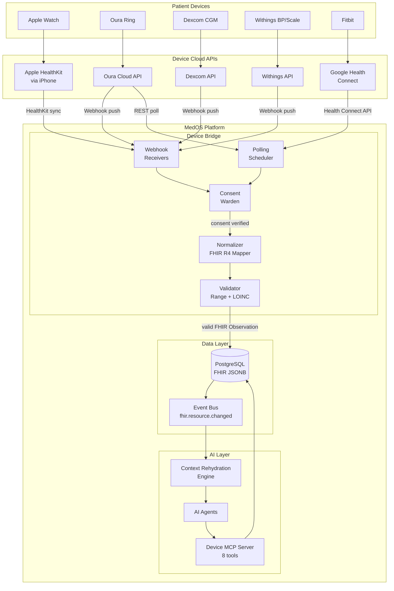
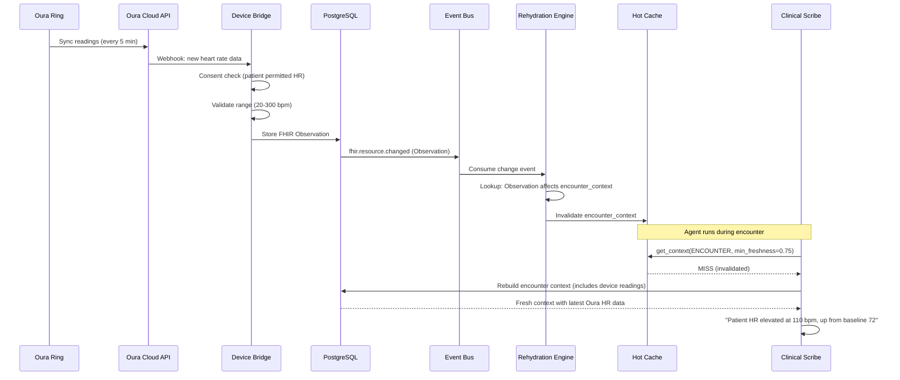

# ADR-007: Wearable and IoT Device Integration via FHIR Observation

## Status

**Accepted** -- 2026-02-28

## Context

MedOS targets mid-size specialty practices (5-30 providers) in Florida, initially orthopedics and dermatology. Patients at these practices increasingly use wearable health devices: Oura Ring for sleep and HRV, Apple Watch for heart rate and ECG, Fitbit for activity, Dexcom CGM for continuous glucose monitoring, Withings for blood pressure and weight.

This data is clinically valuable:

- **Orthopedics**: Post-surgical recovery tracking via activity levels, sleep quality, heart rate recovery. A patient recovering from knee replacement who suddenly drops from 5,000 steps/day to 500 warrants a clinical alert.
- **Dermatology**: UV exposure tracking, temperature monitoring for wound healing, sleep quality for patients on isotretinoin (mood/fatigue monitoring).
- **General**: Blood glucose trends for diabetic co-morbidities, blood pressure for hypertensive patients, SpO2 for post-surgical monitoring.

The [[HEALTHCARE_OS_MASTERPLAN]] Module F (Patient Engagement) mentions "Remote patient monitoring (BLE devices, Apple Health, Google Health Connect)" and Module H (Integration Layer) includes "Device Bridge" in the architecture diagram (see [[System-Architecture-Overview]]). However, there is currently zero architecture defining how device data flows into the system.

Our requirements are:

1. **FHIR-native** -- Device readings must be stored as standard FHIR R4 Observation resources with proper LOINC coding, consistent with [[ADR-001-fhir-native-data-model]].
2. **Multi-device** -- Support Apple Health, Google Health Connect, Oura, Dexcom, Withings, and Fitbit from day one. Extensible to new devices without code changes.
3. **Patient consent** -- Granular opt-in per device and per data type. Patients can share heart rate but not sleep data.
4. **Event-driven** -- New device readings must trigger the context rehydration pipeline (see [[ADR-006-patient-context-rehydration]]) so AI agents always have the latest data.
5. **Privacy** -- Device data is PHI under HIPAA. Same encryption, access control, and audit trail as all other clinical data.
6. **Volume** -- A single Oura Ring generates ~1,440 heart rate readings/day (1 per minute). At 1,000 patients with wearables, that is 1.4M observations/day. The system must handle this without degrading clinical workflows.

## Decision

**We will build a Device Bridge service that normalizes wearable/IoT data into FHIR R4 Observation resources, integrates with the existing FHIR data layer, and exposes device data to AI agents through a Device MCP Server. All device data follows the same golden source pattern as clinical data.**

### Architecture Overview



### FHIR Observation Data Model

All device readings are stored as FHIR R4 Observation resources with standardized LOINC codes. This ensures interoperability with external EHRs and consistency with existing clinical observations.

```python
from datetime import datetime
from typing import Any


# LOINC code mapping for common wearable measurements
DEVICE_LOINC_CODES: dict[str, dict[str, str]] = {
    "heart_rate": {
        "code": "8867-4",
        "display": "Heart rate",
        "system": "http://loinc.org",
        "unit": "/min",
        "ucum": "/min",
    },
    "heart_rate_variability": {
        "code": "80404-7",
        "display": "R-R interval.standard deviation (Heart rate variability)",
        "system": "http://loinc.org",
        "unit": "ms",
        "ucum": "ms",
    },
    "spo2": {
        "code": "2708-6",
        "display": "Oxygen saturation in Arterial blood",
        "system": "http://loinc.org",
        "unit": "%",
        "ucum": "%",
    },
    "steps": {
        "code": "55423-8",
        "display": "Number of steps in unspecified time Pedometer",
        "system": "http://loinc.org",
        "unit": "steps",
        "ucum": "{steps}",
    },
    "sleep_duration": {
        "code": "93832-4",
        "display": "Sleep duration",
        "system": "http://loinc.org",
        "unit": "h",
        "ucum": "h",
    },
    "body_temperature": {
        "code": "8310-5",
        "display": "Body temperature",
        "system": "http://loinc.org",
        "unit": "degC",
        "ucum": "Cel",
    },
    "blood_glucose": {
        "code": "15074-8",
        "display": "Glucose [Moles/volume] in Blood",
        "system": "http://loinc.org",
        "unit": "mg/dL",
        "ucum": "mg/dL",
    },
    "blood_pressure_systolic": {
        "code": "8480-6",
        "display": "Systolic blood pressure",
        "system": "http://loinc.org",
        "unit": "mmHg",
        "ucum": "mm[Hg]",
    },
    "blood_pressure_diastolic": {
        "code": "8462-4",
        "display": "Diastolic blood pressure",
        "system": "http://loinc.org",
        "unit": "mmHg",
        "ucum": "mm[Hg]",
    },
    "body_weight": {
        "code": "29463-7",
        "display": "Body weight",
        "system": "http://loinc.org",
        "unit": "kg",
        "ucum": "kg",
    },
    "respiratory_rate": {
        "code": "9279-1",
        "display": "Respiratory rate",
        "system": "http://loinc.org",
        "unit": "/min",
        "ucum": "/min",
    },
    "ecg_lead_i": {
        "code": "131389-4",
        "display": "ECG Mean heart rate Lead I",
        "system": "http://loinc.org",
        "unit": "/min",
        "ucum": "/min",
    },
}


def build_device_observation(
    patient_id: str,
    device_id: str,
    measurement_type: str,
    value: float,
    effective_datetime: datetime,
    device_name: str,
    device_source: str,
    tenant_id: str,
) -> dict[str, Any]:
    """Build a FHIR R4 Observation resource from a device reading.

    Args:
        patient_id: FHIR Patient resource ID.
        device_id: FHIR Device resource ID.
        measurement_type: Key from DEVICE_LOINC_CODES (e.g., "heart_rate").
        value: Numeric measurement value.
        effective_datetime: When the measurement was taken.
        device_name: Human-readable device name (e.g., "Oura Ring Gen 3").
        device_source: Source platform (e.g., "oura", "apple_health", "dexcom").
        tenant_id: Tenant ID for multi-tenancy.

    Returns:
        A valid FHIR R4 Observation resource as a dict.
    """
    loinc = DEVICE_LOINC_CODES[measurement_type]

    return {
        "resourceType": "Observation",
        "status": "final",
        "category": [
            {
                "coding": [
                    {
                        "system": "http://terminology.hl7.org/CodeSystem/observation-category",
                        "code": "vital-signs",
                        "display": "Vital Signs",
                    }
                ]
            },
            {
                "coding": [
                    {
                        "system": "http://medos.health/CodeSystem/observation-source",
                        "code": "device-generated",
                        "display": "Device Generated",
                    }
                ]
            },
        ],
        "code": {
            "coding": [
                {
                    "system": loinc["system"],
                    "code": loinc["code"],
                    "display": loinc["display"],
                }
            ],
            "text": loinc["display"],
        },
        "subject": {"reference": f"Patient/{patient_id}"},
        "effectiveDateTime": effective_datetime.isoformat(),
        "valueQuantity": {
            "value": value,
            "unit": loinc["unit"],
            "system": "http://unitsofmeasure.org",
            "code": loinc["ucum"],
        },
        "device": {"reference": f"Device/{device_id}"},
        "extension": [
            {
                "url": "http://medos.health/StructureDefinition/device-source",
                "valueString": device_source,
            },
            {
                "url": "http://medos.health/StructureDefinition/device-name",
                "valueString": device_name,
            },
        ],
        "meta": {
            "tag": [
                {
                    "system": "http://medos.health/CodeSystem/tenant",
                    "code": tenant_id,
                }
            ],
        },
    }
```

### FHIR Device Resource

Each patient's connected device is registered as a FHIR Device resource:

```python
def build_device_resource(
    patient_id: str,
    device_type: str,
    manufacturer: str,
    model: str,
    serial_number: str | None = None,
) -> dict[str, Any]:
    """Build a FHIR R4 Device resource for a wearable device.

    Example:
        build_device_resource(
            patient_id="patient-123",
            device_type="oura_ring",
            manufacturer="Oura",
            model="Oura Ring Gen 3",
            serial_number=None,  # Patient may not provide
        )
    """
    device_type_codes = {
        "oura_ring": {"code": "467178001", "display": "Wearable patient monitoring device"},
        "apple_watch": {"code": "467178001", "display": "Wearable patient monitoring device"},
        "fitbit": {"code": "467178001", "display": "Wearable patient monitoring device"},
        "dexcom_cgm": {"code": "258158006", "display": "Continuous glucose monitor"},
        "withings_bp": {"code": "258057004", "display": "Blood pressure monitor"},
        "withings_scale": {"code": "258087007", "display": "Weighing scale"},
    }

    type_info = device_type_codes.get(device_type, device_type_codes["oura_ring"])

    resource: dict[str, Any] = {
        "resourceType": "Device",
        "status": "active",
        "type": {
            "coding": [
                {
                    "system": "http://snomed.info/sct",
                    "code": type_info["code"],
                    "display": type_info["display"],
                }
            ],
        },
        "manufacturer": manufacturer,
        "modelNumber": model,
        "patient": {"reference": f"Patient/{patient_id}"},
    }

    if serial_number:
        resource["serialNumber"] = serial_number

    return resource
```

### Consent Model

Patient consent is granular: per device and per data type. Stored as FHIR Consent resources:

```python
from enum import Enum


class DeviceDataType(str, Enum):
    """Data types patients can individually consent to share."""
    HEART_RATE = "heart_rate"
    HRV = "heart_rate_variability"
    SPO2 = "spo2"
    STEPS = "steps"
    SLEEP = "sleep_duration"
    TEMPERATURE = "body_temperature"
    BLOOD_GLUCOSE = "blood_glucose"
    BLOOD_PRESSURE = "blood_pressure"
    BODY_WEIGHT = "body_weight"
    RESPIRATORY_RATE = "respiratory_rate"
    ECG = "ecg_lead_i"


def build_device_consent(
    patient_id: str,
    device_id: str,
    permitted_data_types: list[DeviceDataType],
    denied_data_types: list[DeviceDataType],
) -> dict[str, Any]:
    """Build a FHIR R4 Consent resource for device data sharing.

    The patient explicitly opts in to each data type. Data types not in
    permitted_data_types are denied by default.
    """
    provisions = []

    for dt in permitted_data_types:
        loinc = DEVICE_LOINC_CODES[dt.value]
        provisions.append({
            "type": "permit",
            "code": [
                {
                    "coding": [
                        {
                            "system": loinc["system"],
                            "code": loinc["code"],
                            "display": loinc["display"],
                        }
                    ]
                }
            ],
            "actor": [
                {
                    "role": {
                        "coding": [
                            {
                                "system": "http://terminology.hl7.org/CodeSystem/v3-ParticipationType",
                                "code": "CST",
                                "display": "Custodian",
                            }
                        ]
                    },
                    "reference": {"reference": f"Device/{device_id}"},
                }
            ],
        })

    for dt in denied_data_types:
        loinc = DEVICE_LOINC_CODES[dt.value]
        provisions.append({
            "type": "deny",
            "code": [
                {
                    "coding": [
                        {
                            "system": loinc["system"],
                            "code": loinc["code"],
                            "display": loinc["display"],
                        }
                    ]
                }
            ],
        })

    return {
        "resourceType": "Consent",
        "status": "active",
        "scope": {
            "coding": [
                {
                    "system": "http://terminology.hl7.org/CodeSystem/consentscope",
                    "code": "patient-privacy",
                    "display": "Privacy Consent",
                }
            ]
        },
        "category": [
            {
                "coding": [
                    {
                        "system": "http://medos.health/CodeSystem/consent-category",
                        "code": "device-data-sharing",
                        "display": "Wearable Device Data Sharing",
                    }
                ]
            }
        ],
        "patient": {"reference": f"Patient/{patient_id}"},
        "dateTime": datetime.now().isoformat(),
        "provision": {
            "type": "deny",  # Default: deny all unless explicitly permitted
            "provision": provisions,
        },
    }


class ConsentWarden:
    """Enforces patient consent for device data.

    Called before every device reading is persisted. Drops readings for
    data types the patient has not consented to.
    """

    async def check_consent(
        self,
        tenant_id: str,
        patient_id: str,
        device_id: str,
        data_type: DeviceDataType,
        db: "AsyncSession",
    ) -> bool:
        """Check if patient has consented to this specific data type from this device.

        Returns True if permitted, False if denied or no consent exists.
        """
        from sqlalchemy import text

        result = await db.execute(text("""
            SELECT resource FROM fhir_resources_current
            WHERE tenant_id = :tenant_id
              AND resource_type = 'Consent'
              AND resource->'patient'->>'reference' = :patient_ref
              AND resource->>'status' = 'active'
              AND resource @> :filter
            LIMIT 1
        """), {
            "tenant_id": tenant_id,
            "patient_ref": f"Patient/{patient_id}",
            "filter": json.dumps({
                "category": [{"coding": [{"code": "device-data-sharing"}]}]
            }),
        })

        row = result.fetchone()
        if row is None:
            return False  # No consent = deny

        consent = row.resource
        loinc = DEVICE_LOINC_CODES[data_type.value]

        # Check provisions for explicit permit
        provisions = consent.get("provision", {}).get("provision", [])
        for p in provisions:
            codes = p.get("code", [])
            for code_block in codes:
                for coding in code_block.get("coding", []):
                    if coding.get("code") == loinc["code"]:
                        return p.get("type") == "permit"

        return False  # Default deny
```

### Device Bridge: Integration Adapters

Each device platform gets a dedicated adapter that handles authentication, data retrieval, and normalization:

```python
from abc import ABC, abstractmethod
from dataclasses import dataclass


@dataclass
class DeviceReading:
    """Normalized device reading before FHIR conversion."""
    measurement_type: str       # Key in DEVICE_LOINC_CODES
    value: float
    effective_datetime: datetime
    device_source: str          # "oura", "apple_health", "dexcom", etc.
    device_name: str
    raw_payload: dict           # Original API response (for debugging)


class DeviceAdapter(ABC):
    """Abstract base for device platform integrations."""

    @abstractmethod
    async def authenticate(self, patient_id: str) -> str:
        """Exchange patient-authorized code for access token.

        Returns access token. Token storage is handled by the bridge.
        """
        ...

    @abstractmethod
    async def fetch_readings(
        self, access_token: str, since: datetime
    ) -> list[DeviceReading]:
        """Fetch new readings since the given timestamp."""
        ...

    @abstractmethod
    async def register_webhook(self, callback_url: str, access_token: str) -> str:
        """Register a webhook for push-based data delivery.

        Returns webhook subscription ID.
        """
        ...

    @abstractmethod
    async def revoke_access(self, access_token: str) -> None:
        """Revoke device access when patient disconnects."""
        ...


class OuraAdapter(DeviceAdapter):
    """Oura Ring Cloud API integration.

    Oura supports both webhook push and REST polling.
    API docs: https://cloud.ouraring.com/v2/docs
    """

    BASE_URL = "https://api.ouraring.com/v2"

    async def authenticate(self, patient_id: str) -> str:
        # OAuth2 authorization code flow
        # Patient authorizes MedOS on oura.com, redirect back with code
        # Exchange code for access_token + refresh_token
        # Store tokens in AWS Secrets Manager (per-patient, per-device)
        ...

    async def fetch_readings(
        self, access_token: str, since: datetime
    ) -> list[DeviceReading]:
        """Fetch heart rate, HRV, SpO2, sleep, temperature from Oura API."""
        import httpx

        readings: list[DeviceReading] = []
        headers = {"Authorization": f"Bearer {access_token}"}
        start_date = since.strftime("%Y-%m-%d")

        async with httpx.AsyncClient() as client:
            # Heart rate (5-minute intervals)
            resp = await client.get(
                f"{self.BASE_URL}/usercollection/heartrate",
                headers=headers,
                params={"start_date": start_date},
            )
            if resp.status_code == 200:
                for item in resp.json().get("data", []):
                    readings.append(DeviceReading(
                        measurement_type="heart_rate",
                        value=item["bpm"],
                        effective_datetime=datetime.fromisoformat(item["timestamp"]),
                        device_source="oura",
                        device_name="Oura Ring",
                        raw_payload=item,
                    ))

            # Sleep duration
            resp = await client.get(
                f"{self.BASE_URL}/usercollection/sleep",
                headers=headers,
                params={"start_date": start_date},
            )
            if resp.status_code == 200:
                for item in resp.json().get("data", []):
                    total_seconds = item.get("total_sleep_duration", 0)
                    readings.append(DeviceReading(
                        measurement_type="sleep_duration",
                        value=round(total_seconds / 3600, 2),
                        effective_datetime=datetime.fromisoformat(item["bedtime_start"]),
                        device_source="oura",
                        device_name="Oura Ring",
                        raw_payload=item,
                    ))

            # HRV (nightly average)
            resp = await client.get(
                f"{self.BASE_URL}/usercollection/daily_readiness",
                headers=headers,
                params={"start_date": start_date},
            )
            if resp.status_code == 200:
                for item in resp.json().get("data", []):
                    if "heart_rate_variability" in item.get("contributors", {}):
                        readings.append(DeviceReading(
                            measurement_type="heart_rate_variability",
                            value=item["contributors"]["heart_rate_variability"],
                            effective_datetime=datetime.fromisoformat(item["day"] + "T06:00:00"),
                            device_source="oura",
                            device_name="Oura Ring",
                            raw_payload=item,
                        ))

        return readings

    async def register_webhook(self, callback_url: str, access_token: str) -> str:
        ...

    async def revoke_access(self, access_token: str) -> None:
        ...


class DexcomAdapter(DeviceAdapter):
    """Dexcom CGM API integration for continuous glucose monitoring.

    Dexcom provides real-time glucose readings every 5 minutes.
    API docs: https://developer.dexcom.com/
    """

    BASE_URL = "https://api.dexcom.com/v3"

    async def authenticate(self, patient_id: str) -> str:
        ...

    async def fetch_readings(
        self, access_token: str, since: datetime
    ) -> list[DeviceReading]:
        """Fetch glucose readings from Dexcom API."""
        import httpx

        readings: list[DeviceReading] = []
        headers = {"Authorization": f"Bearer {access_token}"}

        async with httpx.AsyncClient() as client:
            resp = await client.get(
                f"{self.BASE_URL}/users/self/egvs",
                headers=headers,
                params={
                    "startDate": since.strftime("%Y-%m-%dT%H:%M:%S"),
                    "endDate": datetime.now().strftime("%Y-%m-%dT%H:%M:%S"),
                },
            )
            if resp.status_code == 200:
                for item in resp.json().get("egvs", []):
                    readings.append(DeviceReading(
                        measurement_type="blood_glucose",
                        value=item["value"],  # mg/dL
                        effective_datetime=datetime.fromisoformat(
                            item["systemTime"]
                        ),
                        device_source="dexcom",
                        device_name="Dexcom G7",
                        raw_payload=item,
                    ))

        return readings

    async def register_webhook(self, callback_url: str, access_token: str) -> str:
        ...

    async def revoke_access(self, access_token: str) -> None:
        ...
```

### Device Bridge Pipeline

The bridge orchestrates the flow from raw device data to FHIR resources:

```python
class DeviceBridge:
    """Orchestrates device data ingestion from raw readings to FHIR Observations.

    Pipeline: Authenticate -> Fetch -> Consent Check -> Normalize -> Validate -> Store -> Event
    """

    def __init__(
        self,
        adapters: dict[str, DeviceAdapter],
        consent_warden: ConsentWarden,
        db: "AsyncSession",
        event_bus: "redis.Redis",
    ):
        self.adapters = adapters  # {"oura": OuraAdapter(), "dexcom": DexcomAdapter(), ...}
        self.consent_warden = consent_warden
        self.db = db
        self.event_bus = event_bus

    async def ingest_readings(
        self,
        tenant_id: str,
        patient_id: str,
        device_source: str,
        readings: list[DeviceReading],
    ) -> dict[str, int]:
        """Process a batch of device readings through the pipeline.

        Returns:
            {"accepted": N, "denied_consent": N, "invalid": N}
        """
        stats = {"accepted": 0, "denied_consent": 0, "invalid": 0}

        # Resolve device_id (or create Device resource if first use)
        device_id = await self._resolve_or_create_device(
            tenant_id, patient_id, device_source, readings[0].device_name,
        )

        for reading in readings:
            # Step 1: Consent check
            data_type = DeviceDataType(reading.measurement_type)
            consented = await self.consent_warden.check_consent(
                tenant_id, patient_id, device_id, data_type, self.db,
            )
            if not consented:
                stats["denied_consent"] += 1
                continue

            # Step 2: Validate measurement range
            if not self._validate_range(reading):
                stats["invalid"] += 1
                continue

            # Step 3: Build FHIR Observation
            observation = build_device_observation(
                patient_id=patient_id,
                device_id=device_id,
                measurement_type=reading.measurement_type,
                value=reading.value,
                effective_datetime=reading.effective_datetime,
                device_name=reading.device_name,
                device_source=reading.device_source,
                tenant_id=tenant_id,
            )

            # Step 4: Store in PostgreSQL (golden source)
            resource_id = await self._store_observation(tenant_id, observation)

            # Step 5: Publish change event (triggers context rehydration)
            await self.event_bus.xadd(
                f"fhir:changes:{tenant_id}",
                {
                    "event_type": "fhir.resource.changed",
                    "resource_type": "Observation",
                    "resource_id": resource_id,
                    "patient_id": patient_id,
                    "change_type": "create",
                    "source": f"device:{device_source}",
                },
            )

            stats["accepted"] += 1

        return stats

    @staticmethod
    def _validate_range(reading: DeviceReading) -> bool:
        """Validate device reading is within physiologically plausible range.

        Rejects clearly erroneous readings (sensor malfunction, transmission errors).
        """
        VALID_RANGES: dict[str, tuple[float, float]] = {
            "heart_rate": (20, 300),
            "heart_rate_variability": (1, 500),
            "spo2": (50, 100),
            "steps": (0, 100_000),
            "sleep_duration": (0, 24),
            "body_temperature": (30, 45),        # Celsius
            "blood_glucose": (20, 600),           # mg/dL
            "blood_pressure_systolic": (50, 300), # mmHg
            "blood_pressure_diastolic": (20, 200),
            "body_weight": (1, 500),              # kg
            "respiratory_rate": (4, 60),
        }

        valid_range = VALID_RANGES.get(reading.measurement_type)
        if valid_range is None:
            return True  # Unknown type passes validation (handled by FHIR validator)

        return valid_range[0] <= reading.value <= valid_range[1]

    async def _resolve_or_create_device(
        self, tenant_id: str, patient_id: str, device_source: str, device_name: str,
    ) -> str:
        """Find existing Device resource or create one."""
        ...

    async def _store_observation(self, tenant_id: str, observation: dict) -> str:
        """Store FHIR Observation in PostgreSQL. Returns resource_id."""
        ...
```

### Device MCP Server

AI agents access device data through a dedicated MCP server with 8 tools:

```python
from medos.mcp.base import HIPAAFastMCP


device_mcp = HIPAAFastMCP("device")


@device_mcp.tool()
async def device_list_connected(
    patient_id: str,
    tenant_id: str,
) -> list[dict]:
    """List all connected devices for a patient.

    Returns Device resources with connection status and last sync time.
    """
    ...


@device_mcp.tool()
async def device_get_latest_readings(
    patient_id: str,
    measurement_type: str,
    count: int = 10,
    tenant_id: str = "",
) -> list[dict]:
    """Get the N most recent readings for a measurement type.

    Args:
        patient_id: FHIR Patient ID.
        measurement_type: One of DEVICE_LOINC_CODES keys.
        count: Number of recent readings to return (default 10).
    """
    ...


@device_mcp.tool()
async def device_get_readings_range(
    patient_id: str,
    measurement_type: str,
    start_date: str,
    end_date: str,
    tenant_id: str = "",
) -> list[dict]:
    """Get device readings within a date range.

    Used for trend analysis and longitudinal views.
    """
    ...


@device_mcp.tool()
async def device_get_daily_summary(
    patient_id: str,
    date: str,
    tenant_id: str = "",
) -> dict:
    """Get aggregated daily summary of all device readings.

    Returns min, max, mean, count for each measurement type
    that has data on the given date.
    """
    ...


@device_mcp.tool()
async def device_detect_anomalies(
    patient_id: str,
    measurement_type: str,
    lookback_days: int = 7,
    tenant_id: str = "",
) -> list[dict]:
    """Detect anomalous readings based on patient's baseline.

    Uses statistical outlier detection (> 2 standard deviations from
    the patient's rolling 7-day mean) to flag unusual readings.
    Useful for post-surgical monitoring and chronic disease management.
    """
    ...


@device_mcp.tool()
async def device_get_consent_status(
    patient_id: str,
    tenant_id: str = "",
) -> dict:
    """Get the patient's current device data sharing consent status.

    Returns per-device, per-data-type consent status.
    """
    ...


@device_mcp.tool()
async def device_update_consent(
    patient_id: str,
    device_id: str,
    permitted_types: list[str],
    denied_types: list[str],
    tenant_id: str = "",
) -> dict:
    """Update patient's device data sharing consent.

    Creates a new FHIR Consent resource. Previous consent is superseded.
    Must be initiated by the patient (not the provider).
    """
    ...


@device_mcp.tool()
async def device_disconnect(
    patient_id: str,
    device_id: str,
    tenant_id: str = "",
) -> dict:
    """Disconnect a device and revoke data access.

    Revokes the OAuth token with the device cloud API,
    deactivates the Device resource, and preserves historical data
    (historical Observations are NOT deleted -- they are part of the clinical record).
    """
    ...
```

### Data Volume Management

At scale (1,000+ patients with wearables), device data volume requires specific strategies:

```sql
-- Partition device observations by month for efficient querying and archival
CREATE TABLE fhir_observations_device (
    LIKE fhir_resources INCLUDING ALL
) PARTITION BY RANGE (ts);

-- Monthly partitions (auto-created by maintenance job)
CREATE TABLE fhir_observations_device_2026_03
    PARTITION OF fhir_observations_device
    FOR VALUES FROM ('2026-03-01') TO ('2026-04-01');

-- Optimized index for device observation queries
CREATE INDEX idx_device_obs_patient_type_time
    ON fhir_observations_device (
        tenant_id,
        patient_id,
        resource->'code'->'coding'->0->>'code',  -- LOINC code
        ts DESC
    );

-- Daily aggregation materialized view (reduces query load for dashboards)
CREATE MATERIALIZED VIEW device_daily_aggregates AS
SELECT
    tenant_id,
    (resource->'subject'->>'reference') AS patient_ref,
    (resource->'code'->'coding'->0->>'code') AS loinc_code,
    (resource->'code'->'coding'->0->>'display') AS measurement_name,
    DATE(ts) AS measurement_date,
    COUNT(*) AS reading_count,
    MIN((resource->'valueQuantity'->>'value')::numeric) AS min_value,
    MAX((resource->'valueQuantity'->>'value')::numeric) AS max_value,
    AVG((resource->'valueQuantity'->>'value')::numeric) AS avg_value,
    STDDEV((resource->'valueQuantity'->>'value')::numeric) AS stddev_value
FROM fhir_observations_device
WHERE resource->'category' @> '[{"coding": [{"code": "device-generated"}]}]'
GROUP BY tenant_id, patient_ref, loinc_code, measurement_name, measurement_date;

-- Refresh daily at 2 AM UTC
-- (handled by pg_cron or application-level scheduler)
```

### Integration with Context Rehydration

Device data feeds directly into the context rehydration system (see [[ADR-006-patient-context-rehydration]]). The `CONTEXT_DEPENDENCY_GRAPH` already includes `Device` and `Observation` as dependencies for `encounter_context` and `longitudinal_context`. When a device reading is stored:



### Disconnect and Data Retention

When a patient disconnects a device:

1. OAuth token is revoked with the device cloud API.
2. FHIR Device resource status is set to "inactive".
3. FHIR Consent resource status is set to "inactive".
4. **Historical Observation data is NOT deleted.** Device readings that were part of clinical encounters are part of the medical record and must be retained per HIPAA (minimum 6 years). The patient's right to disconnect is about stopping future data collection, not erasing historical clinical data.

## Consequences

### Positive

- **FHIR-native** -- Device data is stored as standard Observation resources, queryable with the same FHIR search API and consumable by the same AI agents as lab results and vitals recorded by clinicians. No special-case code for "device data" vs "clinical data."
- **Granular consent** -- Patients control exactly which data types they share. This exceeds HIPAA minimum requirements and builds trust. The FHIR Consent model is interoperable with other systems that support consent management.
- **Event-driven freshness** -- New device readings automatically trigger context rehydration (via [[ADR-006-patient-context-rehydration]]), ensuring AI agents always have the latest wearable data during active encounters.
- **Clinical value** -- Post-surgical monitoring (orthopedics), chronic disease management (diabetes, hypertension), and treatment response tracking (dermatology) are all immediately enabled by structured device data in the clinical record.
- **Extensibility** -- Adding a new device platform requires only a new `DeviceAdapter` implementation. No schema changes, no API changes, no frontend changes. The FHIR Observation model and LOINC coding are universal.

### Negative

- **Volume management** -- Device data generates 10-100x more Observations than clinical data. At 1,000 patients with 3 devices each generating readings every 5 minutes, that is 864,000 Observations/day. Mitigation: monthly partitioning, daily aggregation materialized views, and configurable data retention policies.
- **API rate limits** -- Each device cloud API has rate limits (Oura: 5,000 req/day, Dexcom: varies by partner tier). Mitigation: webhook-based push where available (Oura, Dexcom, Withings), polling only for APIs that require it (Google Health Connect), and per-patient sync scheduling to distribute API calls.
- **Data quality** -- Consumer wearables have lower accuracy than medical devices. An Oura Ring heart rate is less reliable than a hospital telemetry monitor. Mitigation: all device observations are tagged with `device-generated` category to distinguish them from clinical measurements. AI agents are trained to weight device data appropriately (informational, not diagnostic).
- **OAuth token management** -- Each patient-device connection requires OAuth tokens that expire and must be refreshed. Mitigation: token storage in AWS Secrets Manager with automatic refresh logic in each adapter.

### Risks

- **API deprecation** -- Device manufacturers may change or deprecate their APIs. Oura is currently on v2, Dexcom on v3. Mitigation: the adapter pattern isolates API-specific code. API changes affect only the specific adapter, not the bridge or downstream consumers.
- **Patient abandonment** -- Patients may connect devices enthusiastically but stop wearing them after weeks. Stale device data (e.g., last reading 30 days ago) should not be presented as current. Mitigation: freshness scoring on device readings; readings older than 7 days are flagged as "historical" in agent context.
- **Regulatory uncertainty** -- The FDA's regulation of consumer wearable data in clinical settings is evolving. Some wearable-derived metrics (e.g., Apple Watch ECG) have FDA clearance; others (e.g., Oura temperature trends) do not. Mitigation: clearly categorize device readings as "patient-generated data" (not diagnostic) in all clinical documentation and AI agent prompts.

## Alternatives Considered

### 1. Direct HealthKit/Health Connect Integration Only (No Cloud APIs)

Require patients to sync via iPhone (HealthKit) or Android (Health Connect), bypassing device-specific cloud APIs.

- **Rejected because**: This would require a MedOS mobile app for data sync. We are a web-first platform in Phase 1. Additionally, some devices (Dexcom, Withings) provide richer data through their cloud APIs than through HealthKit aggregation.

### 2. Third-Party Device Aggregator (Validic, Human API)

Use a middleware service that aggregates data from multiple device platforms.

- **Rejected because**: HIPAA compliance responsibility becomes complex with a third-party data aggregator in the chain. Each aggregator becomes a Business Associate requiring BAA. We also lose control over data freshness, consent enforcement, and cost. Direct cloud API integration is more work initially but gives us full control. The adapter pattern makes adding new devices manageable.

### 3. Store Device Data Outside FHIR (Separate Time-Series Database)

Use InfluxDB or TimescaleDB for high-volume device data, separate from the FHIR store.

- **Rejected because**: This creates a second source of truth for clinical data. AI agents would need to query two data stores to assemble patient context. The complexity of keeping FHIR and time-series stores in sync is not justified when PostgreSQL partitioning and materialized views can handle our volume (1M+ readings/day is well within PostgreSQL's capability with proper partitioning).

### 4. FHIR Bulk Data Import (Batch Only)

Import device data as nightly batch FHIR $import operations.

- **Rejected because**: A 24-hour delay on device data eliminates most clinical value. A patient's heart rate spike during a post-surgical recovery is relevant now, not tomorrow. Event-driven ingestion with sub-minute latency (via webhooks) is necessary for clinical utility.

## References

- [[HEALTHCARE_OS_MASTERPLAN]] -- Module F (Patient Engagement) and Module H (Integrations)
- [[ADR-001-fhir-native-data-model]] -- FHIR JSONB storage model for Observations
- [[ADR-002-multi-tenancy-schema-per-tenant]] -- Tenant isolation for device data
- [[ADR-006-patient-context-rehydration]] -- Context refresh when device readings arrive
- [[Patient-Engagement-Patterns]] -- RPM, remote monitoring, patient digital experience
- [[System-Architecture-Overview]] -- Integration architecture and Device Bridge placement
- [[FHIR-R4-Deep-Dive]] -- Observation, Device, and Consent resource specifications
- [[HIPAA-Deep-Dive]] -- PHI handling, consent, and data retention requirements
- [Apple HealthKit API](https://developer.apple.com/documentation/healthkit)
- [Google Health Connect](https://developer.android.com/health-and-fitness/guides/health-connect)
- [Oura Cloud API v2](https://cloud.ouraring.com/v2/docs)
- [Dexcom Developer API](https://developer.dexcom.com/)
- [LOINC Codes](https://loinc.org/)
