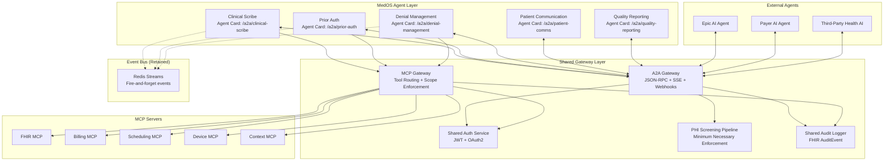
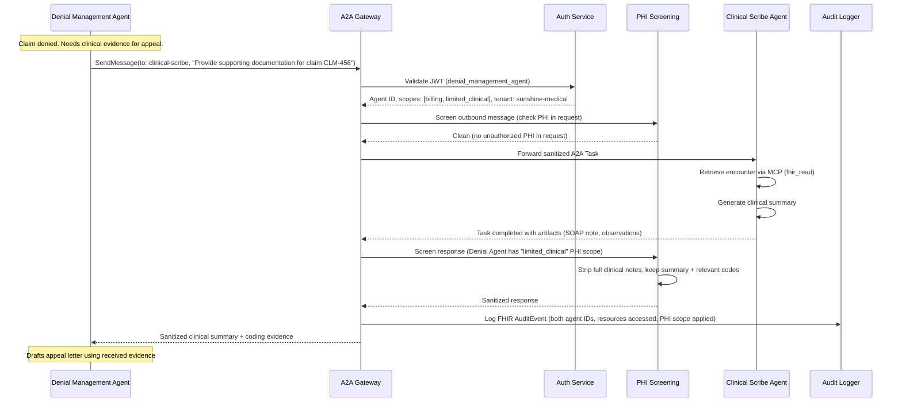

# ADR-008: Adopt A2A Protocol for Inter-Agent Communication

Related: [[ADR-003-ai-agent-framework]] | [[ADR-005-mcp-sdk-integration]] | [[agent-architecture]] | [[mcp-integration-plan]] | [[HEALTHCARE_OS_MASTERPLAN]]

---

## Status

**Accepted** -- 2026-02-28

---

## Context

MedOS has 5 AI agents (Clinical Scribe, Prior Auth, Denial Management, Patient Communication, Quality Reporting) that need to communicate with each other. Currently, inter-agent communication uses a custom event bus (Redis Streams) with an `AgentEvent` model defined in [[agent-architecture]].

This approach has limitations:

1. **No standard protocol** -- our event format is proprietary, making it impossible for external agents to participate
2. **Fire-and-forget only** -- Redis Streams events have no built-in acknowledgment, status tracking, or retry semantics
3. **No multi-turn interaction** -- if Agent A asks Agent B for information and Agent B needs clarification, there is no mechanism for back-and-forth
4. **No capability discovery** -- agents are hardcoded to know about each other; adding a new agent requires updating all existing agents
5. **No external interoperability** -- third-party AI agents (from EHR vendors, payers, health tech companies) cannot connect to MedOS agents

Google's Agent-to-Agent (A2A) Protocol, announced in 2025 and donated to the Linux Foundation, solves all of these problems. A2A is rapidly becoming the industry standard for agent-to-agent communication, with 50+ technology partners including Salesforce, SAP, ServiceNow, LangChain, and major consulting firms.

### Considered Alternatives

| Option | Pros | Cons |
|--------|------|------|
| **Keep Redis Streams event bus** | Simple, already implemented, fast | No standard, no multi-turn, no external interop |
| **Custom REST APIs between agents** | Familiar HTTP patterns | O(N^2) integration complexity, no discovery, no standard |
| **gRPC between agents** | Fast, typed, streaming | No discovery, tight coupling, no external standard |
| **Agent Communication Protocol (ACP)** | IBM-backed alternative to A2A | Smaller ecosystem, less enterprise adoption |
| **A2A Protocol** | Industry standard, agent discovery, multi-turn tasks, streaming, push notifications, opaque execution, 50+ partners | Newer protocol, must implement gateway |

---

## Decision

**Adopt A2A as the inter-agent communication protocol for MedOS.** MCP handles tool/data access (agent -> tools). A2A handles agent-to-agent messaging (agent <-> agent). Both protocols flow through a shared gateway for security enforcement.

### Specific Decisions

1. **MCP = tool access, A2A = agent communication.** These protocols are complementary, not competing. An agent uses MCP to read FHIR data and A2A to ask another agent for analysis.

2. **All A2A messages flow through the A2A Gateway.** The gateway handles authentication (JWT), authorization (PHI scopes), PHI screening, tenant isolation, audit logging, and rate limiting. No direct agent-to-agent communication bypasses the gateway.

3. **A2A Gateway shares infrastructure with MCP Gateway.** Both gateways use the same auth service, audit logging, and PHI screening pipeline. This avoids duplication and ensures consistent security enforcement.

4. **Department agents communicate via A2A Tasks, not direct function calls.** When the Billing Agent needs ICD-10 codes from the Clinical Scribe Agent, it creates an A2A Task. This provides status tracking, retry semantics, and audit trail.

5. **The event bus (Redis Streams) remains for fire-and-forget notifications.** Events like `metric.updated`, `audit.logged`, and `cache.invalidated` stay on the event bus. A2A replaces the event bus for workflows requiring acknowledgment or multi-turn interaction.

6. **Every MedOS agent exposes an A2A Agent Card.** Agent Cards are the discovery mechanism. External agents find MedOS agents via `/.well-known/agent.json` and per-agent endpoints.

7. **External agent marketplace via A2A Agent Cards.** Third-party healthcare AI agents (from EHR vendors, payers, health tech companies) connect to MedOS through A2A. This is the foundation of the healthcare AI marketplace described in [[HEALTHCARE_OS_MASTERPLAN]].

8. **PHI screening is mandatory for all A2A messages.** Unlike internal MCP calls (where PHI scope is enforced per-tool), A2A messages can contain arbitrary content. The A2A Gateway must scan all messages for PHI and enforce minimum necessary principle based on the receiving agent's PHI access level.

### Architecture

### A2A Message Flow Example: Denial Agent Requests Documentation

---

## Consequences

### Positive

1. **Industry-standard interoperability** -- MedOS agents can communicate with any A2A-compliant agent from any vendor
2. **Multi-turn agent conversations** -- A2A Tasks support `input-required` state, enabling back-and-forth between agents when more information is needed
3. **Task lifecycle management** -- Every inter-agent interaction has clear states (submitted, working, completed, failed, canceled) with audit trails
4. **External agent marketplace** -- Third-party healthcare AI agents can discover and connect to MedOS via Agent Cards, enabling the platform/marketplace vision
5. **Streaming for long-running tasks** -- SSE support means agents can stream incremental results (e.g., transcription progress) without polling
6. **Push notifications for async workflows** -- Prior Auth status updates (which can take days) are delivered via webhooks instead of polling
7. **Opaque execution** -- Agents remain black boxes to each other, preserving proprietary logic and simplifying security
8. **HIPAA compliance path** -- PHI screening at the gateway level ensures minimum necessary principle across all inter-agent communication

### Negative

1. **Additional infrastructure** -- A2A Gateway must be built and maintained alongside MCP Gateway (mitigated by shared auth/audit infrastructure)
2. **Protocol complexity** -- A2A adds JSON-RPC, SSE, and webhook handling to the stack (mitigated by using the `a2a-sdk` Python package)
3. **Migration effort** -- Existing event bus flows need to be evaluated for migration to A2A (mitigated by keeping event bus for fire-and-forget; only migrate workflows that need acknowledgment)
4. **Protocol maturity** -- A2A is relatively new (2025), though backed by Google and 50+ partners with Linux Foundation governance

### Neutral

1. **Event bus remains** -- Redis Streams event bus is retained for fire-and-forget notifications. This is not a full replacement but a complementary addition.
2. **Agent Cards already exist** -- MedOS already has `/.well-known/agent.json`. This ADR formalizes and expands Agent Card compliance to full A2A spec.
3. **Dependencies** -- `a2a-sdk` (pip install a2a-sdk) and `fasta2a` (pip install fasta2a) are added as production dependencies.

---

## Implementation Plan

### Phase 1: Internal A2A (Sprint 3-4)
- Build A2A Gateway (shared infrastructure with MCP Gateway)
- Update Agent Cards to full A2A compliance
- Implement Denial Agent <-> Clinical Scribe A2A communication
- Implement Prior Auth Agent <-> Clinical Scribe A2A communication
- Add PHI screening to A2A messages

### Phase 2: Advanced A2A (Sprint 5-6)
- SSE streaming for Clinical Scribe long-running tasks
- Push notifications for Prior Auth status updates
- Full A2A task history and replay for audit
- Context ID mapping to clinical workflows
- Migrate remaining event bus workflows to A2A where appropriate

### Phase 3: External A2A (Month 12+)
- Public Agent Cards for external discovery
- OAuth2 client credentials for third-party agents
- Third-party EHR agent integration (Epic, Cerner) via A2A
- Healthcare AI marketplace via A2A Agent Cards
- A2A federation across MedOS instances

---

## References

- [A2A Protocol Specification](https://a2a-protocol.org/latest/)
- [A2A GitHub Repository](https://github.com/a2aproject/A2A)
- [Google Blog: A2A Announcement](https://developers.googleblog.com/en/a2a-a-new-era-of-agent-interoperability/)
- [Pydantic AI A2A Integration](https://ai.pydantic.dev/a2a/)
- [IBM A2A Analysis](https://www.ibm.com/think/topics/agent2agent-protocol)
- [[a2a-protocol-reference]] -- Full protocol reference for MedOS
- [[agent-architecture]] -- Agent framework consuming A2A
- [[mcp-integration-plan]] -- MCP protocol (complement to A2A)
- [[ADR-003-ai-agent-framework]] -- LangGraph + Claude decision
- [[ADR-005-mcp-sdk-integration]] -- MCP SDK integration decision
