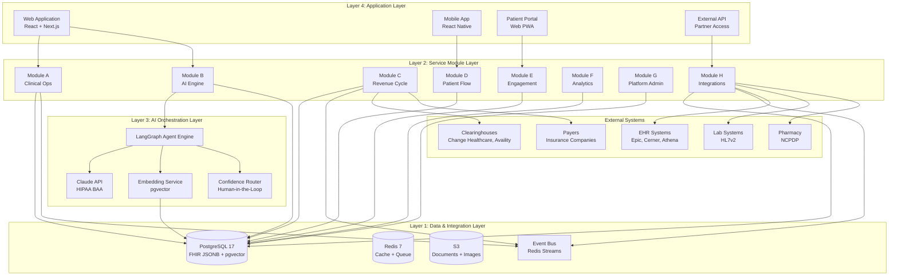
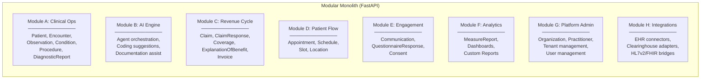
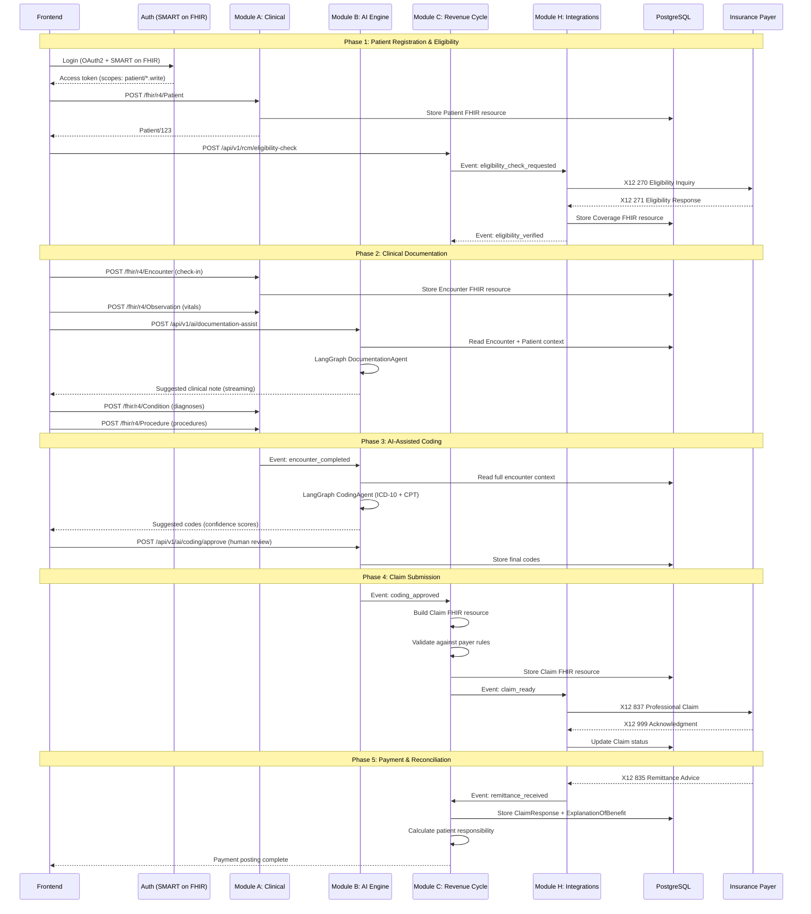
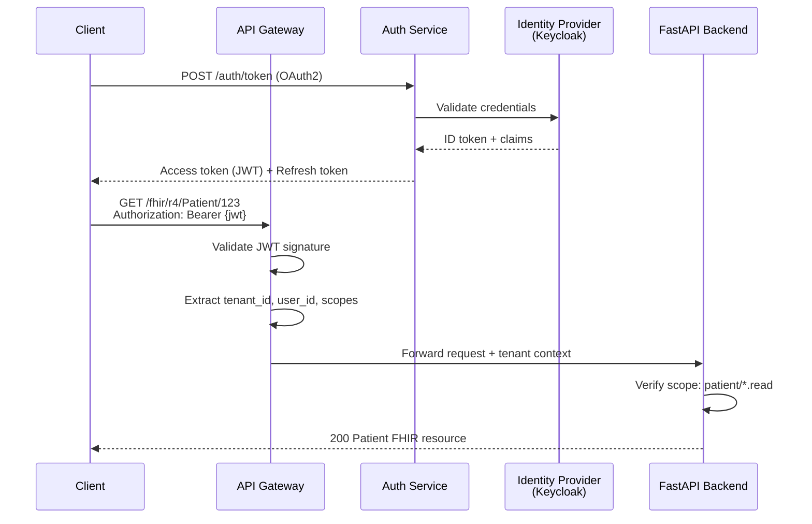
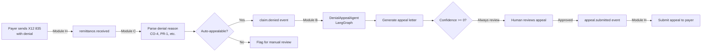
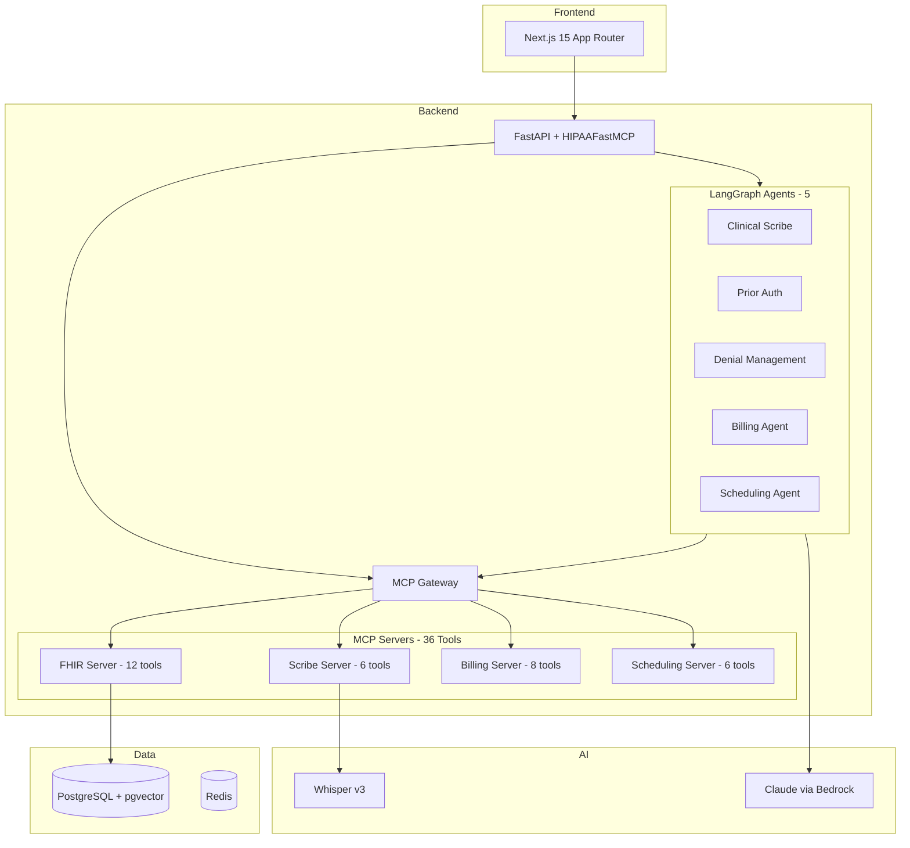
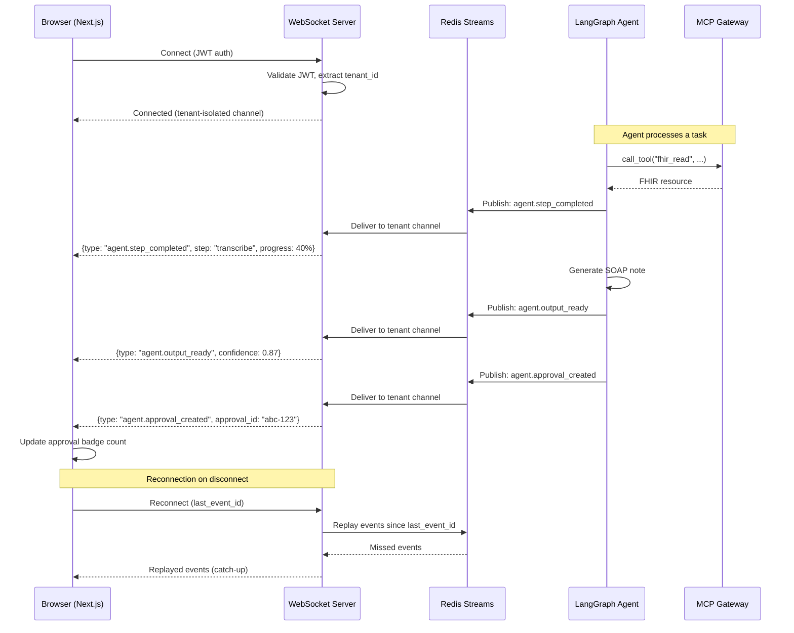
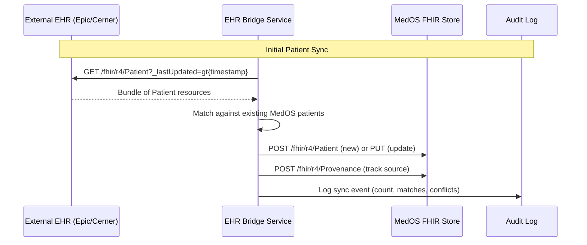

# MedOS System Architecture Overview

This document defines the comprehensive system architecture for MedOS Healthcare OS. It describes how the platform's components are organized, how data flows through the system, and how external integrations connect. This is a living document that will evolve as the system matures.

For the strategic vision behind these decisions, see [[HEALTHCARE_OS_MASTERPLAN]].

---

## 1. High-Level Architecture

MedOS is organized into four horizontal layers. Each layer has a clear responsibility boundary and communicates with adjacent layers through defined interfaces.



### Layer Responsibilities

| Layer | Responsibility | Key Technologies |
|-------|---------------|-----------------|
| **Application** | User interfaces, API gateway, authentication | React, Next.js, React Native |
| **AI Orchestration** | Agent workflows, LLM calls, confidence routing | LangGraph, Claude, pgvector |
| **Service Modules** | Business logic, domain rules, FHIR operations | FastAPI, Pydantic, SQLAlchemy |
| **Data & Integration** | Persistence, caching, event streaming, external I/O | PostgreSQL 17, Redis, S3 |

---

## 2. Service Boundaries

The eight modules defined in [[HEALTHCARE_OS_MASTERPLAN]] map to FastAPI routers within a modular monolith (see [[ADR-004-fastapi-backend-architecture]]). Each module owns its domain logic and FHIR resource types.



### Module Communication Rules

1. **Intra-module**: Direct function calls within the same module.
2. **Inter-module**: Via the internal event bus (Redis Streams) or through FHIR repository reads. Modules never import each other's internal services directly.
3. **External**: Module H is the sole gateway for external system communication. Other modules request external operations by publishing events that Module H consumes.

### Deployment Strategy

The initial deployment is a **modular monolith**: all modules run in a single FastAPI process. Module boundaries are enforced through code organization, not network boundaries. This allows:

- Faster development (no network overhead, shared database transactions)
- Easier debugging (single process, shared logging)
- Future extraction: any module can be extracted into an independent service by converting inter-module event bus calls to network calls

---

## 3. Data Flow: Patient Encounter Lifecycle

The following traces how a patient encounter flows through the entire system, from registration to payment receipt. This is the core workflow that [[Revenue-Cycle-Deep-Dive]] describes in business terms.



---

## 4. API Design

### API Structure

MedOS exposes two API namespaces:

| Namespace | Purpose | Example |
|-----------|---------|---------|
| `/fhir/r4/*` | Standards-compliant FHIR R4 RESTful API | `GET /fhir/r4/Patient/123` |
| `/api/v1/*` | MedOS-specific business operations | `POST /api/v1/rcm/eligibility-check` |

### FHIR RESTful API

The FHIR API implements the standard FHIR RESTful interactions:

```
# Read
GET    /fhir/r4/{ResourceType}/{id}

# Version Read
GET    /fhir/r4/{ResourceType}/{id}/_history/{version}

# Search
GET    /fhir/r4/{ResourceType}?param=value&_count=20

# Create
POST   /fhir/r4/{ResourceType}

# Update
PUT    /fhir/r4/{ResourceType}/{id}

# Patch
PATCH  /fhir/r4/{ResourceType}/{id}

# Delete
DELETE /fhir/r4/{ResourceType}/{id}

# History
GET    /fhir/r4/{ResourceType}/{id}/_history

# FHIR Operations
POST   /fhir/r4/{ResourceType}/$operation-name
```

### MedOS Business API

```
# Revenue Cycle
POST   /api/v1/rcm/eligibility-check
POST   /api/v1/rcm/claims/submit
GET    /api/v1/rcm/claims/{id}/status
POST   /api/v1/rcm/denials/{id}/appeal

# AI Engine
POST   /api/v1/ai/coding/suggest
POST   /api/v1/ai/coding/{task_id}/approve
POST   /api/v1/ai/documentation/assist
GET    /api/v1/ai/tasks/{task_id}/status

# Scheduling
GET    /api/v1/scheduling/slots?date=2026-02-27&provider=dr-smith
POST   /api/v1/scheduling/appointments
PUT    /api/v1/scheduling/appointments/{id}/check-in

# Analytics
GET    /api/v1/analytics/dashboard/overview
GET    /api/v1/analytics/reports/revenue?period=monthly
GET    /api/v1/analytics/reports/coding-accuracy
```

### Versioning Strategy

- FHIR endpoints are versioned by FHIR release: `/fhir/r4/`, `/fhir/r5/` (future)
- Business API is versioned numerically: `/api/v1/`, `/api/v2/`
- Breaking changes increment the version; additive changes do not
- Old versions are supported for a minimum of 12 months after deprecation notice

### Authentication Flow



---

## 5. Event Architecture

MedOS uses an event-driven architecture for inter-module communication. Events decouple modules and enable asynchronous workflows critical to healthcare operations (claim processing, AI agent pipelines, notification delivery).

### Event Bus: Redis Streams

Redis Streams provides ordered, persistent event delivery with consumer groups:

```python
# Event definitions
class MedOSEvent(BaseModel):
    event_id: str = Field(default_factory=lambda: str(uuid4()))
    event_type: str
    tenant_id: str
    timestamp: datetime = Field(default_factory=datetime.utcnow)
    source_module: str
    payload: dict
    correlation_id: str | None = None  # For tracing event chains

# Core events and their consumers
EVENT_ROUTING = {
    # Clinical Events
    "patient.registered":          ["engagement", "rcm"],
    "encounter.started":           ["scheduling", "analytics"],
    "encounter.completed":         ["ai_engine", "analytics"],

    # AI Events
    "coding.suggested":            ["clinical"],       # Show suggestions to provider
    "coding.approved":             ["rcm"],             # Trigger claim creation
    "coding.rejected":             ["ai_engine"],       # Retrain / log for review

    # Revenue Cycle Events
    "eligibility.verified":        ["clinical", "scheduling"],
    "claim.submitted":             ["analytics"],
    "claim.accepted":              ["analytics"],
    "claim.denied":                ["ai_engine"],       # Trigger denial appeal agent
    "remittance.received":         ["analytics", "engagement"],

    # Patient Engagement Events
    "appointment.reminder":        ["engagement"],
    "balance.due":                 ["engagement"],

    # Integration Events
    "ehr.sync.completed":          ["clinical"],
    "lab.result.received":         ["clinical", "engagement"],
}
```

### Event Flow Example: Claim Denial



---

## 6. Security Architecture

Healthcare security is not optional. MedOS implements defense-in-depth at every layer, as required by [[HIPAA-Deep-Dive]].

### Authentication: SMART on FHIR + OAuth2

MedOS implements the [SMART on FHIR](http://hl7.org/fhir/smart-app-launch/) authorization framework, which extends OAuth2 for healthcare:

```
# SMART on FHIR Scopes (examples)
patient/*.read         # Read all patient-compartment resources
patient/Observation.write   # Write observations only
user/*.read            # Read based on user's access level
launch/patient         # EHR launch with patient context
system/*.read          # Backend service access
```

### Authorization: RBAC + ABAC Hybrid

```python
# Role-Based Access Control (RBAC) - coarse-grained
ROLES = {
    "physician": [
        "patient/*.read", "patient/*.write",
        "encounter/*.read", "encounter/*.write",
    ],
    "nurse": [
        "patient/*.read",
        "observation/*.read", "observation/*.write",
    ],
    "biller": [
        "claim/*.read", "claim/*.write",
        "coverage/*.read",
        "patient/Patient.read",  # Demographics only, not clinical
    ],
    "admin": [
        "system/*.*",
    ],
}

# Attribute-Based Access Control (ABAC) - fine-grained
# Applied AFTER RBAC passes
class ABACPolicy:
    """Example: Physician can only access patients they are treating."""
    async def evaluate(self, user, resource, action) -> bool:
        if user.role == "physician" and resource.type == "Patient":
            # Check if physician has an active Encounter with this patient
            return await self.has_care_relationship(user.id, resource.id)
        return True
```

### Audit Trail

Every data access is logged as required by HIPAA:

```python
class AuditEntry(BaseModel):
    """HIPAA-compliant audit log entry."""
    timestamp: datetime
    event_type: str          # read, create, update, delete, search, export
    resource_type: str       # Patient, Encounter, Claim, etc.
    resource_id: str | None  # Specific resource (null for search)
    actor_id: str            # User or system identity
    actor_role: str          # physician, nurse, biller, system
    tenant_id: str
    ip_address: str
    user_agent: str
    request_id: str          # Correlation ID
    outcome: str             # success, failure, error
    detail: dict             # Search parameters, error details
```

Audit logs are:
- Immutable (append-only table, no UPDATE/DELETE permissions)
- Stored in the tenant schema (see [[ADR-002-multi-tenancy-schema-per-tenant]])
- Retained for a minimum of 6 years (HIPAA requirement)
- Queryable for compliance reporting and breach investigation

### Encryption

| Layer | Mechanism | Key Management |
|-------|-----------|---------------|
| In transit | TLS 1.3 (all connections) | ACM certificates, auto-renewal |
| At rest (database) | PostgreSQL TDE + per-tenant KMS | AWS KMS, per-tenant keys ([[ADR-002-multi-tenancy-schema-per-tenant]]) |
| At rest (files) | S3 SSE-KMS | Per-tenant KMS keys |
| Application | Field-level encryption for SSN, etc. | AWS KMS envelope encryption |

---

## 7. Integration Architecture

MedOS connects to the broader healthcare ecosystem through Module H (Integrations). Each integration type uses the appropriate healthcare standard.

```mermaid
graph TB
    subgraph "MedOS Platform"
        H[Module H: Integrations]
        FHIR_SRV[FHIR R4 Server]
        EVENT_BUS[Event Bus]
    end

    subgraph "EHR Systems"
        EPIC[Epic<br/>FHIR R4 + HL7v2]
        CERNER[Oracle Health<br/>FHIR R4]
        ATHENA[Athena<br/>FHIR R4 + REST]
    end

    subgraph "Revenue Cycle"
        CH[Change Healthcare<br/>X12 837/835]
        AVAIL[Availity<br/>X12 270/271]
        WAYSTAR[Waystar<br/>API]
    end

    subgraph "Clinical Systems"
        LAB[Lab Systems<br/>HL7v2 ORU/ORM]
        PHARM[Pharmacy<br/>NCPDP SCRIPT]
        RAD[Radiology<br/>DICOM + HL7v2]
    end

    subgraph "Public Health"
        IMM[Immunization Registries<br/>HL7v2 VXU]
        REPORT[Public Health Reporting<br/>eCR FHIR]
    end

    H <-->|FHIR R4 + SMART| EPIC
    H <-->|FHIR R4| CERNER
    H <-->|FHIR R4 + REST| ATHENA

    H <-->|X12 EDI| CH
    H <-->|X12 EDI| AVAIL
    H <-->|REST API| WAYSTAR

    H <-->|MLLP HL7v2| LAB
    H <-->|NCPDP| PHARM
    H <-->|HL7v2 + DICOM| RAD

    H -->|HL7v2| IMM
    H -->|FHIR| REPORT

    FHIR_SRV --> H
    H --> EVENT_BUS
```



### Integration Patterns

| Pattern | Use Case | Implementation |
|---------|----------|---------------|
| **FHIR REST** | EHR data exchange, Bulk Data | HTTP client with SMART on FHIR auth |
| **X12 EDI** | Claims (837), Remittance (835), Eligibility (270/271) | X12 parser/generator, SFTP or API delivery |
| **HL7v2 MLLP** | Lab results (ORU), Lab orders (ORM) | MLLP listener + HL7v2 parser (python-hl7) |
| **Webhook** | Real-time notifications from partners | Inbound webhook endpoints with signature verification |
| **Bulk FHIR** | Large data exports/imports | FHIR $export/$import operations with NDJSON |

### Connector Architecture

Each external system gets a dedicated connector class that handles:

```python
class EHRConnector(ABC):
    """Abstract base for EHR integration connectors."""

    @abstractmethod
    async def authenticate(self) -> TokenResponse:
        """Obtain access token (SMART on FHIR backend services)."""
        ...

    @abstractmethod
    async def read_patient(self, patient_id: str) -> dict:
        """Read a Patient resource from the external EHR."""
        ...

    @abstractmethod
    async def search_encounters(self, patient_id: str, date_range: tuple) -> list[dict]:
        """Search encounters for a patient within a date range."""
        ...

    @abstractmethod
    async def write_back(self, resource_type: str, resource: dict) -> str:
        """Write a resource back to the EHR (if supported)."""
        ...

class EpicConnector(EHRConnector):
    """Epic-specific FHIR R4 + HL7v2 connector."""

    def __init__(self, config: EpicConfig):
        self.base_url = config.fhir_base_url
        self.client_id = config.client_id
        self.private_key = config.private_key_ref  # AWS Secrets Manager reference

    async def authenticate(self) -> TokenResponse:
        """Epic backend services auth (SMART on FHIR)."""
        jwt_assertion = create_jwt_assertion(
            client_id=self.client_id,
            token_endpoint=f"{self.base_url}/oauth2/token",
            private_key=await get_secret(self.private_key),
        )
        async with httpx.AsyncClient() as client:
            response = await client.post(
                f"{self.base_url}/oauth2/token",
                data={
                    "grant_type": "client_credentials",
                    "client_assertion_type": "urn:ietf:params:oauth:client-assertion-type:jwt-bearer",
                    "client_assertion": jwt_assertion,
                },
            )
            return TokenResponse(**response.json())
```

### Data Synchronization Strategy

External data synchronization follows a **pull-then-reconcile** pattern:

1. **Scheduled Pull**: Cron-based sync pulls new/updated resources from external EHRs every 15 minutes
2. **Webhook Real-time**: Where available (Epic, Oracle Health), subscribe to real-time notifications
3. **Reconciliation**: Incoming resources are matched against existing FHIR resources by identifiers (MRN, NPI, etc.)
4. **Conflict Resolution**: External system is source of truth for clinical data; MedOS is source of truth for billing/RCM data
5. **Audit**: Every sync operation is logged with source system, resource count, and any conflicts detected

---

## Infrastructure Overview

### Deployment Architecture

```
AWS Region (us-east-1)
|-- VPC
|   |-- Public Subnet
|   |   |-- ALB (Application Load Balancer)
|   |   |-- NAT Gateway
|   |
|   |-- Private Subnet (Application)
|   |   |-- ECS Fargate: FastAPI (2-10 tasks, auto-scaling)
|   |   |-- ECS Fargate: Celery Workers (2-20 tasks)
|   |
|   |-- Private Subnet (Data)
|       |-- RDS PostgreSQL 17 (Multi-AZ, encrypted)
|       |-- ElastiCache Redis 7 (Cluster mode)
|       |-- S3 (Documents, encrypted per-tenant KMS)
|
|-- CloudWatch (Logging, Metrics, Alarms)
|-- AWS KMS (Per-tenant encryption keys)
|-- AWS Secrets Manager (API keys, credentials)
|-- Route53 (DNS)
|-- ACM (TLS certificates)
```

All infrastructure is managed via Terraform as specified in the global development guidelines. No CloudFormation, no manual CLI operations for infrastructure changes.

### Scaling Strategy

| Component | Scaling Trigger | Min | Max |
|-----------|----------------|-----|-----|
| FastAPI (ECS) | CPU > 60% or Request count | 2 | 10 |
| Celery Workers | Queue depth > 100 | 2 | 20 |
| PostgreSQL | Manual (vertical) | db.r6g.xlarge | db.r6g.4xlarge |
| Redis | Manual (vertical) | cache.r6g.large | cache.r6g.xlarge |

---

## Cross-Cutting Concerns

### Observability

- **Structured Logging**: JSON logs with correlation IDs, tenant context, and request tracing
- **Metrics**: Prometheus-compatible metrics exposed at `/metrics`, scraped by CloudWatch
- **Distributed Tracing**: OpenTelemetry with W3C Trace Context propagation
- **Alerting**: CloudWatch Alarms for error rates, latency P95, and queue depth

### Error Handling

All errors returned through the FHIR API use the FHIR OperationOutcome resource format:

```json
{
  "resourceType": "OperationOutcome",
  "issue": [
    {
      "severity": "error",
      "code": "not-found",
      "diagnostics": "Patient/123 not found",
      "details": {
        "coding": [
          {
            "system": "http://terminology.hl7.org/CodeSystem/operation-outcome",
            "code": "MSG_NO_EXIST"
          }
        ]
      }
    }
  ]
}
```

### Rate Limiting

- Per-tenant rate limits based on plan tier (Standard: 100 req/s, Premium: 500 req/s, Enterprise: custom)
- Per-user rate limits within tenant (default: 30 req/s)
- AI endpoint rate limits (coding suggestions: 10/min, documentation: 20/min)
- Rate limit headers returned on all responses: `X-RateLimit-Limit`, `X-RateLimit-Remaining`, `X-RateLimit-Reset`

---

## Full System Architecture (Sprint 2)

The following diagram shows the complete system architecture as of Sprint 2, including all MCP servers and LangGraph agents:



See [[ADR-005-mcp-sdk-integration]] for the HIPAAFastMCP design decision and [[EPIC-007-mcp-sdk-refactoring]] for Sprint 2 implementation scope.

---

## WebSocket Real-Time Event Flow (Sprint 3)

Sprint 3 introduces WebSocket-based real-time agent events. When agents process tasks, events are broadcast to connected frontend clients, enabling a live dashboard experience. See [[EPIC-008-demo-polish]] T3 for implementation details.



### WebSocket Event Types

| Event | Trigger | Payload |
|-------|---------|---------|
| `agent.started` | Agent task begins execution | `task_id`, `agent_type`, `input_summary` |
| `agent.step_completed` | Agent completes a pipeline step | `task_id`, `step_name`, `progress_pct` |
| `agent.output_ready` | Agent generates final output | `task_id`, `confidence`, `output_type` |
| `agent.approval_created` | Output requires human review | `task_id`, `approval_id`, `agent_type`, `confidence` |
| `approval.resolved` | Human approves/rejects/modifies | `approval_id`, `decision`, `reviewer_id` |

---

## Sprint 3 Additions: Agent Runner + Patient Intake Workflow

Sprint 3 ([[EPIC-008-demo-polish]]) adds two key backend capabilities:

### Agent Runner API

A unified endpoint (`POST /api/v1/agents/run`) replaces agent-specific trigger routes. The frontend sends `{ agent_type, input_params }` and gets back a `task_id` for status tracking. Agent execution is async, with progress broadcast via WebSocket.

### Patient Intake Workflow

An end-to-end orchestrated workflow (`POST /api/v1/workflows/patient-intake`) that chains:

1. **Patient lookup** (FHIR MCP `fhir_read`)
2. **Eligibility check** (Billing MCP `billing_check_eligibility`)
3. **Appointment confirm** (Scheduling MCP `scheduling_book`)
4. **Encounter create** (FHIR MCP `fhir_create`)
5. **Clinical Scribe trigger** (Agent Runner)

Each step emits WebSocket events for real-time frontend updates. See [[Clinical-Workflows-Overview]] for the clinical workflow context.

---

## Security Middleware Stack (Sprint 5)

Sprint 5 ([[EPIC-010-security-pilot-readiness]]) introduces a production-grade security middleware pipeline that wraps every FastAPI request. These middlewares execute in order before the request reaches any router.

### PHISafeErrorHandler

Strips PHI from error responses. When an unhandled exception occurs, the handler catches it, logs the full stack trace (internally, never exposed), and returns a generic FHIR OperationOutcome with a correlation ID. The caller never sees patient names, MRNs, SSNs, or any of the 18 HIPAA identifiers in error output.

### RateLimiter

Token bucket algorithm with per-client rate limiting. Configurable burst and sustained rates per endpoint category:

| Endpoint Category | Burst | Sustained | Window |
|---|---|---|---|
| Auth (login, token) | 10 | 10/min | 1 min |
| FHIR Search | 200 | 100/min | 1 min |
| FHIR Write | 100 | 50/min | 1 min |
| AI Pipeline | 20 | 10/min | 1 min |
| MCP Gateway | 100 | 50/min | 1 min |

### InputValidator

Validates all incoming requests before they reach business logic:

- Max body size enforcement (10MB default, 50MB for audio uploads)
- Content-type validation (reject unexpected MIME types)
- SQL injection pattern detection in query parameters and body
- XSS pattern detection in string fields
- Path traversal detection in URL segments and file references
- FHIR-specific validation (resource type names, search parameter formats)

### SecurityHeaders

Applied to all outbound responses:

| Header | Value | Purpose |
|---|---|---|
| `Strict-Transport-Security` | `max-age=31536000; includeSubDomains` | Force HTTPS |
| `X-Frame-Options` | `DENY` | Prevent clickjacking |
| `X-Content-Type-Options` | `nosniff` | Prevent MIME sniffing |
| `Content-Security-Policy` | `default-src 'self'; script-src 'self'` | Restrict resource loading |
| `Referrer-Policy` | `strict-origin-when-cross-origin` | Control referrer leakage |
| `X-Request-Id` | `{uuid}` | Correlation ID for tracing |

---

## Field-Level Encryption (Sprint 5)

Beyond database-level TDE and S3 SSE-KMS, Sprint 5 adds application-layer field-level encryption for the most sensitive patient identifiers. This ensures that even with direct database access, raw SSN/MRN values are never visible.

### Architecture

```
Patient Data In → Encrypt(SSN, MRN, DOB) → Store ciphertext in PostgreSQL
                                                    |
Patient Data Out ← Decrypt(SSN, MRN, DOB) ← Read ciphertext from PostgreSQL
```

### Key Derivation

- Per-tenant master key stored in AWS KMS
- PBKDF2 derives field-specific encryption keys from the tenant master key
- Each field type (SSN, MRN, DOB) gets a unique derived key
- Key rotation: new master key encrypts new records; old master key retained for decryption of existing records (envelope encryption pattern)

### Encryption Algorithm

- Fernet (AES-128-CBC + HMAC-SHA256) for field values
- Deterministic encryption option for SSN (allows exact-match search on ciphertext)
- Transparent encrypt/decrypt helpers in the data access layer
- Performance target: < 50ms per field operation

### Encrypted Fields

| Field | Resource | Encryption Mode |
|---|---|---|
| SSN | Patient | Deterministic (searchable) |
| MRN | Patient | Deterministic (searchable) |
| DOB | Patient | Randomized |
| Subscriber ID | Coverage | Deterministic (searchable) |
| Bank Account | ClaimResponse | Randomized |

---

## Data Migration & EHR Integration (Sprint 5)

Sprint 5 adds production-grade data migration and EHR connectivity for pilot practice onboarding. See [[EPIC-010-security-pilot-readiness]] T6 and T7.

### CSV Patient Import

- Configurable column mapping (map CSV headers to FHIR Patient fields)
- FHIR Patient resource validation before creation
- Patient matching algorithm for duplicate detection (configurable threshold)
- Manual review queue for uncertain matches (< 5% target)
- Batch capacity: 1000+ patients per import

### HL7v2 ADT Message Parsing

- Parses PID segments from ADT messages (A01, A04, A08)
- Extracts demographics: name, DOB, gender, address, phone, SSN, MRN
- Transforms to FHIR Patient resources
- Handles HL7v2 encoding (field separators, component separators, escape sequences)

### FHIR R4 Client for External EHR

- SMART on FHIR backend services authentication
- Read Patient resources from Epic and Cerner sandbox environments
- Create corresponding MedOS Patient resources with FHIR Provenance tracking
- Bidirectional demographics sync (name, DOB, address, phone, insurance)
- Conflict resolution: external EHR is source of truth for demographics
- Connection health monitoring with retry logic and circuit breaker

### Data Sync Flow



---

## Monitoring & Alerting (Sprint 5)

Sprint 5 introduces a comprehensive monitoring and alerting layer for production readiness. See [[EPIC-010-security-pilot-readiness]] T10 and T12.

### MetricsCollector

In-memory request metrics aggregation that tracks per-endpoint:

- Request count, error count, latency percentiles (P50, P95, P99)
- Response size distribution
- HTTP status code breakdown
- Tenant-level metrics (per-tenant request volume)

Metrics are flushed to CloudWatch every 60 seconds.

### AlertManager

Threshold-based alerting rules with configurable severity:

| Metric | Warning | Critical | Action |
|---|---|---|---|
| Error rate (5xx) | > 3% (5 min) | > 5% (5 min) | PagerDuty page |
| API P99 latency | > 1.5s | > 2s | PagerDuty page |
| DB connection pool utilization | > 70% | > 85% | PagerDuty page |
| CPU utilization | > 70% | > 80% | Auto-scale + notify |
| Memory utilization | > 75% | > 85% | PagerDuty page |
| LLM error rate | > 5% | > 10% | Slack alert + fallback |
| Queue depth | > 500 | > 1000 | Scale workers |

### Health Dashboard API

- `GET /health` -- Basic liveness check
- `GET /health/ready` -- Readiness check (DB, Redis, Claude connectivity)
- `GET /health/metrics` -- Prometheus-compatible metrics export
- `GET /api/v1/admin/dashboard` -- Aggregated system health for admin UI

### Load Testing Infrastructure

- Target: 50 concurrent users, 100 encounters/hour sustained
- Test scenarios: FHIR CRUD, AI documentation, claims processing, analytics queries
- Success criteria: P99 < 1s, zero errors, zero data loss
- Tools: Locust for HTTP load, custom scripts for WebSocket and agent pipeline

---

## References

- [[HEALTHCARE_OS_MASTERPLAN]] -- Strategic vision and module definitions
- [[FHIR-R4-Deep-Dive]] -- FHIR standard analysis
- [[HIPAA-Deep-Dive]] -- Regulatory compliance requirements
- [[Revenue-Cycle-Deep-Dive]] -- Revenue cycle business processes
- [[ADR-001-fhir-native-data-model]] -- Database design decision
- [[ADR-002-multi-tenancy-schema-per-tenant]] -- Multi-tenancy architecture decision
- [[ADR-003-ai-agent-framework]] -- AI agent framework decision
- [[ADR-004-fastapi-backend-architecture]] -- Backend framework decision
- [[EPIC-010-security-pilot-readiness]] -- Sprint 5 security hardening and pilot readiness
