# MedOS AI Agent Architecture

> Complete specification of the agentic AI system within MedOS. Defines how AI agents operate, communicate, and serve providers, patients, and billing staff -- with bounded autonomy, mandatory human oversight, and full audit trails.

Related: [[HEALTHCARE_OS_MASTERPLAN]] | [[ADR-003-ai-agent-framework]] | [[System-Architecture-Overview]] | [[context-rotting-and-agent-memory]] | [[MOC-Agent-Architecture]]

---

## 1. Agent Framework

MedOS agents are **stateful, multi-step AI workflows** built on a layered framework stack. They are not chatbots. They are deterministic state machines with AI-powered processing nodes, operating under strict healthcare constraints.

### Technology Stack

| Layer | Technology | Role |
|-------|-----------|------|
| **Orchestration** | LangGraph | State machine graphs with checkpointing, interrupts, and replay |
| **LLM Backbone** | Claude (via AWS Bedrock, HIPAA BAA) | Reasoning, generation, classification, extraction |
| **Tool Integration** | MCP (Model Context Protocol) | Standardized interface between agents and external tools/data |
| **Healthcare Data** | FHIR-MCP Server | Read/write FHIR R4 resources through MCP |
| **State Persistence** | PostgreSQL (LangGraph checkpointer) | Agent state survives restarts; enables async human review |
| **Observability** | Langfuse + OpenTelemetry | Trace every LLM call, token usage, latency, confidence |

### Why This Stack

- **LangGraph** was chosen over CrewAI, AutoGen, and custom frameworks because healthcare needs explicit state machines with guaranteed human checkpoints, not autonomous agent swarms (see [[ADR-003-ai-agent-framework]] for full analysis).
- **Claude via AWS Bedrock** provides a HIPAA Business Associate Agreement covering PHI in API calls. No PHI leaves the BAA boundary.
- **MCP** standardizes how agents access tools, making it possible for third-party AI apps to integrate with MedOS through the same protocol (see [[mcp-integration-plan]]).

### Agent Execution Model

Every agent follows the same execution pattern, defined in [[ADR-003-ai-agent-framework]]:

```
Input Validation -> Context Retrieval -> AI Processing -> Confidence Check
    |                                                          |
    v                                                     [>= 0.85] -> Auto-execute -> Audit Log -> Output
  Error                                                   [0.70-0.85] -> Execute + Flag for Review -> Audit Log
                                                          [< 0.70] -> Halt + Escalate to Human -> Audit Log
                                                          [Critical action] -> ALWAYS escalate regardless of confidence
```

---

## 2. The 5 Foundation Agents

Each agent is a LangGraph `StateGraph` with defined authority, constraints, escalation rules, and audit requirements. All agents share the base pattern from [[ADR-003-ai-agent-framework]] but with domain-specific nodes and thresholds. For the 7 additional Theoria Medical-specific agents (Agents 6-12), see Section 9.

---

### 2.1 Clinical Documentation Agent (AI Scribe)

**Module:** B (Provider Workflow Engine)
**Pipeline:** Audio -> Transcript -> Clinical NLU -> SOAP Note -> ICD-10/CPT Codes

#### Purpose

Listens to provider-patient encounters via ambient audio capture and generates structured clinical documentation in SOAP format. This is the flagship agent -- the single capability most likely to drive pilot adoption (see [[Ambient-AI-Documentation]] for full domain analysis).

#### Authority (What It CAN Do Autonomously)

- Transcribe audio to text using Whisper v3
- Generate draft SOAP notes from transcripts
- Suggest ICD-10 diagnosis codes with confidence scores
- Suggest CPT procedure codes with confidence scores
- Pre-populate structured FHIR resources (Condition, Procedure, Observation) from notes
- Flag potential coding errors or missing documentation

#### Constraints (What It CANNOT Do -- Hard Limits)

- **CANNOT diagnose patients** -- it extracts diagnoses stated by the provider, it does not generate new diagnoses
- **CANNOT prescribe medications** -- medication decisions are provider-only
- **CANNOT modify signed/finalized clinical records** -- draft only until provider signs off
- **CANNOT access patient records beyond the current encounter** without explicit provider action
- **CANNOT operate without a licensed provider in the review loop**

#### Escalation Rules

| Condition | Action |
|-----------|--------|
| Confidence < 0.75 on any ICD-10 code | Flag code for manual review; highlight uncertainty in UI |
| Confidence < 0.70 on SOAP note section | Mark section as "needs review"; do not auto-populate FHIR |
| Audio quality below threshold (SNR < 10dB) | Notify provider; request re-recording or manual input |
| Detected contradiction in clinical data | Halt coding; present contradiction to provider |
| Patient mentions self-harm or abuse | Immediately flag to provider via priority notification |

#### Confidence Thresholds

| Task | Auto-Execute | Flag for Review | Full Escalation |
|------|-------------|-----------------|-----------------|
| Transcription accuracy | >= 0.95 WER | 0.85-0.95 | < 0.85 |
| SOAP note generation | >= 0.90 | 0.75-0.90 | < 0.75 |
| ICD-10 code suggestion | >= 0.95 | 0.80-0.95 | < 0.80 |
| CPT code suggestion | >= 0.95 | 0.80-0.95 | < 0.80 |

#### Tools / MCP Servers

- **Whisper v3** (self-hosted GPU): Speech-to-text, returns timestamped transcript
- **Claude via Bedrock**: Clinical NLU, note generation, code suggestion
- **FHIR-MCP Server**: Read Patient, Encounter context; Write DocumentReference, Condition, Procedure
- **Terminology MCP Server** (future): ICD-10-CM, CPT, SNOMED CT lookups and validation

#### FHIR Resources

| Operation | Resource | Description |
|-----------|----------|-------------|
| Read | `Patient` | Demographics, allergies, problem list |
| Read | `Encounter` | Current encounter context, chief complaint |
| Read | `Observation` | Vitals captured during encounter |
| Read | `MedicationStatement` | Current medications for context |
| Write | `DocumentReference` | Generated SOAP note (draft status) |
| Write | `Condition` | Extracted diagnoses (draft, pending provider review) |
| Write | `Procedure` | Extracted procedures (draft, pending provider review) |
| Write | `DiagnosticReport` | Structured findings (draft) |

#### Audit Trail

Every run of the Clinical Documentation Agent produces a FHIR `Provenance` resource containing:

```json
{
  "resourceType": "Provenance",
  "target": [{"reference": "DocumentReference/456"}],
  "recorded": "2026-02-28T14:30:00Z",
  "agent": [
    {
      "type": {"text": "AI Agent"},
      "who": {"display": "MedOS Clinical Documentation Agent v1.2.0"}
    },
    {
      "type": {"text": "Reviewer"},
      "who": {"reference": "Practitioner/dr-smith"}
    }
  ],
  "entity": [
    {
      "role": "source",
      "what": {"display": "Audio recording (encounter/789)"}
    }
  ],
  "extension": [
    {
      "url": "https://medos.health/fhir/ext/ai-metadata",
      "extension": [
        {"url": "model-version", "valueString": "claude-sonnet-4-20250514"},
        {"url": "confidence-score", "valueDecimal": 0.92},
        {"url": "prompt-hash", "valueString": "sha256:a1b2c3..."},
        {"url": "processing-time-ms", "valueInteger": 3400},
        {"url": "review-status", "valueCode": "approved"},
        {"url": "corrections-made", "valueInteger": 2}
      ]
    }
  ]
}
```

#### State Machine

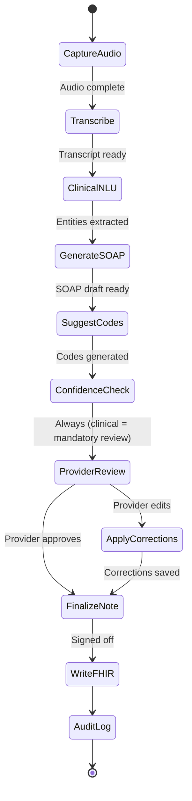

---

### 2.2 Prior Authorization Agent

**Module:** C (Revenue Cycle) + D (Payer Integration)
**Pipeline:** PA Requirement Detection -> Clinical Evidence Gathering -> Form Generation -> Submission -> Status Tracking

#### Purpose

Automates the prior authorization workflow, which currently costs the U.S. healthcare system $35 billion/year and consumes 14.6 hours/week per practice (see [[Prior-Authorization-Deep-Dive]]). The agent detects when a PA is needed, gathers clinical evidence, generates the submission, and tracks status through approval.

#### Authority (What It CAN Do Autonomously)

- Detect PA requirements by checking payer-specific rules against ordered services
- Gather supporting clinical documentation from the FHIR store
- Generate PA request forms with clinical justification narrative
- Submit PA requests via X12 278 or payer API (after human approval)
- Track PA status and send notifications on updates
- Auto-resubmit with additional documentation when payer requests more information (pended status)

#### Constraints (What It CANNOT Do -- Hard Limits)

- **CANNOT fabricate clinical data** -- all clinical justification must trace to existing FHIR resources
- **CANNOT bypass medical necessity criteria** -- if clinical evidence is insufficient, it must escalate
- **CANNOT submit without human approval** -- PA submissions always require provider or staff sign-off
- **CANNOT modify clinical records** to make them support a PA request
- **CANNOT guarantee approval** -- it optimizes the submission, it does not control payer decisions

#### Escalation Rules

| Condition | Action |
|-----------|--------|
| Insufficient clinical evidence for medical necessity | Alert staff; suggest what documentation is needed |
| Payer requests peer-to-peer review | Notify provider; schedule P2P call; provide talking points |
| PA denied | Hand off to [[#2.3 Denial Management Agent]] |
| Urgent/emergent PA (patient safety) | Priority alert to provider; flag as urgent in submission |
| Unknown payer PA requirements | Flag for manual research; add to knowledge base when resolved |

#### Confidence Thresholds

| Task | Auto-Execute | Flag for Review | Full Escalation |
|------|-------------|-----------------|-----------------|
| PA requirement detection | >= 0.95 | 0.85-0.95 | < 0.85 |
| Clinical evidence sufficiency | >= 0.90 | 0.75-0.90 | < 0.75 |
| Form generation | N/A | N/A | ALWAYS review (0%) |
| Submission | N/A | N/A | ALWAYS review (0%) |

PA submissions **always require human confirmation** regardless of confidence score. This is a hard constraint -- financial and clinical liability demands it.

#### Tools / MCP Servers

- **Claude via Bedrock**: Clinical justification narrative generation, medical necessity analysis
- **FHIR-MCP Server**: Read Patient, Encounter, Condition, Procedure, Observation, MedicationRequest
- **Prior Auth MCP Server** (custom): Payer rule lookups, X12 278 generation, payer API submission
- **Scheduling MCP Server** (custom): P2P review scheduling

#### FHIR Resources

| Operation | Resource | Description |
|-----------|----------|-------------|
| Read | `Patient` | Demographics, insurance info |
| Read | `Coverage` | Active insurance coverage, payer details |
| Read | `Condition` | Supporting diagnoses |
| Read | `Procedure` | Requested procedure requiring PA |
| Read | `Observation` | Lab results, vitals supporting medical necessity |
| Read | `MedicationRequest` | Medication requiring PA |
| Read | `DocumentReference` | Clinical notes supporting the request |
| Write | `ClaimResponse` (PA) | PA request and response tracking |
| Write | `Task` | PA workflow task status |

#### Audit Trail

Logs: PA requirement trigger, clinical evidence gathered (references only, no PHI duplication), justification narrative generated, submission timestamp, payer response, human reviewer identity, all status transitions.

---

### 2.3 Denial Management Agent

**Module:** C (Revenue Cycle)
**Pipeline:** Denial Receipt -> Root Cause Analysis -> Appeal Strategy -> Appeal Draft -> Resubmission

#### Purpose

Analyzes claim denials, identifies root causes, determines if an appeal is warranted, drafts appeal letters with supporting clinical evidence, and manages the resubmission workflow. Currently, 65% of denials are never appealed, yet 50-70% of appeals are successful -- this represents massive recoverable revenue (see [[Revenue-Cycle-Deep-Dive]]).

#### Authority (What It CAN Do Autonomously)

- Parse X12 835 remittance advice to extract denial reason codes (CARC/RARC)
- Classify denial type: clinical, technical, coding, eligibility, timeliness
- Calculate financial impact and prioritize appeals by dollar value and success probability
- Gather supporting clinical evidence from FHIR store
- Draft appeal letters with payer-specific formatting and clinical arguments
- Suggest corrected codes when denial is coding-related
- Track appeal deadlines and send deadline warnings

#### Constraints (What It CANNOT Do -- Hard Limits)

- **CANNOT alter clinical documentation** to support an appeal
- **CANNOT create false claims** or misrepresent clinical facts
- **CANNOT submit appeals without human approval** -- all appeals require staff or provider sign-off
- **CANNOT fabricate clinical evidence** that does not exist in the FHIR store
- **CANNOT override a legitimate denial** -- if the denial is correct, it must report that to staff

#### Escalation Rules

| Condition | Action |
|-----------|--------|
| Denial appears clinically legitimate | Report to staff: "This denial may be correct. Recommend accepting." |
| High-value denial (> $5,000) | Priority alert to billing manager; recommend provider review |
| Pattern detected (same denial reason across multiple claims) | Generate pattern report; flag systemic issue |
| Appeal deadline < 48 hours | Urgent alert to billing staff |
| Payer requires additional clinical records | Route to provider for clinical input |

#### Confidence Thresholds

| Task | Auto-Execute | Flag for Review | Full Escalation |
|------|-------------|-----------------|-----------------|
| Denial reason classification | >= 0.95 | 0.85-0.95 | < 0.85 |
| Appeal viability assessment | >= 0.90 | 0.75-0.90 | < 0.75 |
| Appeal letter draft | N/A | N/A | ALWAYS review (0%) |
| Appeal submission | N/A | N/A | ALWAYS review (0%) |

Like the Prior Auth Agent, appeal submissions **always require human confirmation**.

#### Tools / MCP Servers

- **Claude via Bedrock**: Denial analysis, appeal strategy, letter generation
- **FHIR-MCP Server**: Read Claim, ClaimResponse, ExplanationOfBenefit, Patient, Encounter, Condition
- **Billing/Claims MCP Server** (custom): X12 835 parsing, CARC/RARC code lookups, appeal submission
- **Analytics MCP Server** (custom): Historical denial patterns, success rates by payer/code/reason

#### FHIR Resources

| Operation | Resource | Description |
|-----------|----------|-------------|
| Read | `Claim` | Original claim details |
| Read | `ClaimResponse` | Payer adjudication result |
| Read | `ExplanationOfBenefit` | Full remittance details |
| Read | `Patient` | Demographics for appeal |
| Read | `Encounter` | Encounter supporting the claim |
| Read | `Condition`, `Procedure` | Clinical evidence for appeal |
| Read | `DocumentReference` | Clinical notes supporting appeal |
| Write | `Claim` | Corrected/resubmitted claim |
| Write | `Communication` | Appeal letter and correspondence |
| Write | `Task` | Appeal workflow tracking |

#### Audit Trail

Logs: Denial reason codes, financial impact, appeal viability score, evidence gathered, appeal strategy selected, letter generated (hash), human reviewer, submission timestamp, appeal outcome.

---

### 2.4 Patient Communication Agent

**Module:** F (Patient Engagement)
**Pipeline:** Event Trigger -> Message Generation -> Channel Selection -> Delivery -> Response Handling

#### Purpose

Manages proactive and reactive patient communications across multiple channels (SMS, email, web portal, voice). Handles appointment reminders, pre-visit instructions, billing inquiries, FAQ responses, and basic triage routing. This agent is patient-facing and operates under strict constraints about what it can and cannot say.

#### Authority (What It CAN Do Autonomously)

- Send appointment reminders and confirmations
- Answer pre-defined FAQ questions (office hours, location, accepted insurance, etc.)
- Provide billing balance information and payment links
- Collect pre-visit intake information (demographics, insurance, symptoms checklist)
- Route urgent messages to appropriate staff
- Send post-visit follow-up instructions (pre-approved by provider)
- Respond to rescheduling requests by offering available slots

#### Constraints (What It CANNOT Do -- Hard Limits)

- **CANNOT diagnose or provide medical advice** -- not a clinical tool
- **CANNOT triage emergencies** -- any mention of chest pain, difficulty breathing, suicidal ideation, or similar emergencies must immediately display "Call 911" and alert staff
- **CANNOT access PHI beyond what is needed** for the specific communication (minimum necessary principle)
- **CANNOT share clinical results** (lab, imaging) -- patients must access these through the patient portal or provider
- **CANNOT make clinical recommendations** -- scheduling, billing, and logistics only
- **CANNOT impersonate a human** -- must clearly identify as an AI assistant

#### Escalation Rules

| Condition | Action |
|-----------|--------|
| Patient describes emergency symptoms | Display emergency instructions; alert provider immediately |
| Patient asks clinical questions | Route to provider messaging; explain "I can help with scheduling and billing, but clinical questions need your care team" |
| Patient expresses frustration or anger | Route to human staff member; do not attempt to de-escalate autonomously |
| Patient requests medical records | Direct to patient portal; do not transmit records via SMS/email |
| Message content unclear | Ask one clarifying question; if still unclear, route to staff |
| Patient mentions billing dispute | Route to billing department; provide reference number |

#### Confidence Thresholds

| Task | Auto-Execute | Flag for Review | Full Escalation |
|------|-------------|-----------------|-----------------|
| Appointment reminders | >= 0.99 (template-based) | N/A | N/A |
| FAQ responses | >= 0.85 | 0.70-0.85 | < 0.70 |
| Billing inquiries | >= 0.90 | 0.75-0.90 | < 0.75 |
| Triage routing | N/A | N/A | ALWAYS route to human |

#### Tools / MCP Servers

- **Claude via Bedrock**: Natural language understanding, response generation
- **FHIR-MCP Server**: Read Patient (demographics), Appointment (scheduling)
- **Scheduling MCP Server** (custom): Available slots, appointment booking/rescheduling
- **SMS/Email API**: Twilio (SMS), SES (email) for message delivery
- **Billing/Claims MCP Server** (custom): Balance lookup, payment link generation

#### FHIR Resources

| Operation | Resource | Description |
|-----------|----------|-------------|
| Read | `Patient` | Name, contact info, preferred language |
| Read | `Appointment` | Upcoming appointments, scheduling context |
| Read | `Schedule`, `Slot` | Available appointment slots |
| Read | `Account` | Patient balance information |
| Read | `Communication` | Prior message history with this patient |
| Write | `Appointment` | Booked/rescheduled appointments |
| Write | `Communication` | Outbound messages (audit trail) |
| Write | `QuestionnaireResponse` | Pre-visit intake responses |

#### Audit Trail

Logs: Message type, channel (SMS/email/portal), content hash, delivery status, patient response, routing decisions, escalation triggers. All outbound messages stored as FHIR `Communication` resources.

---

### 2.5 Quality Reporting Agent

**Module:** E (Population Health & Analytics)
**Pipeline:** Measure Definition -> Patient Population -> Gap Identification -> Report Generation -> Submission

#### Purpose

Identifies care gaps across patient populations, calculates quality measures (HEDIS, MIPS, CMS Star Ratings), predicts readmission risk, and generates compliance reports. This agent operates on population-level data, not individual encounters.

#### Authority (What It CAN Do Autonomously)

- Calculate quality measure numerators and denominators from FHIR data
- Identify patients with care gaps (overdue screenings, missed follow-ups)
- Generate HEDIS, MIPS, and CMS Star Rating reports
- Calculate HCC risk scores (CMS-HCC v28)
- Predict 30-day readmission risk using LACE+ with SDOH factors
- Generate provider performance benchmarks
- Flag patients who are falling out of care protocols

#### Constraints (What It CANNOT Do -- Hard Limits)

- **CANNOT modify patient records or clinical data** -- read-only access to clinical FHIR resources
- **CANNOT directly contact patients** -- care gap notifications go through the Patient Communication Agent or provider workflows
- **CANNOT alter quality measure definitions** -- measures are defined by CMS/NCQA, not by the agent
- **CANNOT submit quality reports to CMS/payers without human approval**
- **CANNOT make individual clinical recommendations** -- it identifies gaps, clinicians decide actions

#### Escalation Rules

| Condition | Action |
|-----------|--------|
| Critical care gap (e.g., cancer screening 2+ years overdue) | Priority alert to care coordinator |
| High readmission risk patient (LACE+ > 12) | Alert care team; suggest intervention |
| Quality measure below reporting threshold | Alert practice manager with improvement recommendations |
| Data quality issues (missing required fields) | Flag to data team; do not estimate missing values |
| Measure logic conflict with local clinical protocols | Flag to clinical leadership for resolution |

#### Confidence Thresholds

| Task | Auto-Execute | Flag for Review | Full Escalation |
|------|-------------|-----------------|-----------------|
| Measure calculation | >= 0.99 (deterministic) | N/A | Data quality issues |
| Care gap identification | >= 0.95 | 0.85-0.95 | < 0.85 |
| Readmission prediction | >= 0.85 | 0.70-0.85 | < 0.70 |
| Report generation | >= 0.95 | N/A | ALWAYS review before external submission |

#### Tools / MCP Servers

- **Claude via Bedrock**: Natural language report generation, gap analysis narrative
- **FHIR-MCP Server**: Read Patient, Condition, Observation, Procedure, MeasureReport, Encounter
- **Analytics MCP Server** (custom): Measure definitions, benchmarking data, population queries
- **Scheduling MCP Server** (custom): Identify patients who need follow-up appointments

#### FHIR Resources

| Operation | Resource | Description |
|-----------|----------|-------------|
| Read | `Patient` | Demographics, insurance, attribution |
| Read | `Condition` | Chronic conditions, problem list |
| Read | `Observation` | Lab results, vitals, screening results |
| Read | `Procedure` | Completed procedures (screenings, etc.) |
| Read | `Encounter` | Visit history, admission/discharge |
| Read | `MedicationStatement` | Current medications |
| Read | `Immunization` | Vaccination history |
| Write | `MeasureReport` | Calculated quality measures |
| Write | `DetectedIssue` | Identified care gaps |
| Write | `RiskAssessment` | Readmission risk scores |

#### Audit Trail

Logs: Measure calculated, population size, numerator/denominator, data sources queried, calculation timestamp, report version, human reviewer for external submissions.

---

## 3. Agent Communication Protocol

Agents do not operate in isolation. Clinical workflows often span multiple agents (e.g., documentation -> coding -> claim -> denial -> appeal). The communication protocol defines how agents coordinate.

### Event Bus Architecture

All inter-agent communication flows through the event bus (Redis Streams, with path to Kafka/EventBridge at scale). Agents never call each other directly.

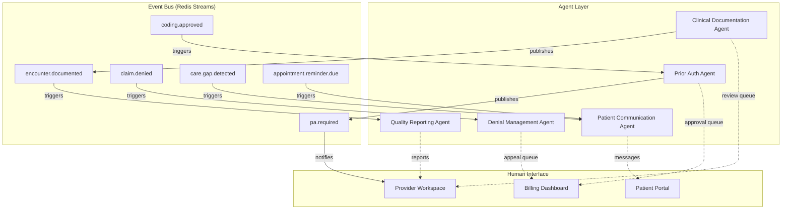

### Event Message Format

```python
class AgentEvent(BaseModel):
    """Standardized event format for inter-agent communication."""
    event_id: str                    # UUID v4
    event_type: str                  # e.g., "encounter.documented"
    source_agent: str                # e.g., "clinical_documentation_agent"
    tenant_id: str                   # Tenant isolation
    timestamp: datetime              # UTC
    correlation_id: str              # Trace entire workflow chain
    payload: dict                    # Event-specific data (FHIR references, not PHI copies)
    priority: Literal["low", "normal", "high", "urgent"]
    requires_ack: bool               # Whether receiving agent must acknowledge
```

### Key Event Flows

| Trigger Event | Source Agent | Target Agent(s) | Action |
|--------------|-------------|-----------------|--------|
| `encounter.documented` | Clinical Documentation | Quality Reporting | Update care gap status, measure denominators |
| `coding.approved` | Clinical Documentation | Prior Auth (if PA required) | Initiate PA workflow |
| `claim.submitted` | (Revenue Cycle module) | Quality Reporting | Track revenue metrics |
| `claim.denied` | (Revenue Cycle module) | Denial Management | Analyze denial, draft appeal |
| `pa.approved` | Prior Auth | Patient Communication | Notify patient that procedure is approved |
| `pa.denied` | Prior Auth | Denial Management | Escalate PA denial for appeal |
| `care.gap.detected` | Quality Reporting | Patient Communication | Send care gap reminder to patient |
| `appeal.outcome` | Denial Management | Quality Reporting | Update financial analytics |

### Agent-to-Human Communication

Agents communicate with humans through **notification queues** with priority levels:

| Priority | SLA | Channel | Example |
|----------|-----|---------|---------|
| **Urgent** | < 5 min | Push notification + SMS + in-app alert | Patient emergency detected; PA deadline today |
| **High** | < 1 hour | Push notification + in-app alert | Appeal draft ready for review; high-value denial |
| **Normal** | < 4 hours | In-app notification | Coding suggestions ready; care gap report updated |
| **Low** | Next login | In-app badge | Quality metrics updated; billing summary available |

### Human-to-Agent Communication

Humans interact with agents through two mechanisms:

1. **Approval Workflows**: Structured UI where humans approve, reject, or correct agent outputs. Every agent with a human-in-the-loop checkpoint presents a review interface specific to its domain (e.g., coding review shows suggested codes with confidence scores and one-click approve/reject).

2. **Natural Language Chat**: For ad-hoc queries ("Why did you suggest this code?" or "What's the denial rate for this payer?"), humans can ask agents questions through a chat interface. The agent has access to its own audit trail and can explain its reasoning.

### Audit of Inter-Agent Communication

All inter-agent events are logged as FHIR `AuditEvent` resources:

```json
{
  "resourceType": "AuditEvent",
  "type": {"code": "agent-communication", "system": "https://medos.health/fhir/audit"},
  "subtype": [{"code": "encounter.documented"}],
  "recorded": "2026-02-28T14:35:00Z",
  "agent": [
    {
      "who": {"display": "Clinical Documentation Agent v1.2.0"},
      "requestor": false
    },
    {
      "who": {"display": "Quality Reporting Agent v1.0.0"},
      "requestor": false
    }
  ],
  "source": {"observer": {"display": "MedOS Event Bus"}},
  "entity": [
    {
      "what": {"reference": "DocumentReference/456"},
      "role": {"code": "4", "display": "Domain Resource"}
    }
  ]
}
```

---

## 4. Bounded Autonomy Framework

The Bounded Autonomy Framework is the governance layer that controls what agents can do. It is the most critical safety mechanism in MedOS and is enforced at the framework level, not the application level.

### Core Principle

> Every agent action has a confidence score. The score determines what happens next. Critical actions always require human confirmation, regardless of confidence.

### Confidence Score Model

Every AI-generated output includes a confidence score between 0.0 and 1.0, calculated from:

- **Model confidence**: Token-level probability from Claude
- **Evidence strength**: How much supporting data exists in the FHIR store
- **Historical accuracy**: How often similar suggestions have been accepted vs corrected
- **Payer-specific patterns**: Historical approval/denial rates for this payer + code combination

```python
class ConfidenceScore(BaseModel):
    """Composite confidence score for agent outputs."""
    overall: float                      # Weighted composite (0.0 - 1.0)
    model_confidence: float             # LLM token probability
    evidence_strength: float            # Supporting data availability
    historical_accuracy: float          # Past acceptance rate for similar outputs
    payer_pattern: float | None         # Payer-specific (billing agents only)

    weights: dict = {
        "model_confidence": 0.40,
        "evidence_strength": 0.30,
        "historical_accuracy": 0.20,
        "payer_pattern": 0.10,
    }
```

### Action Classification

| Category | Confidence Routing | Examples |
|----------|-------------------|----------|
| **Informational** | Standard thresholds | Care gap reports, analytics, measure calculations |
| **Administrative** | Standard thresholds | Appointment reminders, FAQ responses, status updates |
| **Financial** | Always human review | Claim submissions, PA submissions, appeal submissions |
| **Clinical** | Always human review | Code suggestions, note finalization, medication-related |

### Configurable Per Tenant

Confidence thresholds are configurable per tenant via the admin console. A large practice with experienced billing staff might set lower thresholds (more automation). A new practice might set higher thresholds (more review).

```python
class TenantAgentConfig(BaseModel):
    """Per-tenant agent configuration."""
    tenant_id: str
    agent_type: str
    auto_execute_threshold: float      # Default: 0.85
    flag_for_review_threshold: float   # Default: 0.70
    always_review_actions: list[str]   # Actions that bypass confidence (always review)
    enabled: bool                      # Can disable specific agents per tenant
    max_daily_auto_executions: int     # Safety cap on autonomous actions
```

### Safety Caps

Even with high confidence, agents have daily limits on autonomous actions:

| Agent | Max Daily Auto-Executions | Rationale |
|-------|--------------------------|-----------|
| Clinical Documentation | Unlimited (always reviewed) | Provider reviews every note |
| Prior Auth | 0 (always reviewed) | Financial and clinical liability |
| Denial Management | 0 (always reviewed) | Financial liability |
| Patient Communication | 500 per tenant | Prevent spam; rate limit outbound messages |
| Quality Reporting | 50 reports | Prevent excessive compute on large populations |

---

## 5. Memory Architecture

Agents need context to operate effectively, but context degrades over time (see [[context-rotting-and-agent-memory]]). MedOS implements a tiered memory architecture to balance speed, relevance, and accuracy.

### Three-Tier Memory Model

```
                    Speed       Capacity    Persistence    Source of Truth
                    -----       --------    -----------    ---------------
Short-term (Redis)  < 1ms       Small       Session TTL    No (cache)
Mid-term (pgvector) < 10ms      Medium      Persistent     No (index)
Long-term (FHIR)    < 100ms     Large       Permanent      YES (golden source)
```

### Short-Term Memory: Redis

- **What**: Current encounter context, active conversation state, session variables
- **TTL**: 2 hours (configurable per agent type)
- **Use case**: The Clinical Documentation Agent holds the current transcript, extracted entities, and draft note in Redis during an active encounter
- **Eviction**: LRU with TTL expiry

### Mid-Term Memory: pgvector

- **What**: Embedded patient history summaries, recent lab result summaries, payer rule embeddings
- **Persistence**: Permanent, but re-indexed periodically
- **Use case**: The Denial Management Agent retrieves similar past denials and their outcomes via vector similarity search to inform appeal strategy
- **Model**: `text-embedding-3-small` (OpenAI) or equivalent via Bedrock

### Long-Term Memory: PostgreSQL FHIR Store

- **What**: Complete clinical records, claims history, audit trails -- stored as FHIR JSONB resources
- **Persistence**: Permanent (6+ year retention for HIPAA)
- **Source of truth**: This is the golden source. All other memory tiers are derived from it.
- **Use case**: Every agent query ultimately validates against the FHIR store. An agent never "remembers" something that contradicts the FHIR store.

### Context Rot Detection

As described in [[context-rotting-and-agent-memory]], agent context degrades during long sessions:

```python
class ContextHealthMonitor:
    """Monitors agent context quality during sessions."""

    REFRESH_THRESHOLD = 0.75  # Cosine similarity threshold

    async def check_context_health(self, agent_state: AgentState) -> float:
        """Compare current context against golden source."""
        current_embedding = await self.embed(agent_state.context_summary)
        fresh_embedding = await self.embed(
            await self.fetch_fresh_context(agent_state.patient_id)
        )
        similarity = cosine_similarity(current_embedding, fresh_embedding)

        if similarity < self.REFRESH_THRESHOLD:
            await self.refresh_context(agent_state)

        return similarity
```

### Golden Source Principle

> The FHIR store is ALWAYS the source of truth. Everything in Redis and pgvector is cache. If an agent's memory contradicts the FHIR store, the FHIR store wins.

Refresh process when context rot is detected:
1. System detects cosine similarity drop below 0.75
2. Queries fresh data from the FHIR store
3. Re-embeds into pgvector
4. Prunes stale context from Redis
5. Agent continues with refreshed context
6. If context is unsalvageable: hand off to human with a clean context ("safe mode")

---

## 6. Observability & Monitoring

### LLM Observability (Langfuse)

Every LLM call is traced through Langfuse with:
- Input/output token counts
- Latency (TTFB and total)
- Model version
- Confidence score
- Cost per call
- Prompt template version (hash)

### Agent-Level Metrics

| Metric | Description | Alert Threshold |
|--------|-------------|-----------------|
| `agent.confidence.mean` | Average confidence score per agent type | < 0.80 (investigate model drift) |
| `agent.escalation.rate` | % of actions escalated to humans | > 40% (model may be underperforming) |
| `agent.correction.rate` | % of auto-approved actions later corrected | > 5% (lower auto-approve threshold) |
| `agent.latency.p95` | 95th percentile agent execution time | > 30s (optimize pipeline) |
| `agent.error.rate` | % of agent runs that fail | > 2% (investigate errors) |

### Drift Detection

Per [[ml-drift-monitoring]], agents are monitored for:
- **Data drift**: Input distribution changes (KS test, PSI)
- **Concept drift**: Model accuracy decay over time
- **Output drift**: Hallucination rate, confidence score trends

Drift detection triggers retraining pipeline in Phase 3+ (see [[ml-drift-monitoring]] for full protocol).

---

## 7. Security & Compliance

### HIPAA Controls for Agents

All agent operations comply with HIPAA requirements as detailed in [[HIPAA-Deep-Dive]]:

| Control | Implementation |
|---------|---------------|
| **Minimum Necessary** | Agents only receive FHIR resources needed for their specific task |
| **Audit Trail** | Every agent action logged as FHIR Provenance/AuditEvent |
| **Access Control** | Agents inherit the permissions of the invoking user (RBAC + ABAC) |
| **Encryption** | All LLM calls over TLS 1.3; data at rest encrypted per-tenant KMS |
| **BAA Coverage** | Claude via AWS Bedrock (HIPAA BAA signed) |
| **Data Retention** | Agent audit logs retained 6+ years |
| **Breach Protocol** | Agent anomaly detection triggers security review |

### Agent Identity & Authentication

Each agent instance runs with a service identity, not a user identity. The agent inherits the requesting user's permissions but logs actions under both identities:

```python
class AgentIdentity(BaseModel):
    agent_type: str          # "clinical_documentation_agent"
    agent_version: str       # "1.2.0"
    instance_id: str         # UUID for this specific run
    invoking_user_id: str    # The human who triggered this agent
    tenant_id: str           # Tenant context
    scopes: list[str]        # FHIR scopes granted to this agent
```

### PHI Handling Rules for Agents

1. **Never log PHI** in agent traces, metrics, or error messages
2. **Never include PHI** in LLM metadata or Langfuse traces -- use resource references only
3. **Never cache PHI** in Redis beyond session TTL
4. **Never transmit PHI** in inter-agent events -- pass FHIR references, not data copies
5. **Always apply minimum necessary** -- strip fields the agent does not need

---

## Approval Workflow (Sprint 3)

The approval workflow is the bridge between AI agents and human decision-makers. Every agent output that requires human review (clinical notes, prior auth requests, appeal letters) flows through this pipeline. See [[EPIC-008-demo-polish]] T1 for the frontend implementation and [[EPIC-007-mcp-sdk-refactoring]] T9 for the backend API.

### Approval Workflow Sequence Diagram

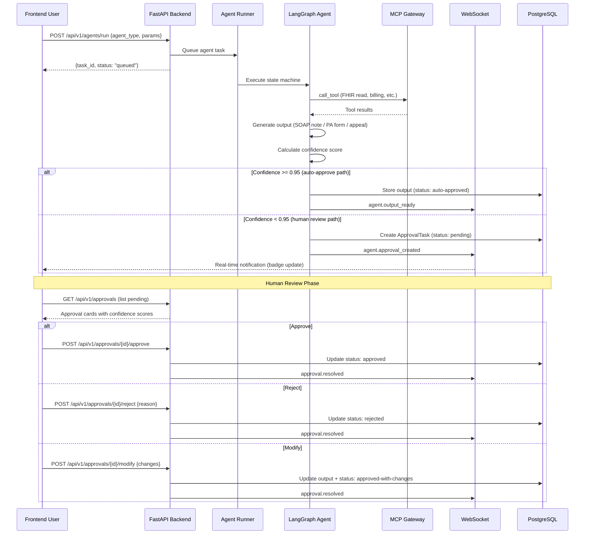

### Full Patient Data Flow

This diagram traces the complete data flow from patient check-in through claim resolution, showing how all five agents and MCP servers coordinate. This is the end-to-end workflow that the [[EPIC-008-demo-polish]] patient intake demo (T5) implements.

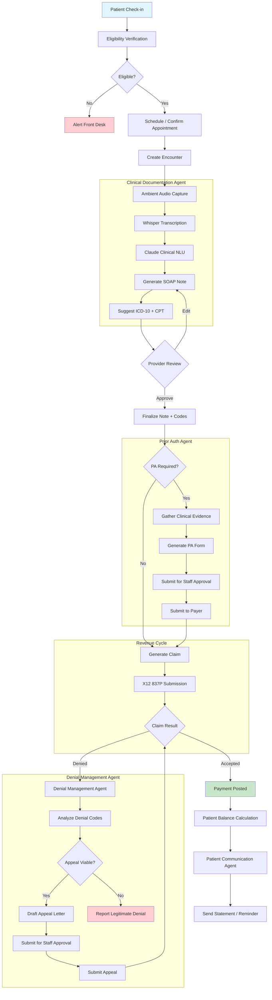

---

## Prior Authorization Agent State Machine (Sprint 4)

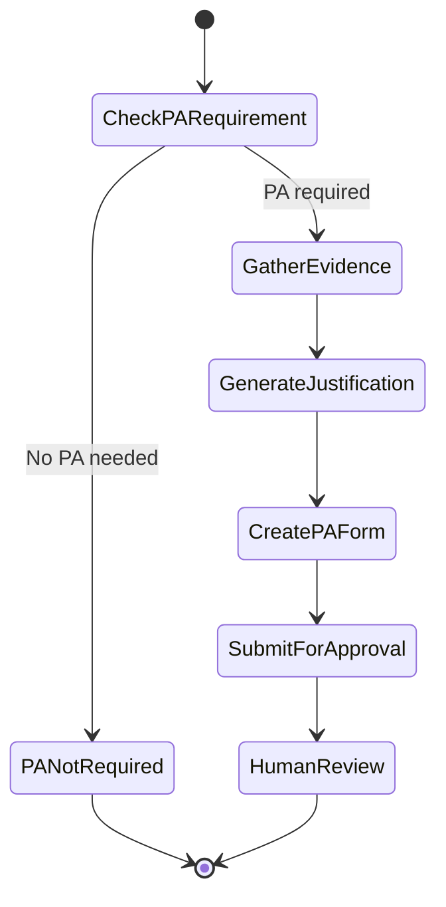

### Prior Authorization Agent Summary

The Prior Authorization Agent automates the end-to-end PA workflow: detecting when a procedure requires authorization, assembling clinical evidence from the FHIR store, generating a medical necessity justification narrative, building the PA form (X12 278 or Da Vinci PAS FHIR Bundle), and routing to a human reviewer before submission to the payer.

| Attribute | Detail |
|-----------|--------|
| **Module** | C (Claims & Billing) / D (AI & Analytics) |
| **Trigger** | `coding.approved` event when procedure requires PA |
| **MCP Tools** | `pa_check_requirement`, `pa_gather_evidence`, `pa_generate_justification`, `pa_create_form`, `pa_submit`, `pa_check_status`, `pa_appeal` (7 tools via Prior Auth MCP Server) |
| **Confidence Thresholds** | >= 0.95 auto-submit for staff review / 0.85-0.95 flag for extra documentation / < 0.85 escalate to billing specialist |
| **Authority Constraints** | CANNOT submit PA to payer without human approval. CANNOT modify clinical data. CANNOT bypass payer-specific documentation requirements. All submissions logged as FHIR AuditEvent. |
| **Max Daily Auto-Executions** | 0 (always requires human approval before payer submission) |

See [[EPIC-007-mcp-sdk-refactoring]] T7 for Sprint 2 implementation details. See [[EPIC-009-revenue-cycle-completion]] for Sprint 4 claims pipeline integration.

---

## Denial Management Agent State Machine (Sprint 4)

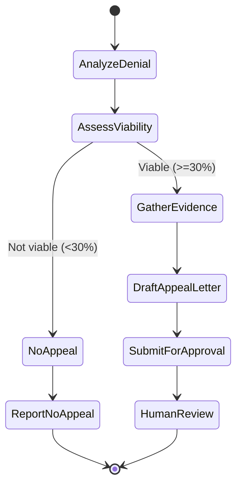

### Denial Management Agent Summary

The Denial Management Agent analyzes claim denials, assesses appeal viability based on denial reason codes (CARC/RARC) and historical overturn rates, gathers supporting clinical evidence, drafts appeal letters with payer-specific argumentation, and routes to a human reviewer before submission. Non-viable denials (< 30% estimated overturn probability) are reported without appeal to avoid wasted effort.

| Attribute | Detail |
|-----------|--------|
| **Module** | C (Claims & Billing) / D (AI & Analytics) |
| **Trigger** | `claim.denied` event from revenue cycle module |
| **MCP Tools** | `denial_analyze`, `denial_assess_viability`, `denial_gather_evidence`, `denial_draft_appeal`, `denial_submit_appeal`, `denial_track_status`, `denial_analytics`, `denial_pattern_report` (8 tools via Billing MCP Server) |
| **Confidence Thresholds** | >= 0.90 auto-draft appeal for review / 0.70-0.90 flag for billing specialist input / < 0.70 escalate to billing manager with full denial analysis |
| **Authority Constraints** | CANNOT submit appeals to payer without human approval. CANNOT modify original claim data. CANNOT waive patient responsibility. All appeal submissions logged as FHIR AuditEvent. |
| **Max Daily Auto-Executions** | 0 (always requires human approval before appeal submission) |
| **Viability Threshold** | < 30% estimated overturn probability = report as legitimate denial, do not appeal |

See [[EPIC-007-mcp-sdk-refactoring]] T8 for Sprint 2 implementation details. See [[EPIC-009-revenue-cycle-completion]] for Sprint 4 claims pipeline integration.

---

## Underpayment Detection Capability (Sprint 4)

Underpayment detection is not a standalone agent but an **AI-powered analytical module** integrated into the billing MCP tools. It runs automatically during payment posting (when 835 remittance data is processed) and can be invoked on-demand through the `billing_post_payment` MCP tool.

### How It Works

```
835 Remittance Parsed
    │
    ▼
Per-Service-Line Analysis
    │
    ├── Compare paid amount vs contracted rate
    ├── Compare allowed amount vs fee schedule
    └── Identify adjustment codes (CO, OA, PI, PR)
          │
          ▼
    Variance Calculation
          │
    ┌─────┼────────────────┐
    │     │                │
  >20%  10-20%           <10%
CRITICAL MODERATE        MINOR
    │     │                │
    ▼     ▼                ▼
  Flag + Alert    Flag    Log only
```

### Severity Classification

| Severity | Variance | Action | Notification |
|----------|----------|--------|--------------|
| **Critical** | > 20% underpaid | Flag for immediate billing staff review, auto-generate appeal template | Alert to billing manager |
| **Moderate** | 10-20% underpaid | Flag in underpayment queue with comparison data | Visible in billing dashboard |
| **Minor** | < 10% underpaid | Log for trend analysis, no immediate action | Included in weekly analytics |

### Integration Points

| Integration | Detail |
|-------------|--------|
| **MCP Tool** | `billing_post_payment` -- underpayment flags included in payment posting results |
| **Data Source** | Contracted rates from payer contracts (configured in [[EPIC-010-security-pilot-readiness]] T9 practice configuration panel) |
| **Output** | Underpayment report per remittance: service line, expected amount, paid amount, variance, severity, suggested action |
| **Analytics** | Feeds into revenue analytics dashboard ([[EPIC-009-revenue-cycle-completion]] T6) for trend tracking |
| **Denial Management** | Critical underpayments can trigger the Denial Management agent for appeal generation |

### Key Design Decisions

- **Not a full agent** because underpayment detection is a deterministic comparison (paid vs contracted), not a multi-step reasoning task requiring LLM orchestration.
- **AI-enhanced** for edge cases: when adjustment reason codes are ambiguous or contractual rates are missing, Claude classifies the adjustment and estimates expected payment from historical data.
- **Confidence scoring** applies: if the contracted rate lookup confidence is < 0.85 (e.g., rate not found, multiple possible rates), the underpayment flag includes a `needs_review: true` indicator.

See [[EPIC-009-revenue-cycle-completion]] T4 for the payment posting module that hosts this capability.

---

## Security Pipeline (All Agents)

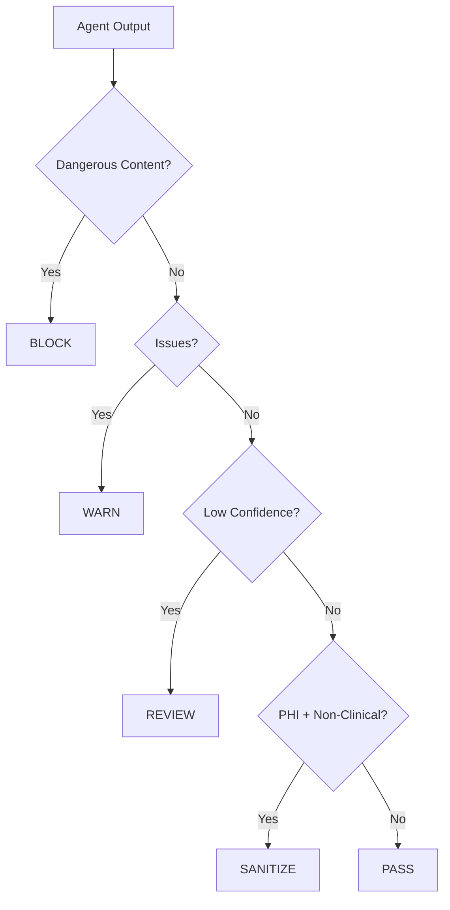

This pipeline is enforced at the framework level via `HIPAAFastMCP.call_tool()` override. See [[ADR-005-mcp-sdk-integration]] for the architectural decision.

---

## 8. Implementation Roadmap

### Phase 1 (Months 0-6): Foundation

- [ ] Base agent framework (LangGraph + PostgreSQL checkpointer)
- [ ] HIPAA compliance layer (minimum necessary, audit logging)
- [ ] Clinical Documentation Agent (MVP: audio -> SOAP note)
- [ ] Confidence routing engine with configurable thresholds
- [ ] Provider review UI for documentation agent
- [ ] FHIR-MCP Server integration

### Phase 2 (Months 6-12): Revenue Agents

- [ ] Prior Authorization Agent
- [ ] Denial Management Agent
- [ ] Patient Communication Agent (appointment reminders, basic FAQ)
- [ ] Inter-agent event bus (Redis Streams)
- [ ] Billing staff review UI

### Phase 3 (Months 12-18): Intelligence

- [ ] Quality Reporting Agent
- [ ] ML drift monitoring and retraining pipeline
- [ ] Cross-agent workflow orchestration
- [ ] Custom MCP servers (Scheduling, Billing, Analytics)
- [ ] Agent analytics dashboard

### Phase 4 (Months 18-24): Platform

- [ ] Third-party agent marketplace (MCP-based)
- [ ] Tenant-customizable agent workflows
- [ ] Multi-model routing (specialized models per task)
- [ ] Advanced memory architecture (context rot detection)

---

## Agent Security Model (Sprint 5)

Sprint 5 ([[EPIC-010-security-pilot-readiness]]) introduces a hardened agent security model. Every agent operates within a security envelope that prevents unauthorized data access, enforces minimum-necessary PHI exposure, and routes low-confidence outputs to human review.

### Credential Injection

Agents **never see raw credentials**. The MCP Gateway injects credentials at the transport layer:

1. Agent requests a tool call (e.g., `fhir_read`, `billing_submit_claim`)
2. MCP Gateway intercepts the request
3. Gateway retrieves the required credential from AWS Secrets Manager
4. Gateway injects the credential into the outbound request to the MCP server
5. MCP server executes with the credential; response flows back to agent
6. Agent receives only the data response -- never the credential itself

This ensures that even if an agent's state is logged, dumped, or inspected, no credentials are ever present in agent memory.

### PHI Access Policies per Agent Type

Each agent type has explicit PHI access boundaries enforced by the MCP Gateway:

| Agent | PHI Access Level | Allowed FHIR Resources | Restricted Fields |
|---|---|---|---|
| Clinical Scribe | Full clinical | Patient, Encounter, Observation, Condition, Procedure | Financial data |
| Prior Auth | Clinical + coverage | Patient, Encounter, Coverage, Claim | SSN (masked) |
| Denial Management | Billing + limited clinical | Claim, ClaimResponse, ExplanationOfBenefit, Patient (demographics only) | Full clinical notes |
| Billing | Billing only | Claim, Coverage, Invoice, Patient (demographics only) | All clinical data |
| Scheduling | Demographics only | Patient (name, DOB, phone), Appointment, Schedule, Slot | Clinical data, SSN, insurance |

### Safety Layer Pipeline

Every agent output passes through a 4-stage safety pipeline before reaching the user or being persisted:

```
Agent Output → [Block] → [Warn] → [Review] → [Sanitize] → Delivered
```

| Stage | Purpose | Trigger | Action |
|---|---|---|---|
| **Block** | Prevent dangerous content | Detected medication advice, diagnosis generation, or treatment recommendations from non-clinical agents | Hard stop; output discarded; incident logged |
| **Warn** | Flag potentially unsafe content | Unusual patterns (unexpected PHI in billing output, contradictory clinical data) | Output delivered with warning flag; logged for review |
| **Review** | Route to human review | Confidence < 0.85 for clinical output, any financial transaction > $1000 | Output queued in approval queue; not delivered until human approves |
| **Sanitize** | Strip PHI from non-clinical outputs | Non-clinical agent (billing, scheduling) producing output containing HIPAA identifiers | PHI fields masked or removed before delivery |

### Confidence Routing

Confidence scores determine whether agent output proceeds automatically or requires human intervention:

| Confidence Range | Action | Use Case |
|---|---|---|
| >= 0.95 | Auto-approve | High-confidence ICD-10 codes, routine claim submissions |
| >= 0.85 | Pass (execute with audit) | Standard SOAP notes, eligibility checks |
| 0.70 - 0.85 | Flag for review | Uncertain diagnoses, complex claims |
| < 0.70 | Human review required | Novel clinical presentations, high-value procedures, appeals |
| Any (critical action) | Always human review | Financial transactions, prior auth submissions, signed documents |

### Agent Audit Trail

Every agent action generates a FHIR AuditEvent:

```python
class AgentAuditEvent:
    agent_type: str          # clinical_scribe, prior_auth, etc.
    agent_run_id: str        # LangGraph thread ID
    action: str              # tool_call, output_generated, escalated, blocked
    tool_name: str | None    # MCP tool invoked (if applicable)
    confidence: float | None # Confidence score (if applicable)
    safety_stage: str        # block, warn, review, sanitize, pass
    tenant_id: str
    patient_id: str | None   # If PHI was accessed
    timestamp: datetime
    correlation_id: str      # Links to parent request
```

---

## Inter-Agent Communication (A2A Protocol)

MedOS agents communicate with each other using the **Agent-to-Agent (A2A) Protocol**, an open standard created by Google and governed by the Linux Foundation. A2A complements MCP: where MCP handles agent-to-tool communication (reading FHIR data, submitting claims), A2A handles agent-to-agent communication (requesting analysis, sharing results, coordinating workflows).

See [[ADR-008-a2a-agent-communication]] for the full decision record and [[a2a-protocol-reference]] for the protocol specification.

### Two Protocols, One Gateway

| Protocol | Direction | Purpose | Example |
|----------|-----------|---------|---------|
| **MCP** | Agent -> Tool | Data access, tool execution | Scribe Agent reads FHIR Patient via `fhir_read` |
| **A2A** | Agent <-> Agent | Inter-agent collaboration | Denial Agent asks Scribe Agent for supporting documentation |

Both protocols flow through a shared gateway layer that enforces authentication, PHI screening, tenant isolation, and audit logging.

### A2A Communication Diagram

```mermaid
graph TB
    subgraph "Foundation Agents"
        Scribe[Clinical Scribe Agent]
        PA[Prior Auth Agent]
        Denial[Denial Management Agent]
        PatComm[Patient Communication Agent]
        Quality[Quality Reporting Agent]
    end

    subgraph "Theoria Medical Agents"
        Guardian[Post-Acute Guardian]
        CCMRev[CCM Revenue Agent]
        ShiftSum[Shift Summary Agent]
        ACOQual[ACO REACH Quality]
        SNFBridge[SNF-Hospital Bridge]
        CareOpt[Care Plan Optimizer]
        StaffOpt[Staffing Optimizer]
    end

    subgraph "External Agents (A2A)"
        EpicAI[Epic AI Agent]
        PayerAI[Payer AI Agent]
        Marketplace[Marketplace AI Apps]
    end

    subgraph "Gateway Layer"
        A2A_GW[A2A Gateway<br/>Auth + PHI Screening + Audit]
        MCP_GW[MCP Gateway<br/>Tool Routing + Audit]
    end

    subgraph "MCP Servers"
        FHIR[FHIR MCP - 12 tools]
        Billing[Billing MCP - 13 tools]
        Sched[Scheduling MCP - 6 tools]
        Device[Device MCP - 8 tools]
        Context[Context MCP - 4 tools]
    end

    %% A2A: agent-to-agent (Foundation)
    Scribe <-->|A2A| A2A_GW
    PA <-->|A2A| A2A_GW
    Denial <-->|A2A| A2A_GW
    PatComm <-->|A2A| A2A_GW
    Quality <-->|A2A| A2A_GW

    %% A2A: agent-to-agent (Theoria)
    Guardian <-->|A2A| A2A_GW
    CCMRev <-->|A2A| A2A_GW
    ShiftSum <-->|A2A| A2A_GW
    ACOQual <-->|A2A| A2A_GW
    SNFBridge <-->|A2A| A2A_GW
    CareOpt <-->|A2A| A2A_GW
    StaffOpt <-->|A2A| A2A_GW

    %% A2A: external
    EpicAI <-->|A2A| A2A_GW
    PayerAI <-->|A2A| A2A_GW
    Marketplace <-->|A2A| A2A_GW

    %% MCP: agent-to-tool
    Scribe -->|MCP| MCP_GW
    PA -->|MCP| MCP_GW
    Denial -->|MCP| MCP_GW
    Guardian -->|MCP| MCP_GW
    CareOpt -->|MCP| MCP_GW
    SNFBridge -->|MCP| MCP_GW
    MCP_GW --> FHIR
    MCP_GW --> Billing
    MCP_GW --> Sched
    MCP_GW --> Device
    MCP_GW --> Context
```

### Example: Denial Management Agent Requests Supporting Documentation

When a claim is denied, the Denial Management Agent needs clinical documentation from the Clinical Scribe Agent to build an appeal. This is an A2A interaction:

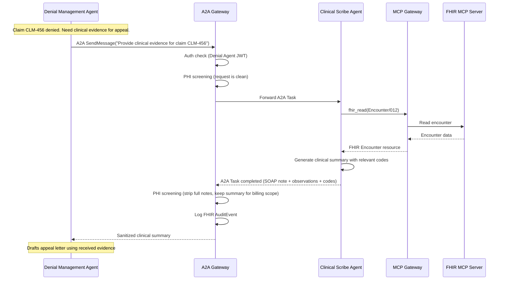

### Example: Device Bridge Notifies Clinical Scribe of New Reading

When a wearable device reports an abnormal reading during an active encounter, the Device Bridge triggers a notification to the Clinical Scribe Agent via A2A:

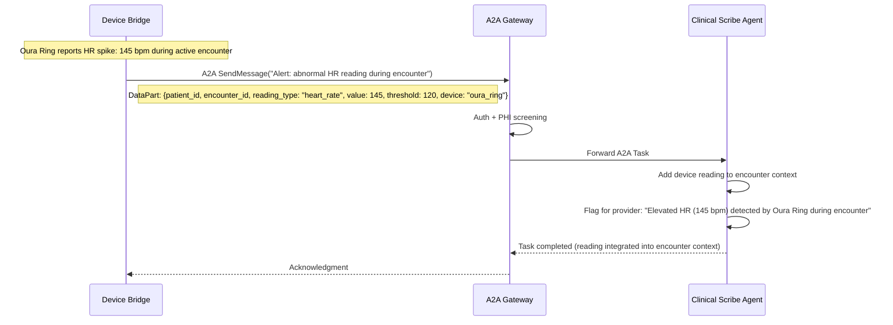

### PHI Screening in A2A Messages

All A2A messages pass through the PHI screening pipeline at the gateway. The gateway enforces minimum necessary principle based on the **receiving** agent's PHI access level:

| Receiving Agent | PHI Access Level | What They Receive |
|----------------|-----------------|-------------------|
| Clinical Scribe | Full clinical | Full FHIR resources, clinical notes, observations |
| Prior Auth | Clinical + coverage | Clinical data + insurance/coverage info |
| Denial Management | Billing + limited clinical | Summary notes, codes, billing data (not full clinical notes) |
| Patient Communication | Demographics only | Name, contact info, appointment details |
| Quality Reporting | Population (de-identified) | Aggregated metrics, no individual PHI |

### A2A and Context Rehydration Integration

A2A messages can trigger context rehydration events. When one agent updates patient data (e.g., Clinical Scribe generates new SOAP note), it publishes a context change via A2A that the Context Rehydration Engine picks up:

1. Clinical Scribe completes documentation -> A2A notification to downstream agents
2. Context Rehydration Engine detects change -> refreshes stale contexts
3. Quality Reporting Agent's care gap assessment gets fresh data automatically
4. Denial Management Agent's pending appeals get updated clinical evidence

This replaces the simple event bus approach with structured A2A Tasks that include status tracking and acknowledgment.

### Agent Cards

Each MedOS agent exposes an A2A Agent Card at a dedicated endpoint, enabling capability discovery:

| Agent | Agent Card URL | Key Skills |
|-------|---------------|------------|
| Clinical Scribe | `/a2a/clinical-scribe` | generate-soap-note, suggest-codes, encounter-summary |
| Prior Auth | `/a2a/prior-auth` | check-pa-required, gather-evidence, generate-pa-form |
| Denial Management | `/a2a/denial-management` | analyze-denial, draft-appeal, assess-viability |
| Patient Communication | `/a2a/patient-comms` | send-reminder, answer-faq, route-message |
| Quality Reporting | `/a2a/quality-reporting` | calculate-measure, identify-gaps, benchmark |
| Post-Acute Guardian | `/a2a/post-acute-guardian` | assess-risk, generate-alert, monitor-device |
| CCM Revenue | `/a2a/ccm-revenue` | track-activity, check-eligibility, generate-claim |
| Shift Summary | `/a2a/shift-summary` | scan-patients, generate-briefing, deliver-handoff |
| ACO REACH Quality | `/a2a/aco-quality` | identify-gaps, calculate-measures, project-savings |
| SNF-Hospital Bridge | `/a2a/snf-bridge` | ingest-discharge, reconcile, generate-report |
| Care Plan Optimizer | `/a2a/care-optimizer` | analyze-trends, retrieve-guidelines, recommend |
| Staffing Optimizer | `/a2a/staffing` | predict-census, optimize-schedule, analyze-cost |

External agents discover MedOS agents via the standard `/.well-known/agent.json` endpoint, which lists all available Agent Cards. After OAuth2 authentication, external agents can access extended Agent Cards with additional capabilities.

---

## 9. Theoria Medical Agents (Sprint S4F)

MedOS Sprint S4F introduces 7 new agents designed specifically for Theoria Medical's post-acute care operations. These agents extend the core platform with capabilities tailored to managing 200+ SNF/ALF facilities under ACO REACH value-based contracts. See [[EPIC-016-theoria-medical-pilot]] for the full sprint plan and [[LangGraph-Agent-Implementation]] for implementation details.

### 9.1 Theoria Agent Architecture Overview

The Theoria agents integrate with the existing 5-agent platform through the A2A protocol ([[ADR-008-a2a-agent-communication]]), device data pipeline ([[ADR-007-wearable-iot-integration]]), and context rehydration engine ([[ADR-006-context-rehydration]]). They add specialized post-acute care capabilities while sharing the same infrastructure: LangGraph orchestration, PostgreSQL checkpointing, HIPAA compliance layer, and Langfuse observability.

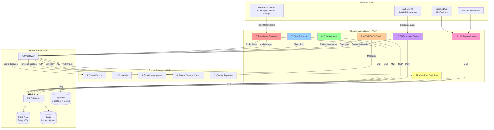

---

### 9.2 Post-Acute Guardian Agent

**Module:** F (Patient Engagement) + B (Provider Workflow)
**Pipeline:** Device Reading -> Context Rehydration -> Risk Assessment -> Alert Triage -> Provider Notification

#### Purpose

Monitors post-acute patients via wearable device data (weight, SpO2, HRV, sleep quality, heart rate) and detects clinically significant deterioration patterns before they require hospitalization. The primary use case: catching CHF exacerbation (3 lbs weight gain in 48h + sleep quality decline) before it becomes a $15-25K rehospitalization.

#### Authority

- Read device data from Device Bridge MCP Server
- Generate risk assessments with P1-P4 severity classification
- Send P2-P4 alerts via A2A to Patient Communication Agent
- Log risk assessments as FHIR RiskAssessment resources

#### Constraints

- **CANNOT diagnose** -- identifies risk patterns, not diagnoses
- **CANNOT prescribe or modify medications** -- medication suggestions always require physician approval
- **CANNOT suppress critical alerts** -- P1 alerts always reach the physician
- **CANNOT access device data outside assigned facility/patient scope**

#### Escalation Rules

| Condition | Action |
|-----------|--------|
| Weight gain >3 lbs in 48h + SpO2 <92% (CHF patient) | P1: Immediate physician alert, Furosemide consideration |
| SpO2 <90% sustained >30 min | P1: Immediate alert + recommend stat telemedicine |
| HRV decrease >20% from baseline | P2: Urgent nursing alert |
| Sleep quality drop >15% over 3 days | P3: Routine -- add to next shift briefing |
| Device offline >24 hours | P3: Alert nursing staff to check device |

#### Confidence Thresholds

| Task | Auto-Execute | Flag for Review | Full Escalation |
|------|-------------|-----------------|-----------------|
| P3-P4 alert generation | >= 0.85 | 0.70-0.85 | < 0.70 |
| P1-P2 alert generation | >= 0.90 | 0.80-0.90 | < 0.80 |
| Medication recommendations | N/A | N/A | ALWAYS human review |

#### FHIR Resources

| Operation | Resource | Description |
|-----------|----------|-------------|
| Read | `Patient`, `Observation`, `Device`, `DeviceMetric` | Device readings and patient context |
| Read | `Condition`, `MedicationRequest`, `CarePlan` | Clinical context for risk assessment |
| Write | `RiskAssessment`, `CommunicationRequest`, `Flag` | Risk scores, alerts, patient flags |

#### Revenue / Clinical Impact

- Prevents $15-25K rehospitalizations
- Protects ACO REACH shared savings
- Generates RPM billing revenue (CPT 99457/99458: $50-80/patient/month)

---

### 9.3 CCM Revenue Agent

**Module:** C (Revenue Cycle) + F (Patient Engagement)
**Pipeline:** Activity Tracking -> Classification -> Eligibility Check -> Threshold Detection -> Claim Generation -> Billing Review

#### Purpose

Tracks Chronic Care Management (CCM) activities per patient per month and automatically generates CPT 99490/99491 claims when the 20-minute or 40-minute threshold is crossed. Captures $60-150/patient/month in revenue that most practices leave on the table due to manual tracking burden.

#### Authority

- Track and classify CCM-qualifying activities from EventBridge events
- Verify billing eligibility (consent, care plan, 2+ chronic conditions)
- Generate claim drafts with appropriate CPT codes
- Route claims for billing staff review

#### Constraints

- **CANNOT submit claims without human review**
- **CANNOT fabricate or inflate activity durations**
- **CANNOT bill without verified patient consent on file**
- **CANNOT bill without an active care plan (CMS requirement)**

#### Confidence Thresholds

| Task | Auto-Execute | Flag for Review | Full Escalation |
|------|-------------|-----------------|-----------------|
| Activity classification | >= 0.90 | 0.80-0.90 | < 0.80 |
| Claim generation | N/A | N/A | ALWAYS human review |

#### Revenue Impact

- $60-150/patient/month in CCM billing
- With 5,000+ attributed lives: potential $300K-750K/month revenue capture
- Estimated 70%+ of qualifying CCM time currently goes unbilled

---

### 9.4 Shift Summary Agent

**Module:** B (Provider Workflow)
**Pipeline:** Provider Login -> Multi-Facility Scan -> Context Rehydration -> Priority Ranking -> Briefing Generation -> Delivery

#### Purpose

Generates structured handoff briefings when providers transition between shifts across 50+ facilities. Priority-ranks patients by acuity and pending actions. P1 patients (acute changes, unacknowledged critical alerts) are always flagged for immediate review.

#### Authority

- Scan active patients across assigned facilities
- Batch rehydrate clinical context for all patients
- Generate priority-ranked shift briefings
- Deliver briefings to incoming provider at login

#### Constraints

- **Informational only** -- no autonomous clinical actions
- **CANNOT modify patient records** -- read-only access
- **CANNOT suppress P1 patient flags** -- always shown prominently

#### Clinical Impact

- Prevents information loss at shift boundaries (80% of serious SNF medical errors)
- Saves 30-45 minutes of manual chart review per shift start
- Unified view across 50+ facilities for single provider

---

### 9.5 ACO REACH Quality Agent

**Module:** E (Population Health & Analytics)
**Pipeline:** Population Scan -> Gap Identification -> Revenue Impact Calculation -> Outreach Queue -> Quality Measure Reporting

#### Purpose

Monitors Theoria's attributed patient population under ACO REACH (Empassion Health) for care gaps, calculates quality measure compliance, and triggers automated patient outreach. Directly impacts shared savings distributions by optimizing quality scores.

#### Authority

- Identify care gaps from HEDIS/CMS quality measures (rule-based)
- Calculate revenue impact per gap closure
- Queue outreach via A2A to Patient Communication Agent
- Generate FHIR MeasureReport resources

#### Constraints

- **CANNOT make individual clinical recommendations** -- identifies gaps, clinicians decide actions
- **CANNOT directly contact patients** -- outreach goes through Patient Communication Agent
- **CANNOT submit quality reports externally without practice manager approval**
- **CANNOT alter quality measure definitions** -- measures defined by CMS/NCQA

#### Confidence Thresholds

| Task | Auto-Execute | Flag for Review | Full Escalation |
|------|-------------|-----------------|-----------------|
| Gap identification | >= 0.90 (rule-based) | 0.80-0.90 | < 0.80 |
| Quality score calculation | >= 0.99 (deterministic) | N/A | Data quality issues |
| Clinical recommendations | N/A | N/A | ALWAYS provider sign-off |

---

### 9.6 SNF-to-Hospital Semantic Data Bridge

**Module:** H (Integration) + A (Patient Identity)
**Pipeline:** ADT Event -> Discharge Summary Ingestion -> NLP Parsing -> Pre-Hospital Record Retrieval -> Semantic Reconciliation -> Discrepancy Report -> Physician Review

#### Purpose

Solves Dr. Di Rezze's founding insight: the dangerous "false sense of security" when patients transition between hospital and SNF without proper data reconciliation. Ingests discharge summaries (structured FHIR or unstructured PDF), reconciles against the pre-hospitalization record, and generates discrepancy reports for every medication change, new diagnosis, and follow-up instruction.

#### Authority

- Ingest discharge summaries from hospital FHIR endpoints or document uploads
- Parse unstructured clinical documents using NLP
- Perform semantic medication and diagnosis reconciliation
- Generate structured discrepancy reports
- Alert providers via A2A for critical discrepancies

#### Constraints

- **ALL medication changes** require pharmacist/physician review before updating patient record
- **CANNOT auto-update patient medications** in the EHR -- reconciliation is advisory until reviewed
- **CANNOT modify clinical records** -- generates reports for human action
- **CANNOT access hospital systems beyond authorized FHIR scope**

#### Confidence Thresholds

| Task | Auto-Execute | Flag for Review | Full Escalation |
|------|-------------|-----------------|-----------------|
| Medication matching | >= 0.90 | 0.80-0.90 | < 0.80 |
| Diagnosis reconciliation | >= 0.85 | 0.75-0.85 | < 0.75 |
| Follow-up extraction | >= 0.80 | 0.70-0.80 | < 0.70 |

#### Clinical Impact

- Catches medication errors at the most dangerous transition point in healthcare
- Reduces 30-day readmission rates by 20-30% through proper transition reconciliation
- Addresses the core problem that led Di Rezze to found Theoria Medical

---

### 9.7 Generative Care Plan Optimizer

**Module:** B (Provider Workflow) + E (Population Health)
**Pipeline:** Longitudinal Data Gathering -> Clinical Guideline RAG Retrieval -> Recommendation Generation -> Evidence Scoring -> Physician Review

#### Purpose

AI super-consultant that synthesizes longitudinal patient data with latest clinical guidelines (via RAG from pgvector) to generate proactive, evidence-based care recommendations. Scales top-clinician expertise across Theoria's entire 200+ facility network.

#### Authority

- Pull comprehensive longitudinal patient data from FHIR store
- Retrieve relevant clinical guidelines via semantic search (pgvector)
- Generate evidence-based recommendations with A/B/C evidence levels
- Predict deterioration risk based on trend analysis

#### Constraints

- **ALWAYS requires physician review** -- this is decision SUPPORT, not autonomous care
- **CANNOT prescribe medications** -- medication suggestions are advisory only
- **Evidence Level C recommendations** require attending physician (not NP/PA) sign-off
- **CANNOT override physician clinical judgment**
- **NEVER recommends without evidence citation**

#### Kill Shot Example

> "Weight up 4 lbs in 48h + nocturnal O2 desaturation -> 85% predictive of CHF exacerbation within 72h. Recommend: 1) 40mg Lasix IV Push, 2) Stat telemedicine check-in, 3) Daily weight protocol"
> Evidence Level: A (ACCF/AHA Heart Failure Guidelines, 2022 update)

---

### 9.8 Dynamic Staffing & Resource Allocation Agent

**Module:** B (Provider Workflow) + F (Patient Engagement)
**Pipeline:** Census Data + Provider Availability -> Census Prediction (72h) -> Cost-Optimal Assignment -> Schedule Recommendations -> Operations Review

#### Purpose

Optimizes provider scheduling across 200+ facilities using census predictions, acuity modeling, and cost optimization. Reduces reliance on expensive locum tenens providers ($2-5K/day). Directly addresses Amulet Capital Partners' margin expansion mandate.

#### Authority

- Gather facility census, acuity, and staffing data
- Predict census trends 72 hours in advance
- Generate cost-optimal provider scheduling recommendations
- Calculate savings vs current staffing model

#### Constraints

- **All schedule changes** require operations team review
- **Changes affecting > 5 providers** require ops director approval
- **Cost savings > $10K/week** require ops director + finance review
- **CANNOT violate state-mandated staffing ratios** (hard constraint)
- **CANNOT schedule providers beyond regulatory hour limits** (12h/shift, 60h/week)

#### Confidence Thresholds

| Task | Auto-Execute | Flag for Review | Full Escalation |
|------|-------------|-----------------|-----------------|
| Census prediction (72h) | >= 0.85 | 0.70-0.85 | < 0.70 |
| Cost optimization | >= 0.80 | 0.65-0.80 | < 0.65 |
| Schedule changes | N/A | N/A | ALWAYS operations review |

#### Revenue Impact

- Reduces locum tenens costs ($2-5K/day per locum shift avoided)
- Projected 10-15% reduction in total provider staffing costs
- Prevents understaffing fines from state regulators

---

### 9.9 Theoria Agent Communication Map

This diagram shows how the 7 Theoria agents communicate with each other and with the 5 foundation agents through the A2A protocol.

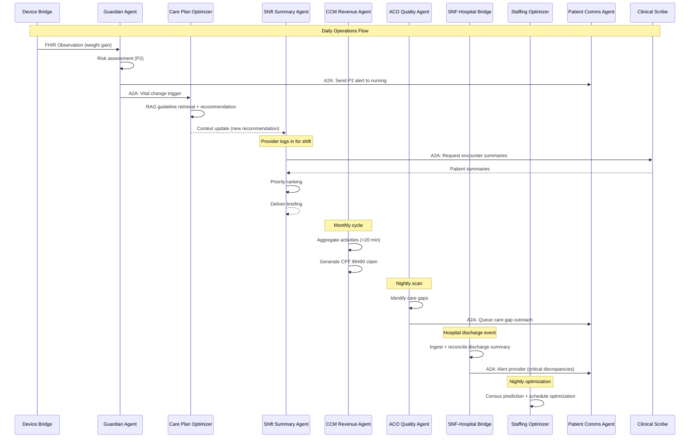

---

### 9.10 Theoria Agent Security Model

All Theoria agents inherit the base security model from Section 7 with additional PHI access controls specific to multi-facility post-acute care:

| Agent | PHI Access Level | Allowed FHIR Resources | Restricted Fields |
|---|---|---|---|
| Post-Acute Guardian | Clinical + device data | Patient, Observation, Device, Condition, MedicationRequest | Financial data, insurance |
| CCM Revenue | Billing + limited clinical | Patient, CarePlan, Communication, Claim, Condition | Full clinical notes |
| Shift Summary | Full clinical (read-only) | Patient, Encounter, Observation, MedicationRequest, DiagnosticReport | Financial data |
| ACO REACH Quality | Population (aggregated) | Patient, Observation, Condition, Procedure, MeasureReport | Individual PHI minimized |
| SNF-Hospital Bridge | Full clinical + cross-system | Patient, MedicationRequest, Condition, DocumentReference, Encounter | Financial data |
| Care Plan Optimizer | Full clinical | Patient, CarePlan, Observation, MedicationRequest, Condition | Financial data, insurance |
| Staffing Optimizer | Demographics only | Practitioner, PractitionerRole, Schedule, Location, Organization | All clinical data, all patient PHI |

### 9.11 Theoria Agent Cards (A2A Discovery)

| Agent | Agent Card URL | Key Skills |
|-------|---------------|------------|
| Post-Acute Guardian | `/a2a/post-acute-guardian` | assess-risk, generate-alert, monitor-device |
| CCM Revenue | `/a2a/ccm-revenue` | track-activity, check-eligibility, generate-claim |
| Shift Summary | `/a2a/shift-summary` | scan-patients, generate-briefing, deliver-handoff |
| ACO REACH Quality | `/a2a/aco-quality` | identify-gaps, calculate-measures, project-savings |
| SNF-Hospital Bridge | `/a2a/snf-bridge` | ingest-discharge, reconcile, generate-report |
| Care Plan Optimizer | `/a2a/care-optimizer` | analyze-trends, retrieve-guidelines, recommend |
| Staffing Optimizer | `/a2a/staffing` | predict-census, optimize-schedule, analyze-cost |

---

### 9.12 Updated Implementation Roadmap

The Theoria agents are scheduled for Sprint S4F, extending the Phase 1 roadmap:

| Phase | Agents | Timeline |
|-------|--------|----------|
| Phase 1 Foundation (S0-S6) | 1. Clinical Scribe, 2. Prior Auth, 3. Denial Management, 4. Patient Comms, 5. Quality Reporting | Months 0-6 (DONE) |
| Sprint S4F (Theoria Pilot) | 6. Guardian, 7. CCM Revenue, 8. Shift Summary, 9. ACO Quality, 10. SNF Bridge, 11. Care Optimizer, 12. Staffing | Weeks 15-18 |
| Phase 2 (Post-Pilot) | Refinement, additional facility onboarding, payer integrations | Months 7-12 |

---

### 9.13 Updated Event Bus with Theoria Agents

```mermaid
graph TB
    subgraph "Foundation Agents"
        DOC[Clinical Documentation Agent]
        PA[Prior Auth Agent]
        DEN[Denial Management Agent]
        PAT[Patient Communication Agent]
        QUA[Quality Reporting Agent]
    end

    subgraph "Theoria Agents"
        GUARD[Post-Acute Guardian]
        CCM[CCM Revenue Agent]
        SHIFT[Shift Summary Agent]
        ACO[ACO REACH Quality Agent]
        BRIDGE[SNF-Hospital Bridge]
        CARE[Care Plan Optimizer]
        STAFF[Staffing Optimizer]
    end

    subgraph "Event Bus (Redis Streams)"
        E1[encounter.documented]
        E2[coding.approved]
        E3[pa.required]
        E4[claim.denied]
        E5[care.gap.detected]
        E6[appointment.reminder.due]
        E7[device.reading.received]
        E8[device.alert.triggered]
        E9[ccm.threshold.crossed]
        E10[shift.transition]
        E11[discharge.received]
        E12[census.changed]
    end

    subgraph "Human Interface"
        PROV[Provider Workspace]
        BILL[Billing Dashboard]
        PTNT[Patient Portal]
        OPS[Operations Dashboard]
    end

    %% Foundation events
    DOC -->|publishes| E1
    E1 -->|triggers| QUA
    E2 -->|triggers| PA
    E4 -->|triggers| DEN
    E5 -->|triggers| PAT
    E6 -->|triggers| PAT

    %% Theoria events
    E7 -->|triggers| GUARD
    GUARD -->|publishes| E8
    E8 -->|triggers| CARE
    E8 -->|notifies| PROV
    E9 -->|triggers| CCM
    CCM -.->|claim queue| BILL
    E10 -->|triggers| SHIFT
    SHIFT -.->|briefing| PROV
    E11 -->|triggers| BRIDGE
    BRIDGE -.->|reconciliation| PROV
    E12 -->|triggers| STAFF
    STAFF -.->|schedule| OPS
    ACO -->|publishes| E5
    ACO -.->|reports| PROV
```

---

### 9.14 Safety Caps (Updated with Theoria Agents)

| Agent | Max Daily Auto-Executions | Rationale |
|-------|--------------------------|-----------|
| Clinical Documentation | Unlimited (always reviewed) | Provider reviews every note |
| Prior Auth | 0 (always reviewed) | Financial and clinical liability |
| Denial Management | 0 (always reviewed) | Financial liability |
| Patient Communication | 500 per tenant | Prevent spam; rate limit outbound messages |
| Quality Reporting | 50 reports | Prevent excessive compute on large populations |
| Post-Acute Guardian | Unlimited for P3-P4; P1-P2 always reviewed | Device data is continuous; critical alerts need immediate review |
| CCM Revenue | 200 claims per tenant | Rate limit claim generation; billing staff review capacity |
| Shift Summary | Unlimited (informational) | Read-only, no autonomous actions |
| ACO REACH Quality | 100 outreach per day | Prevent outreach fatigue; respect patient preferences |
| SNF-Hospital Bridge | 0 (always reviewed) | Medication safety -- all changes need physician review |
| Care Plan Optimizer | 0 (always reviewed) | Clinical recommendations always need physician approval |
| Staffing Optimizer | 0 (always reviewed) | Schedule changes always need operations approval |

---

## References

- [[HEALTHCARE_OS_MASTERPLAN]] -- Full vision and module definitions
- [[ADR-003-ai-agent-framework]] -- Framework selection decision
- [[ADR-001-fhir-native-data-model]] -- FHIR data model consumed by agents
- [[ADR-004-fastapi-backend-architecture]] -- Backend serving agent endpoints
- [[ADR-006-context-rehydration]] -- Context rehydration for Theoria agents
- [[ADR-007-wearable-iot-integration]] -- Device integration for Guardian Agent
- [[ADR-008-a2a-agent-communication]] -- A2A protocol adoption decision
- [[System-Architecture-Overview]] -- How agents fit in the overall system
- [[context-rotting-and-agent-memory]] -- Memory architecture research
- [[ml-drift-monitoring]] -- Drift detection for agent models
- [[Ambient-AI-Documentation]] -- Clinical documentation domain knowledge
- [[Prior-Authorization-Deep-Dive]] -- Prior auth domain knowledge
- [[Revenue-Cycle-Deep-Dive]] -- Revenue cycle domain knowledge
- [[HIPAA-Deep-Dive]] -- HIPAA compliance requirements
- [[mcp-integration-plan]] -- MCP integration strategy
- [[a2a-protocol-reference]] -- A2A protocol reference
- [[MOC-Agent-Architecture]] -- Navigation index for agent docs
- [[EPIC-010-security-pilot-readiness]] -- Sprint 5 security hardening
- [[EPIC-016-theoria-medical-pilot]] -- Theoria Medical pilot sprint
- [[FHIR-R4-Deep-Dive]] -- FHIR resource schemas including Theoria-specific resources
- [[LangGraph-Agent-Implementation]] -- Full implementation code for all 11 agents
