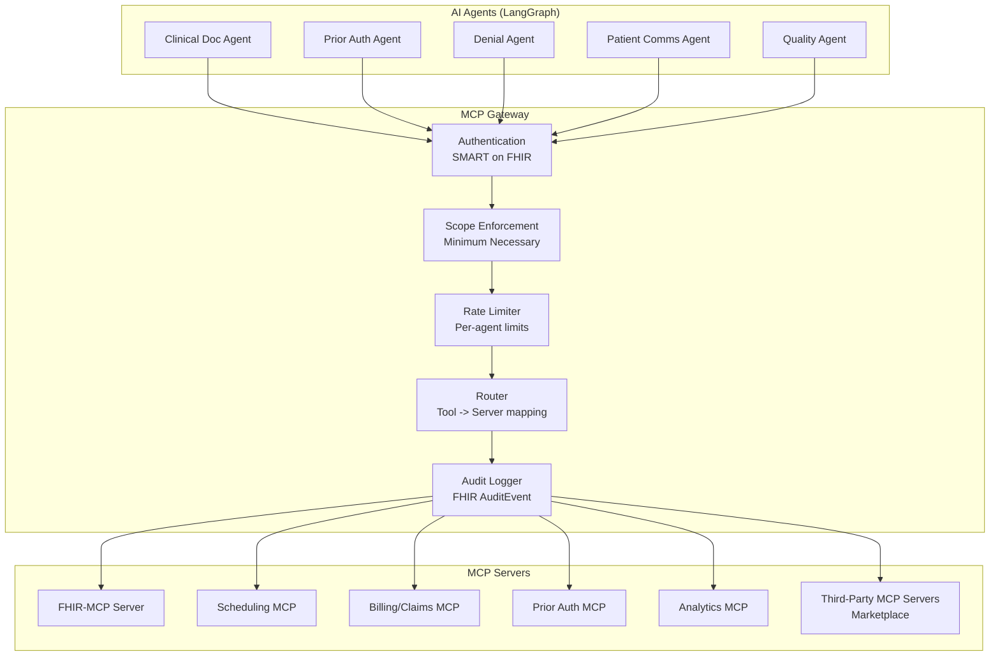
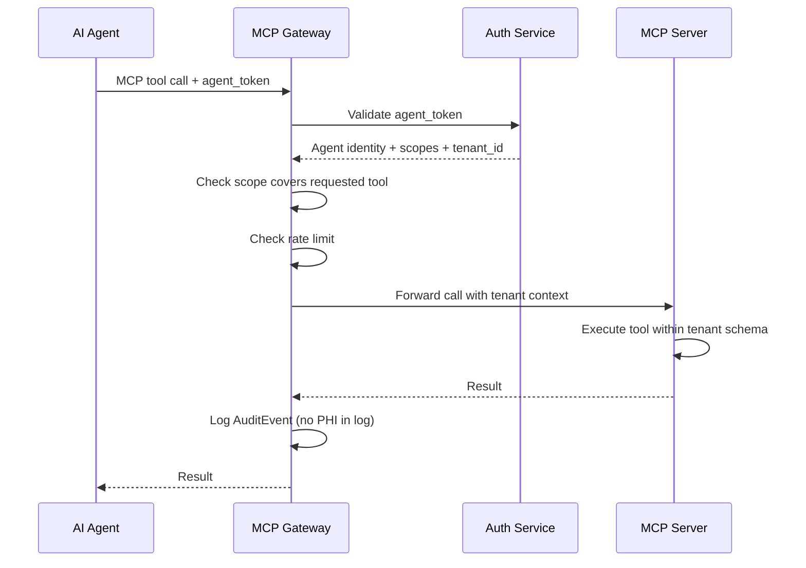
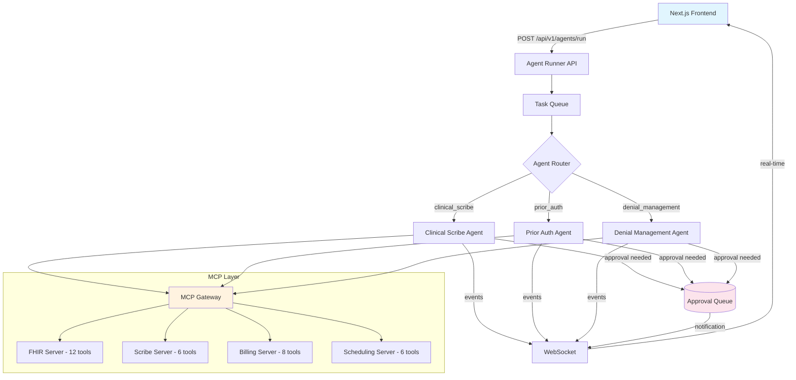
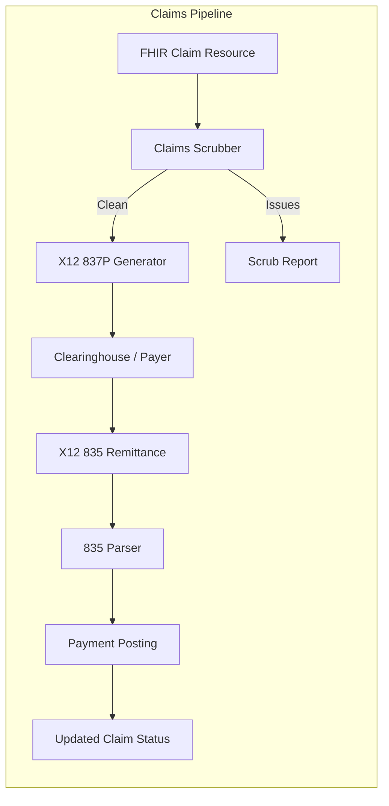
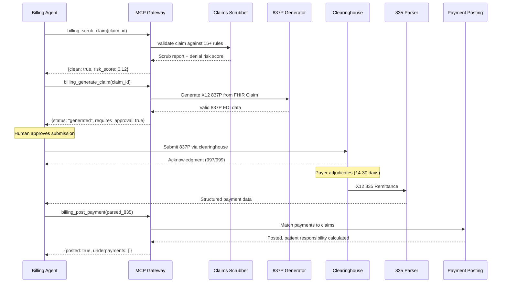

# MCP Integration Plan for MedOS

> How MedOS uses Model Context Protocol (MCP) to connect AI agents with healthcare tools, data, and third-party applications. MCP is the "USB-C for AI" -- a single standard interface that replaces custom integrations.

**Why this matters:** MCP is the foundation of MedOS's ecosystem strategy. Instead of each AI agent writing custom code to talk to EHRs, payers, and schedulers, all agents use the same standardized protocol. This enables third-party healthcare AI apps to integrate MedOS without knowing our internals -- unlocking the "healthcare AI marketplace" vision.

**Related:** [[agent-architecture]] | [[HEALTHCARE_OS_MASTERPLAN]] | [[ADR-003-langgraph-claude-agents]] | [[System-Architecture-Overview]]

---

## 1. What Is MCP and Why It Matters for Healthcare AI

### The Problem MCP Solves

Today, every AI tool integration is bespoke. If an AI agent needs to read a FHIR resource, query a scheduling system, and submit a claim, it needs three different custom connectors with three different authentication mechanisms, three different data formats, and three different error handling patterns. This does not scale.

### What MCP Is

Model Context Protocol (MCP) is an open standard (created by Anthropic, now community-governed) that defines how AI models interact with external tools and data sources. It provides:

- **Standardized tool interface**: Tools expose capabilities via a uniform JSON-RPC protocol
- **Resource access**: AI models can read structured data through a consistent interface
- **Prompt injection**: Servers can provide context-specific prompts to guide AI behavior
- **Authentication**: Built-in auth flow supporting OAuth2, API keys, and service-to-service credentials
- **Streaming**: Real-time data flow for long-running operations

### Why MCP Matters for Healthcare: Four Strategic Reasons

#### 1. Standardized Interface Between AI Agents and Healthcare Data

Without MCP: Each AI agent (Clinical Documentation, Prior Auth, Denial Management) writes custom code to query FHIR servers, payer systems, scheduling APIs, and billing systems. Code duplicates. Bugs in one agent don't get fixed in another. Maintenance becomes a nightmare.

With MCP: All agents use the same protocol to access all systems. The complexity lives in one place: the MCP servers. Agents become thin clients that call standardized tools. One team maintains the servers; agents focus on logic.

#### 2. Third-Party Integration Without Custom Code

**Current state:** If Epic wants to integrate MedOS, they'd need to:
- Study our API docs
- Build custom adapters
- Maintain compatibility as we evolve
- Handle their compliance + our compliance

**MCP future:** Epic publishes an MCP server that exposes FHIR operations. MedOS agents connect. Done. Epic handles their compliance; we handle ours. No custom integration code needed.

**Impact:** This unlocks the healthcare AI ecosystem. Vendors (EHR, labs, pharmacies, imaging) become MCP publishers. MedOS becomes the hub.

#### 3. Aligns with Anthropic's Healthcare Ecosystem

Anthropic is investing heavily in Claude for Healthcare. MCP is their standard for AI-system integration. By adopting MCP:
- MedOS becomes compatible with Claude's healthcare roadmap
- Future Claude healthcare features integrate seamlessly
- Positions MedOS as "the Claude-native healthcare OS"

#### 4. Enables the Healthcare AI Marketplace

MCP enables MedOS to become a **platform**, not just a product. Third-party AI developers can build specialized applications (dermatology AI, radiology AI, coding accuracy AI) that:
- Connect to MedOS via MCP
- Access patient data securely (via SMART on FHIR)
- Write results back to FHIR
- Operate within our audit and compliance framework

This is how we build the "app store for healthcare AI" -- and how MedOS becomes the OS, not just an application.

### Comparison: Approaches to Healthcare Integration

| Dimension | Traditional APIs | Custom Connectors | **MCP (Our Approach)** |
|-----------|-----------------|------------------|----------------------|
| **Standardization** | Each vendor defines API | No standard, pure custom | One protocol for all |
| **Third-party apps** | Need to learn our API | Cannot reasonably integrate | Plug and play via MCP |
| **Code reuse** | Per-integration | None; duplicate everywhere | Centralized in servers |
| **Security** | Per-API auth | Per-integration auth | Centralized auth + audit |
| **Vendor ecosystem** | Vendors learn our internals | Not feasible | Vendors publish MCP servers |
| **Scalability to N vendors** | O(N) connectors | O(N) custom code | O(1) MCP standard |

---

## 2. FHIR-MCP Server (Open Source, Available Now)

An open-source FHIR-MCP Server already exists. It provides MCP-compatible access to FHIR R4 resources, which means our agents can immediately interact with healthcare data through MCP.

### Capabilities

The FHIR-MCP Server exposes FHIR operations as MCP tools:

| MCP Tool | FHIR Operation | Description |
|----------|---------------|-------------|
| `fhir_read` | `GET /fhir/r4/{type}/{id}` | Read a specific resource |
| `fhir_search` | `GET /fhir/r4/{type}?params` | Search resources with FHIR search parameters |
| `fhir_create` | `POST /fhir/r4/{type}` | Create a new resource |
| `fhir_update` | `PUT /fhir/r4/{type}/{id}` | Update an existing resource |
| `fhir_history` | `GET /fhir/r4/{type}/{id}/_history` | Get resource version history |
| `fhir_operation` | `POST /fhir/r4/{type}/$op` | Execute FHIR operations ($everything, $validate, etc.) |

### Integration with MedOS Agents

```python
# Example: Clinical Documentation Agent using FHIR-MCP Server
from mcp import MCPClient

async def retrieve_clinical_context(state: CodingAgentState) -> dict:
    """Retrieve clinical context via FHIR-MCP Server."""
    client = MCPClient("fhir-mcp-server")

    # Read patient demographics
    patient = await client.call_tool("fhir_read", {
        "resourceType": "Patient",
        "id": state.patient_id,
    })

    # Search for encounter context
    encounter = await client.call_tool("fhir_search", {
        "resourceType": "Encounter",
        "params": {
            "patient": state.patient_id,
            "_id": state.encounter_id,
            "_include": "Encounter:diagnosis",
        },
    })

    # Get recent observations (vitals)
    observations = await client.call_tool("fhir_search", {
        "resourceType": "Observation",
        "params": {
            "patient": state.patient_id,
            "encounter": state.encounter_id,
            "category": "vital-signs",
        },
    })

    return {
        "patient_fhir": patient,
        "encounter_fhir": encounter,
        "observations": observations,
    }
```

### Security Configuration

The FHIR-MCP Server must be configured with:

- **SMART on FHIR backend services auth**: Service-to-service JWT-based authentication
- **Scope enforcement**: Agent requests only the FHIR scopes it needs (minimum necessary)
- **Tenant isolation**: MCP requests include tenant context; server enforces schema isolation
- **Audit logging**: Every MCP tool call logged as FHIR AuditEvent
- **Rate limiting**: Per-agent rate limits to prevent runaway queries

---

## 3. Custom MCP Servers to Build

Beyond the FHIR-MCP Server, MedOS needs domain-specific MCP servers for workflows that are not covered by standard FHIR operations.

### 3.1 Scheduling MCP Server

**Phase:** 2
**Used by:** Patient Communication Agent, Prior Auth Agent, Quality Reporting Agent

| MCP Tool | Description |
|----------|-------------|
| `scheduling_available_slots` | Query available appointment slots by provider, location, type, date range |
| `scheduling_book` | Book an appointment (creates FHIR Appointment) |
| `scheduling_reschedule` | Reschedule an existing appointment |
| `scheduling_cancel` | Cancel an appointment with reason |
| `scheduling_waitlist_add` | Add patient to waitlist for earlier slot |
| `scheduling_no_show_predict` | Get ML-predicted no-show probability for a patient/slot |

**Implementation notes:**
- Wraps the MedOS scheduling API (Module D)
- Enforces provider availability rules and buffer times
- Returns FHIR `Slot` and `Appointment` resources
- No-show prediction is read-only; agents cannot modify scheduling rules

### 3.2 Billing/Claims MCP Server

**Phase:** 2
**Used by:** Denial Management Agent, Prior Auth Agent, Quality Reporting Agent

| MCP Tool | Description |
|----------|-------------|
| `billing_check_eligibility` | Real-time eligibility check (X12 270/271) |
| `billing_submit_claim` | Submit a claim (X12 837) -- requires human approval flag |
| `billing_claim_status` | Check claim status (X12 276/277) |
| `billing_parse_remittance` | Parse X12 835 remittance advice |
| `billing_denial_lookup` | Look up denial reason codes (CARC/RARC) with descriptions |
| `billing_submit_appeal` | Submit appeal -- requires human approval flag |
| `billing_patient_balance` | Get patient account balance |
| `billing_payer_rules` | Query payer-specific rules (PA requirements, filing deadlines, etc.) |

**Implementation notes:**
- Wraps Module C (Revenue Cycle) and Module D (Payer Integration)
- Claims and appeals are marked as `requires_human_approval: true` in tool metadata
- The MCP server refuses to execute these tools unless the approval flag is set
- X12 parsing/generation handled internally; agents receive/send structured data

### 3.3 Prior Auth MCP Server

**Phase:** 2
**Used by:** Prior Auth Agent

| MCP Tool | Description |
|----------|-------------|
| `pa_check_required` | Check if PA is required for a service + payer combination |
| `pa_get_requirements` | Get payer-specific PA requirements (documentation needed, forms, etc.) |
| `pa_generate_request` | Generate PA request (X12 278 or payer API format) |
| `pa_submit` | Submit PA request -- requires human approval |
| `pa_check_status` | Check PA status |
| `pa_get_determination` | Get PA determination details |
| `pa_appeal` | Initiate PA appeal -- requires human approval |

**Implementation notes:**
- Integrates with Da Vinci Prior Authorization Support (PAS) Implementation Guide
- Supports both X12 278 (legacy) and FHIR-based PA (CMS mandate, effective 2026-2027)
- Payer rule database updated weekly from payer publications
- All submissions gated by human approval

### 3.4 Analytics MCP Server

**Phase:** 3
**Used by:** Quality Reporting Agent, all agents (for historical pattern analysis)

| MCP Tool | Description |
|----------|-------------|
| `analytics_measure_calculate` | Calculate a quality measure for a patient population |
| `analytics_care_gaps` | Identify care gaps for a patient or population |
| `analytics_denial_patterns` | Analyze denial patterns by payer, code, reason, time period |
| `analytics_coding_accuracy` | Get historical coding acceptance rates |
| `analytics_benchmark` | Compare practice metrics against network benchmarks |
| `analytics_revenue_forecast` | Revenue projections based on pipeline |
| `analytics_readmission_risk` | Calculate readmission risk for a patient |

**Implementation notes:**
- Read-only server (no write operations)
- Queries pre-computed analytics in Snowflake/PostgreSQL
- Results are aggregated and de-identified where possible
- Caches frequently-requested metrics in Redis

---

## 4. MCP Gateway Architecture

All MCP traffic flows through a central gateway that enforces security, routing, and observability.



### Gateway Responsibilities

| Function | Description |
|----------|-------------|
| **Authentication** | Validates agent identity and invoking user credentials via SMART on FHIR |
| **Scope Enforcement** | Checks that the requested MCP tool is within the agent's granted scopes |
| **Tenant Isolation** | Injects tenant_id into all MCP calls; servers enforce schema isolation |
| **Rate Limiting** | Per-agent, per-server rate limits to prevent resource exhaustion |
| **Audit Logging** | Every MCP tool call logged with agent identity, tool name, parameters (no PHI), and result status |
| **Routing** | Maps MCP tool names to the correct server instance |
| **Circuit Breaking** | Disables MCP server calls if error rate exceeds threshold (protect agents from degraded services) |

---

## 5. Enabling Third-Party AI Apps (The Marketplace)

### The Vision

MedOS becomes a platform by exposing MCP servers that third-party developers can connect their AI applications to. A third-party app for dermatology AI image analysis can connect to MedOS, read relevant patient data, and write results back -- all through MCP.

### How It Works

1. **Developer registers app** in MedOS Developer Portal
2. **App declares capabilities**: What MCP tools it needs (scopes)
3. **Practice admin approves app**: Grants specific scopes for their tenant
4. **App connects via MCP**: Uses SMART on FHIR auth, accesses only approved data
5. **MedOS audits everything**: Every MCP call logged, PHI access tracked

### Marketplace MCP Access Tiers

| Tier | Access | Use Case | Review Process |
|------|--------|----------|---------------|
| **Read-Only** | `fhir_read`, `fhir_search`, `analytics_*` | Dashboards, analytics, reporting | Automated review |
| **Read-Write** | Above + `fhir_create`, `fhir_update` | Clinical tools, documentation aids | Manual security review |
| **Workflow** | Above + `scheduling_*`, `billing_*` | Full workflow apps | Full security audit + HIPAA assessment |

### Security for Third-Party Apps

- **Sandbox environment**: All new apps tested in sandbox before production access
- **Scope limitation**: Apps only access the MCP tools they declared; no lateral movement
- **PHI audit**: Every PHI access by third-party apps logged and available to practice admin
- **Revocation**: Practice admin can revoke app access instantly; MCP gateway enforces immediately
- **Data residency**: Third-party apps cannot export bulk PHI; MCP responses are streaming only
- **Rate limiting**: Aggressive rate limits for third-party apps (separate from internal agents)

---

## 6. Security: MCP Authentication, Tenant Isolation, PHI Protection

### Authentication Flow



### Tenant Isolation

MCP servers enforce tenant isolation at the data layer:

- Every MCP call includes `tenant_id` injected by the gateway (agents cannot forge this)
- MCP servers connect to tenant-specific database schemas (see [[ADR-002-multi-tenancy-schema-per-tenant]])
- Cross-tenant MCP calls are impossible by design
- Per-tenant KMS keys encrypt data at rest (see [[System-Architecture-Overview]])

### PHI Protection in MCP

| Layer | Protection |
|-------|-----------|
| **Transport** | TLS 1.3 for all MCP traffic |
| **Parameters** | MCP gateway strips PHI from audit logs; logs resource references only |
| **Responses** | MCP responses contain FHIR resources with field-level encryption for sensitive fields (SSN, etc.) |
| **Caching** | MCP responses are NOT cached at the gateway level; caching happens only at the MCP server level with appropriate TTL and encryption |
| **Error messages** | MCP errors never contain PHI; generic error codes with correlation IDs for debugging |

---

## 7. Implementation Roadmap

### Phase 1 (Months 0-6): Foundation

- [ ] Deploy FHIR-MCP Server connected to MedOS FHIR store
- [ ] Build MCP Gateway (auth, routing, audit)
- [ ] Integrate Clinical Documentation Agent with FHIR-MCP Server
- [ ] Establish MCP security patterns (scope enforcement, tenant isolation)

### Phase 2 (Months 6-12): Core MCP Servers

- [ ] Build Scheduling MCP Server
- [ ] Build Billing/Claims MCP Server
- [ ] Build Prior Auth MCP Server
- [ ] Integrate all revenue cycle agents with MCP
- [ ] MCP monitoring and alerting dashboard

### Phase 3 (Months 12-18): Platform

- [ ] Build Analytics MCP Server
- [ ] Developer Portal for third-party MCP apps
- [ ] Sandbox environment for app testing
- [ ] App review and approval workflow
- [ ] First 3-5 marketplace apps

### Phase 4 (Months 18-24): Ecosystem

- [ ] Public MCP SDK (Python, JavaScript)
- [ ] MCP app certification program
- [ ] Partner integrations (EHR vendors publishing MCP servers)
- [ ] Cross-platform MCP federation (connect to other MCP-enabled systems)

---

## Hybrid Approach: HIPAAFastMCP (Sprint 2)

Instead of fully custom MCP, we now subclass `FastMCP` from the official SDK:

- `HIPAAFastMCP(FastMCP)` overrides `call_tool()` for security pipeline
- `@hipaa_tool` decorator replaces tuple-based registration
- SDK handles JSON-RPC, SSE transport, input schema generation
- Our security pipeline (auth, PHI, rate limit, audit) stays intact

### Tool Count: 32 Total
| Server | Tools | Status |
|--------|-------|--------|
| FHIR | 12 | Migrated to @hipaa_tool |
| Scribe | 6 | Migrated to @hipaa_tool |
| Billing | 8 | NEW in Sprint 2 |
| Scheduling | 6 | NEW in Sprint 2 |

See [[ADR-005-mcp-sdk-integration]] for decision rationale.

---

## Agent Runner Integration (Sprint 3)

Sprint 3 ([[EPIC-008-demo-polish]]) introduces the Agent Runner API, which provides a unified interface for triggering LangGraph agents. The agent runner interacts with MCP servers through the gateway, enabling the frontend to invoke any agent via a single endpoint.



### Tool Count: 32 Confirmed (Sprint 2 Complete)

| Server | Tools | Status | Sprint |
|--------|-------|--------|--------|
| FHIR | 12 | Done (migrated to @hipaa_tool) | Sprint 1 -> 2 |
| Scribe | 6 | Done (migrated to @hipaa_tool) | Sprint 1 -> 2 |
| Billing | 8 | Done (NEW in Sprint 2) | Sprint 2 |
| Scheduling | 6 | Done (NEW in Sprint 2) | Sprint 2 |
| **Total** | **32** | **All operational** | |

### Sprint 3 MCP Usage

Sprint 3 does not add new MCP tools but introduces new patterns for consuming them:

1. **Agent Runner** provides a unified API for triggering agents that use MCP tools
2. **Patient Intake Workflow** chains multiple MCP tool calls across servers in a single orchestrated flow
3. **WebSocket events** broadcast MCP tool execution progress to the frontend in real-time

See [[EPIC-008-demo-polish]] for the full Sprint 3 scope.

---

## Claims Pipeline Architecture (Sprint 4)

Sprint 4 ([[EPIC-009-revenue-cycle-completion]]) completes the revenue cycle by building the X12 claims pipeline. This pipeline connects FHIR Claim resources to clearinghouse submission and remittance processing, all accessible via 4 new MCP tools.



### Claims Pipeline MCP Tools

| MCP Tool | Operation | Approval Required |
|----------|-----------|-------------------|
| `billing_generate_claim` | Generate X12 837P from FHIR Claim | Yes (for submission) |
| `billing_scrub_claim` | Run scrubbing rules, return denial risk score | No (read-only) |
| `billing_post_payment` | Post payment from parsed 835 | Yes |
| `billing_claims_analytics` | Query claims metrics (clean rate, denials, AR) | No (read-only) |

### Updated Tool Count: 36 Total

| Server | Tools | Status | Sprint |
|--------|-------|--------|--------|
| FHIR | 12 | Done (migrated to @hipaa_tool) | Sprint 1 -> 2 |
| Scribe | 6 | Done (migrated to @hipaa_tool) | Sprint 1 -> 2 |
| Billing | 12 | Done (8 Sprint 2 + 4 Sprint 4) | Sprint 2, 4 |
| Scheduling | 6 | Done (NEW in Sprint 2) | Sprint 2 |
| **Total** | **36** | **All operational** | |

### End-to-End Claims Flow with MCP



See [[EPIC-009-revenue-cycle-completion]] for the full Sprint 4 scope.

---

## References

- [[agent-architecture]] -- Agent framework that consumes MCP servers
- [[HEALTHCARE_OS_MASTERPLAN]] -- Platform vision and marketplace strategy
- [[ADR-003-ai-agent-framework]] -- LangGraph + MCP decision
- [[ADR-002-multi-tenancy-schema-per-tenant]] -- Tenant isolation enforced by MCP
- [[System-Architecture-Overview]] -- Overall system architecture
- [[FHIR-R4-Deep-Dive]] -- FHIR standard that FHIR-MCP Server exposes
- [[HIPAA-Deep-Dive]] -- HIPAA requirements for MCP security
- [[MOC-Agent-Architecture]] -- Navigation index
- [[EPIC-009-revenue-cycle-completion]] -- Sprint 4 claims pipeline
- [MCP Specification](https://modelcontextprotocol.io/)
- [FHIR-MCP Server (GitHub)](https://github.com/fhir-mcp/fhir-mcp-server)
