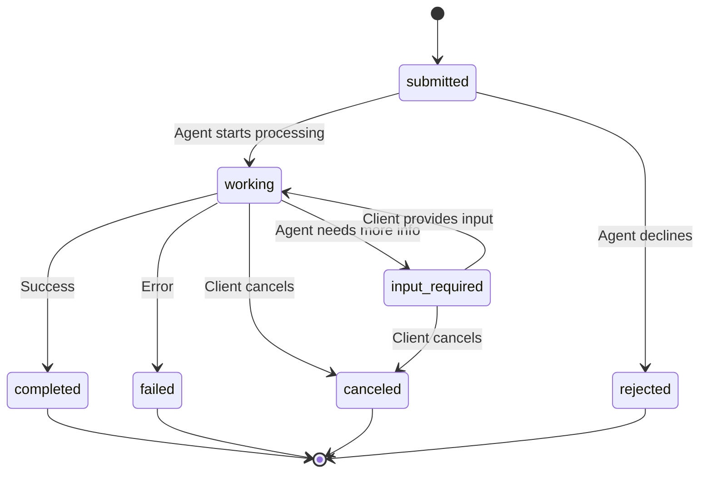
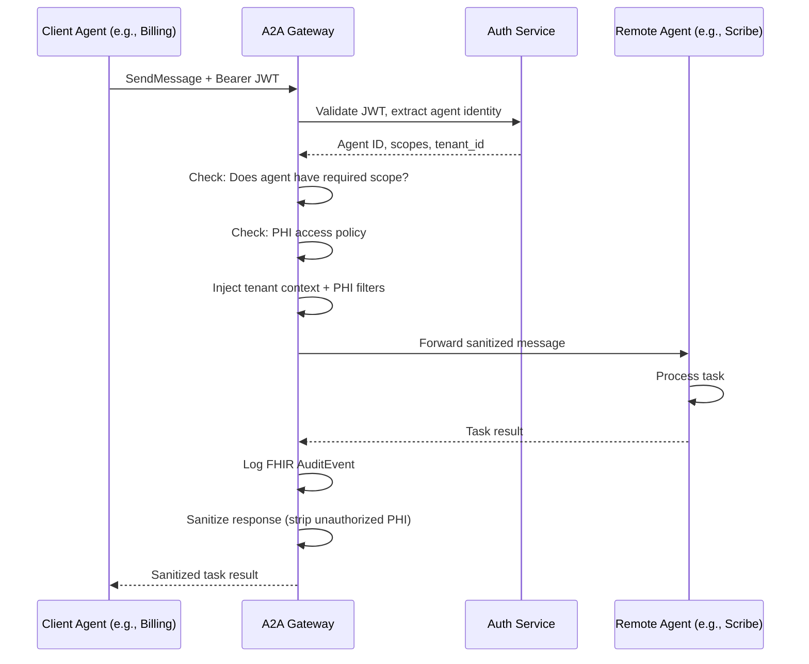
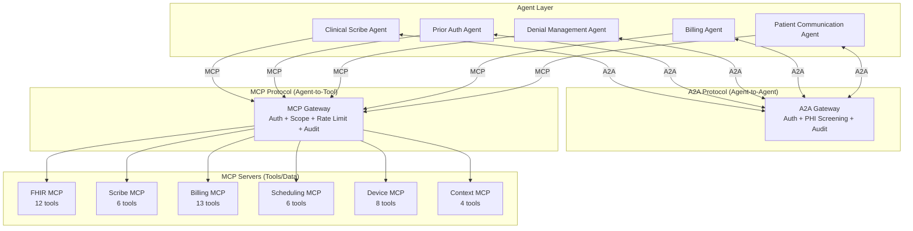

# A2A Protocol Reference for MedOS

> Complete reference on Google's Agent-to-Agent (A2A) protocol and how it applies to MedOS Healthcare OS. A2A enables inter-agent communication, while MCP handles tool/data access. Together, they form the dual-protocol foundation for MedOS's agentic architecture.

Related: [[ADR-008-a2a-agent-communication]] | [[agent-architecture]] | [[mcp-integration-plan]] | [[HEALTHCARE_OS_MASTERPLAN]]

---

## 1. What Is A2A

Agent-to-Agent (A2A) Protocol is an **open standard** created by Google and donated to the Linux Foundation. It enables AI agents built on different frameworks and by different vendors to **discover each other's capabilities, negotiate interaction modes, securely collaborate on long-running tasks, and operate without exposing their internal state, memory, or tools**.

### Key Distinction: A2A vs MCP

| Protocol | Purpose | Direction | Analogy |
|----------|---------|-----------|---------|
| **MCP** (Model Context Protocol) | Agent-to-tool communication | Agent -> tools, data, APIs | USB-C for AI tools |
| **A2A** (Agent-to-Agent Protocol) | Agent-to-agent communication | Agent <-> Agent | HTTP for AI agents |

MCP is how an agent accesses FHIR data, submits claims, or queries scheduling. A2A is how the Denial Management Agent asks the Clinical Scribe Agent for supporting documentation for an appeal.

### Design Principles

1. **Embrace agentic capabilities** -- agents are first-class peers, not tools
2. **Build on existing standards** -- HTTP, SSE, JSON-RPC 2.0 (no new protocols)
3. **Secure by default** -- enterprise-grade auth matching OpenAPI schemes
4. **Support long-running tasks** -- handles everything from quick lookups to multi-day workflows
5. **Modality agnostic** -- supports text, structured data, files, audio, and video
6. **Opaque execution** -- agents are black boxes; they never expose internal state, memory, or tool implementations

### Protocol Stack

```
A2A Communication
  ├── Transport: HTTP(S) / gRPC
  ├── Message Format: JSON-RPC 2.0
  ├── Streaming: Server-Sent Events (SSE)
  ├── Discovery: Agent Cards (.well-known/agent.json)
  ├── Auth: API Key, OAuth2, OpenID Connect, mTLS
  └── Async: Push Notifications via Webhooks
```

### Partners (50+)

Atlassian, Box, Cohere, Intuit, LangChain, MongoDB, PayPal, Salesforce, SAP, ServiceNow, UKG, Workday, Accenture, BCG, Deloitte, KPMG, McKinsey, PwC, and others.

---

## 2. Agent Cards

Agent Cards are JSON metadata documents that describe an agent's identity, capabilities, skills, and authentication requirements. They are the discovery mechanism that allows agents to find and evaluate each other.

### Discovery URL

```
https://{host}/.well-known/agent.json
```

MedOS already exposes an Agent Card at this endpoint. The current card needs updating to be fully A2A-compliant.

### Agent Card Schema

```json
{
  "name": "MedOS Clinical Scribe Agent",
  "description": "AI-powered clinical documentation agent that transcribes provider-patient encounters and generates SOAP notes with ICD-10/CPT coding",
  "provider": {
    "name": "MedOS Healthcare OS",
    "url": "https://medos.health"
  },
  "version": "1.2.0",
  "url": "https://api.medos.health/a2a",
  "capabilities": {
    "streaming": true,
    "pushNotifications": true,
    "extendedAgentCard": true
  },
  "securitySchemes": {
    "bearerAuth": {
      "type": "HTTPAuth",
      "scheme": "bearer",
      "bearerFormat": "JWT"
    },
    "oauth2": {
      "type": "OAuth2",
      "flows": {
        "clientCredentials": {
          "tokenUrl": "https://auth.medos.health/oauth/token",
          "scopes": {
            "agent:clinical": "Access clinical agent capabilities",
            "agent:billing": "Access billing agent capabilities",
            "agent:scheduling": "Access scheduling capabilities"
          }
        }
      }
    }
  },
  "security": [{"bearerAuth": []}],
  "skills": [
    {
      "id": "generate-soap-note",
      "name": "Generate SOAP Note",
      "description": "Generate a structured SOAP note from a clinical encounter transcript",
      "inputModes": ["text/plain", "audio/wav"],
      "outputModes": ["application/fhir+json", "text/plain"]
    },
    {
      "id": "suggest-codes",
      "name": "Suggest ICD-10/CPT Codes",
      "description": "Suggest diagnosis and procedure codes from clinical documentation",
      "inputModes": ["text/plain", "application/fhir+json"],
      "outputModes": ["application/json"]
    }
  ],
  "interfaces": [
    {
      "transport": "jsonrpc",
      "url": "https://api.medos.health/a2a/jsonrpc"
    }
  ]
}
```

### Key Agent Card Fields

| Field | Required | Description |
|-------|----------|-------------|
| `name` | Yes | Human-readable agent name |
| `description` | Yes | What the agent does |
| `provider` | Yes | Organization behind the agent |
| `version` | Yes | Agent version (semver) |
| `url` | Yes | Base URL for A2A communication |
| `capabilities` | Yes | Streaming, push notifications, extended card support |
| `securitySchemes` | Yes | Authentication methods (API Key, OAuth2, mTLS, etc.) |
| `security` | Yes | Required auth for accessing this agent |
| `skills` | Yes | Array of operations the agent can perform |
| `interfaces` | Yes | Supported protocol bindings (JSON-RPC, gRPC, HTTP/REST) |
| `signature` | No | Cryptographic proof of card authenticity |

### Extended Agent Card

When `capabilities.extendedAgentCard` is `true`, authenticated clients can call `GetExtendedAgentCard` to retrieve a more detailed version with additional skills, internal endpoints, or privileged capabilities not exposed publicly.

**MedOS usage:** External agents see basic skills. After OAuth2 authentication with proper scopes, they see clinical-specific capabilities.

---

## 3. Task Lifecycle

Tasks are the fundamental unit of work in A2A. A client agent creates a task by sending a message to a remote agent, and the task progresses through defined states.

### Task States



| State | Description | MedOS Example |
|-------|-------------|---------------|
| `submitted` | Task received, not yet processing | Billing Agent sends request to Scribe Agent |
| `working` | Active processing underway | Scribe Agent generating SOAP note |
| `input-required` | Awaiting client input to continue | Scribe Agent needs encounter ID from Billing Agent |
| `completed` | Successfully finished | ICD-10 codes returned to Billing Agent |
| `failed` | Unrecoverable error | Patient not found in FHIR store |
| `canceled` | Client requested cancellation | Billing Agent no longer needs the codes |
| `rejected` | Agent declined to process | Scribe Agent rejects because agent lacks required PHI scope |

### Task Object Schema

```json
{
  "id": "task-abc-123",
  "contextId": "ctx-patient-encounter-456",
  "status": {
    "state": "working",
    "timestamp": "2026-02-28T14:30:00Z",
    "message": {
      "role": "agent",
      "parts": [{"text": "Processing encounter transcript..."}]
    }
  },
  "history": [],
  "artifacts": [],
  "metadata": {
    "tenant_id": "tenant-sunshine-medical",
    "patient_reference": "Patient/789",
    "encounter_reference": "Encounter/012",
    "phi_access_level": "clinical"
  },
  "createdAt": "2026-02-28T14:29:55Z",
  "updatedAt": "2026-02-28T14:30:00Z"
}
```

### Context ID

The `contextId` groups related tasks into a conversation. In MedOS, the context ID maps to a clinical workflow:

- **Patient encounter context:** All A2A tasks related to a single patient encounter share a `contextId`
- **Claim lifecycle context:** All tasks related to a claim (PA, submission, denial, appeal) share a `contextId`
- **Population health context:** All tasks in a quality measure calculation share a `contextId`

---

## 4. Messages and Parts

### Message Structure

```json
{
  "role": "user",
  "parts": [
    {"text": "Retrieve ICD-10 codes for encounter Encounter/012"},
    {
      "data": {
        "encounter_id": "Encounter/012",
        "patient_id": "Patient/789",
        "requested_output": ["icd10_codes", "cpt_codes", "confidence_scores"]
      }
    }
  ],
  "contextId": "ctx-patient-encounter-456",
  "taskId": "task-abc-123"
}
```

### Part Types

| Part Type | Description | MedOS Usage |
|-----------|-------------|-------------|
| **TextPart** | Plain or formatted text | Natural language requests between agents |
| **FilePart** | File reference (URI + MIME type) | Audio recordings, PDF clinical notes |
| **DataPart** | Structured JSON data | FHIR resources, coding results, denial analysis |

### Artifacts

Artifacts are the outputs generated by the remote agent. They are delivered as part of the Task response.

```json
{
  "artifacts": [
    {
      "name": "icd10-suggestions",
      "parts": [
        {
          "data": {
            "codes": [
              {"code": "M54.5", "display": "Low back pain", "confidence": 0.97},
              {"code": "M51.16", "display": "Lumbar disc degeneration", "confidence": 0.89}
            ],
            "source_encounter": "Encounter/012",
            "generated_at": "2026-02-28T14:30:05Z"
          }
        }
      ],
      "metadata": {
        "agent_version": "1.2.0",
        "model": "claude-sonnet-4-20250514"
      }
    }
  ]
}
```

---

## 5. JSON-RPC Methods

All A2A communication uses JSON-RPC 2.0 over HTTP(S).

### Core Operations

| Method | Purpose | Returns |
|--------|---------|---------|
| `SendMessage` | Send message, receive Task or Message | Task (async) or Message (sync) |
| `SendStreamingMessage` | Send message with real-time updates via SSE | Stream of TaskStatusUpdateEvent, TaskArtifactUpdateEvent |
| `GetTask` | Retrieve task state and history | Task |
| `ListTasks` | Query tasks with filtering/pagination | Task[] |
| `CancelTask` | Request task cancellation | Task (with canceled state) |
| `SubscribeToTask` | Stream updates for an existing task | SSE stream |

### Push Notification Methods

| Method | Purpose |
|--------|---------|
| `CreateTaskPushNotificationConfig` | Register webhook endpoint for task updates |
| `GetTaskPushNotificationConfig` | Retrieve webhook config |
| `ListTaskPushNotificationConfigs` | List all configs for a task |
| `DeleteTaskPushNotificationConfig` | Remove webhook config |

### Discovery

| Method | Purpose |
|--------|---------|
| `GetExtendedAgentCard` | Retrieve detailed Agent Card after authentication |

### Example: SendMessage Request

```json
{
  "jsonrpc": "2.0",
  "id": 1,
  "method": "SendMessage",
  "params": {
    "message": {
      "role": "user",
      "parts": [
        {"text": "Get ICD-10 codes for encounter Encounter/012"},
        {
          "data": {
            "encounter_id": "Encounter/012",
            "patient_id": "Patient/789"
          }
        }
      ]
    },
    "configuration": {
      "historyLength": 10,
      "blocking": false
    }
  }
}
```

### Example: Task Response

```json
{
  "jsonrpc": "2.0",
  "id": 1,
  "result": {
    "id": "task-789",
    "contextId": "ctx-encounter-012",
    "status": {
      "state": "working",
      "timestamp": "2026-02-28T14:30:00Z"
    },
    "history": [],
    "artifacts": []
  }
}
```

---

## 6. Security Model

### Authentication Schemes

A2A supports multiple authentication methods, declared in the Agent Card:

| Scheme | Use Case in MedOS |
|--------|------------------|
| **API Key** | Internal agent-to-agent (dev/staging) |
| **HTTPAuth (Bearer JWT)** | Primary production auth -- JWT with agent identity claims |
| **OAuth2 (Client Credentials)** | External agents authenticating to MedOS |
| **OpenID Connect** | Federated identity for third-party healthcare agents |
| **Mutual TLS (mTLS)** | High-security agent communication (payer integrations) |

### Authentication Flow for MedOS



### HIPAA-Specific Security Extensions

A2A's standard security model must be extended for healthcare:

1. **PHI Screening**: All A2A messages pass through the MCP Gateway's PHI filter before delivery
2. **Minimum Necessary**: Agent Cards declare required PHI scopes; gateway enforces minimum necessary
3. **Audit Trail**: Every A2A message logged as FHIR AuditEvent with both agent identities
4. **Consent Enforcement**: A2A messages involving patient data check consent policies at the gateway
5. **Break-the-Glass**: Emergency override for A2A messages (logged with justification)

---

## 7. Streaming and Push Notifications

### Streaming via SSE

For long-running tasks (e.g., Clinical Scribe processing a 20-minute encounter), A2A supports Server-Sent Events:

```
Client sends: SendStreamingMessage
Server returns SSE stream:
  → TaskStatusUpdateEvent {state: "working", message: "Transcribing audio..."}
  → TaskStatusUpdateEvent {state: "working", message: "Extracting clinical entities..."}
  → TaskArtifactUpdateEvent {artifact: {name: "transcript", parts: [...]}}
  → TaskStatusUpdateEvent {state: "working", message: "Generating SOAP note..."}
  → TaskArtifactUpdateEvent {artifact: {name: "soap-note", parts: [...]}}
  → TaskStatusUpdateEvent {state: "completed"}
```

### Push Notifications via Webhooks

For truly asynchronous workflows (e.g., Prior Auth waiting days for payer response):

```json
{
  "taskId": "task-pa-456",
  "configId": "config-789",
  "payload": {
    "statusUpdate": {
      "state": "completed",
      "message": {
        "role": "agent",
        "parts": [
          {
            "data": {
              "pa_status": "approved",
              "authorization_number": "AUTH-2026-123456",
              "valid_through": "2026-06-28"
            }
          }
        ]
      }
    }
  }
}
```

---

## 8. How A2A Complements MCP in MedOS

### The Dual-Protocol Architecture



### Protocol Responsibility Matrix

| Scenario | Protocol | Example |
|----------|----------|---------|
| Agent reads patient data | **MCP** | Scribe Agent calls `fhir_read` via MCP |
| Agent asks another agent for data | **A2A** | Billing Agent asks Scribe Agent for ICD-10 codes |
| Agent submits a claim | **MCP** | Billing Agent calls `billing_submit_claim` via MCP |
| Agent notifies another agent of an event | **A2A** | PA Agent notifies Denial Agent of a PA denial |
| Agent queries scheduling system | **MCP** | PatComm Agent calls `scheduling_available_slots` via MCP |
| Agent requests supporting documentation | **A2A** | Denial Agent asks Scribe Agent for encounter notes |
| External EHR agent integrates | **A2A** | Epic's AI agent discovers MedOS agents via Agent Cards |
| Third-party app accesses data | **MCP** | Marketplace app calls FHIR MCP tools |

### Migration Path from Event Bus to A2A

MedOS currently uses an event bus (Redis Streams) for inter-agent communication. A2A provides a standardized replacement:

| Current (Event Bus) | Future (A2A) | Benefit |
|---------------------|-------------|---------|
| `encounter.documented` event | A2A Task: Scribe -> Quality Agent | Structured response, status tracking |
| `claim.denied` event | A2A Task: Revenue Cycle -> Denial Agent | Task lifecycle, retry semantics |
| `pa.required` event | A2A Task: Billing -> PA Agent | Input-required state for missing info |
| `care.gap.detected` event | A2A Task: Quality -> PatComm Agent | Delivery confirmation via push notification |

The event bus will remain for fire-and-forget notifications (e.g., audit events, metric updates). A2A replaces event bus for workflows that require acknowledgment, status tracking, or multi-turn interaction.

---

## 9. Code Examples

### Python: A2A Client (Billing Agent requesting codes from Scribe Agent)

```python
from a2a_sdk import A2AClient, Message, TextPart, DataPart

async def request_coding_from_scribe(
    encounter_id: str,
    patient_id: str,
    tenant_id: str,
) -> dict:
    """Billing Agent requests ICD-10/CPT codes from Clinical Scribe Agent via A2A."""
    client = A2AClient(
        agent_url="https://api.medos.health/a2a/clinical-scribe",
        auth_token=await get_agent_jwt("billing_agent", tenant_id),
    )

    task = await client.send_message(
        message=Message(
            role="user",
            parts=[
                TextPart(text=f"Provide ICD-10 and CPT codes for encounter {encounter_id}"),
                DataPart(data={
                    "encounter_id": encounter_id,
                    "patient_id": patient_id,
                    "requested_output": ["icd10_codes", "cpt_codes", "confidence_scores"],
                }),
            ],
        ),
        metadata={
            "tenant_id": tenant_id,
            "phi_scope": "clinical",
            "workflow": "claim_preparation",
        },
    )

    # Poll or stream until completed
    while task.status.state in ("submitted", "working"):
        task = await client.get_task(task.id)

    if task.status.state == "completed":
        return task.artifacts[0].parts[0].data  # Coding results
    elif task.status.state == "input-required":
        # Scribe Agent needs more info -- handle accordingly
        raise NeedMoreInfoError(task.status.message)
    else:
        raise AgentError(f"Task failed: {task.status.state}")
```

### Python: A2A Server (Scribe Agent handling incoming requests)

```python
from pydantic_ai import Agent
from fasta2a import FastA2A, InMemoryStorage, InMemoryBroker

# Create the clinical scribe agent
scribe_agent = Agent(
    "aws-bedrock:claude-sonnet-4-20250514",
    instructions="""You are the MedOS Clinical Scribe Agent.
    When asked for coding, retrieve the encounter from FHIR and suggest ICD-10/CPT codes.
    Always include confidence scores. Never fabricate clinical data.""",
)

# Expose as A2A server
app = scribe_agent.to_a2a(
    name="MedOS Clinical Scribe Agent",
    description="Clinical documentation and coding assistance",
    capabilities={"streaming": True, "pushNotifications": True},
)
```

### Python: Denial Agent requesting documentation via A2A

```python
async def request_supporting_documentation(
    denial_claim_id: str,
    encounter_id: str,
    tenant_id: str,
) -> dict:
    """Denial Management Agent requests supporting docs from Clinical Scribe via A2A."""
    client = A2AClient(
        agent_url="https://api.medos.health/a2a/clinical-scribe",
        auth_token=await get_agent_jwt("denial_management_agent", tenant_id),
    )

    task = await client.send_message(
        message=Message(
            role="user",
            parts=[
                TextPart(
                    text="Provide clinical documentation supporting the medical necessity "
                         f"of services in claim {denial_claim_id}. Include the full SOAP note, "
                         "relevant observations, and any prior clinical context."
                ),
                DataPart(data={
                    "claim_id": denial_claim_id,
                    "encounter_id": encounter_id,
                    "purpose": "appeal_documentation",
                    "required_elements": [
                        "soap_note",
                        "clinical_observations",
                        "medical_history_summary",
                        "treatment_plan_rationale",
                    ],
                }),
            ],
        ),
        metadata={
            "tenant_id": tenant_id,
            "phi_scope": "clinical",
            "workflow": "denial_appeal",
        },
    )

    return await wait_for_completion(client, task)
```

---

## 10. MedOS Agent Cards Inventory

Each MedOS agent will have its own Agent Card. Here are the planned cards:

| Agent | Endpoint | Skills | PHI Level |
|-------|----------|--------|-----------|
| Clinical Scribe | `/a2a/clinical-scribe` | generate-soap-note, suggest-codes, get-transcript, encounter-summary | Full clinical |
| Prior Auth | `/a2a/prior-auth` | check-pa-required, gather-evidence, generate-pa-form, submit-pa | Clinical + coverage |
| Denial Management | `/a2a/denial-management` | analyze-denial, assess-viability, draft-appeal, submit-appeal | Billing + limited clinical |
| Patient Communication | `/a2a/patient-comms` | send-reminder, answer-faq, collect-intake, route-message | Demographics only |
| Quality Reporting | `/a2a/quality-reporting` | calculate-measure, identify-gaps, generate-report, benchmark | Population (de-identified) |

---

## 11. Error Handling

### A2A Error Codes

| Error | Description | MedOS Action |
|-------|-------------|--------------|
| `TaskNotFoundError` | Task does not exist | Log, retry with new task |
| `TaskNotCancelableError` | Task in terminal state | Accept result or create new task |
| `PushNotificationNotSupportedError` | Agent lacks push capability | Fall back to polling |
| `UnsupportedOperationError` | Agent does not support requested skill | Route to different agent or escalate |
| `ContentTypeNotSupportedError` | Unsupported input format | Transform input and retry |
| `VersionNotSupportedError` | Incompatible protocol version | Log, alert, attempt version negotiation |

### Healthcare-Specific Error Extensions

| Error | Description |
|-------|-------------|
| `PHIAccessDeniedError` | Agent lacks PHI scope for requested data |
| `ConsentNotGrantedError` | Patient has not consented to data sharing for this workflow |
| `TenantIsolationError` | Cross-tenant A2A request blocked |
| `AuditRequiredError` | A2A request missing required audit context |

---

## 12. Implementation Priorities for MedOS

### Phase 1: Internal A2A (Sprint 3-4)

1. Deploy A2A Gateway alongside MCP Gateway (shared auth, shared audit)
2. Update Agent Cards to A2A-compliant format
3. Implement A2A communication between Denial Agent <-> Clinical Scribe Agent
4. Implement A2A communication between Prior Auth Agent <-> Clinical Scribe Agent
5. Add PHI screening layer to A2A Gateway

### Phase 2: Advanced A2A (Sprint 5-6)

1. Full A2A streaming for Clinical Scribe long-running tasks
2. Push notifications for Prior Auth status updates
3. A2A task history and replay for audit trails
4. Context ID mapping to clinical workflows

### Phase 3: External A2A (Month 12+)

1. Public Agent Cards for external discovery
2. OAuth2 client credentials flow for third-party agents
3. Third-party EHR agent integration (Epic, Cerner) via A2A
4. Healthcare AI marketplace via A2A Agent Cards

---

## References

- [A2A Protocol Specification](https://a2a-protocol.org/latest/)
- [A2A GitHub Repository](https://github.com/a2aproject/A2A)
- [Google Blog: A2A Announcement](https://developers.googleblog.com/en/a2a-a-new-era-of-agent-interoperability/)
- [Pydantic AI A2A Implementation](https://ai.pydantic.dev/a2a/)
- [IBM A2A Analysis](https://www.ibm.com/think/topics/agent2agent-protocol)
- [A2A Python SDK](https://pypi.org/project/a2a-sdk/)
- [[agent-architecture]] -- MedOS agent framework
- [[mcp-integration-plan]] -- MCP integration strategy
- [[ADR-008-a2a-agent-communication]] -- A2A adoption decision
